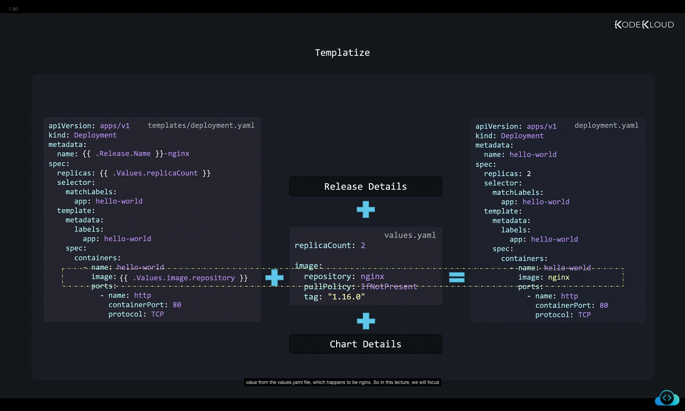
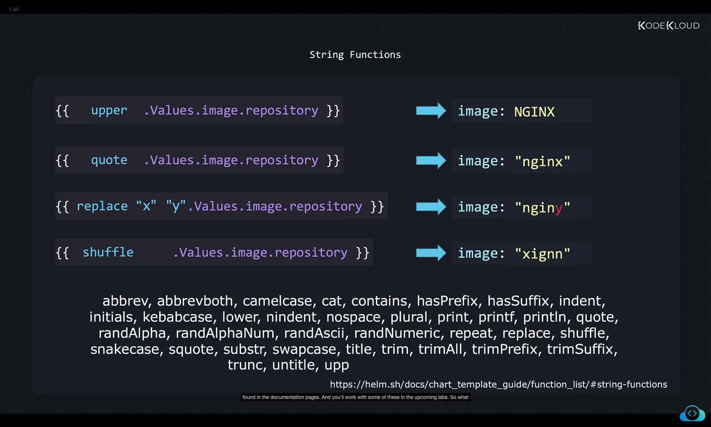
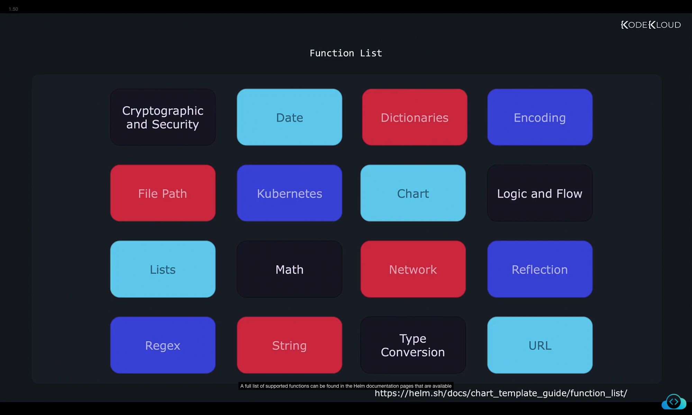
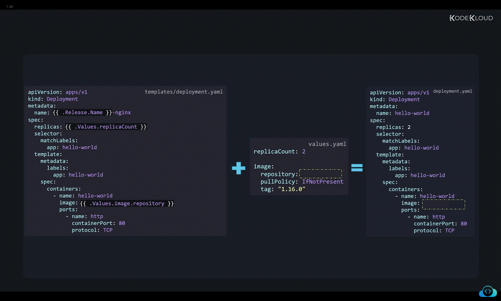

We now look at functions in Helm. So we saw how a template and the values.yaml file together create a valid manifest file. 


templates/deployment.yaml
```
apiVersion: apps/v1
kind: Deployment
metadata:
  name: {{ .Release.Name }}-nginx
spec:
  replicas: {{ .Values.replicaCount }}
  selector:
    matchLabels:
      app: hello-world
  template:
    metadata:
      labels:
        app: hello-world
    spec:
      containers:
        - name: hello-world
          image: {{ .Values.image.repository }}
          ports:
            - name: http
              containerPort: 80
              protocol: TCP
```

values.yaml
```
replicaCount: 2
image:
  repository: nginx
  pullPolicy: IfNotPresent
  tag: "1.16.0"
```

With these definitions, the generated manifest file will be:

```
apiVersion: apps/v1
kind: Deployment
metadata:
  name: hello-world
spec:
  replicas: 2
  selector:
    matchLabels:
      app: hello-world
  template:
    metadata:
      labels:
        app: hello-world
    spec:
      containers:
        - name: hello-world
          image: nginx
          ports:
            - name: http
              containerPort: 80
              protocol: TCP
```


Now what if the values.yaml file didn't have a field set, that will create a file without that field, the output file, of course, will also not have that field. So say for example, the repository name isn't set. So this would result in the resulting manifest file being created without this value. And that in turn would result in the pod failing to be created.


templates/deployment.yaml
```
apiVersion: apps/v1
kind: Deployment
metadata:
  name: {{ .Release.Name }}-nginx
spec:
  replicas: {{ .Values.replicaCount }}
  selector:
    matchLabels:
      app: hello-world
  template:
    metadata:
      labels:
        app: hello-world
    spec:
      containers:
        - name: hello-world
          image: {{ .Values.image.repository }}
          ports:
            - name: http
              containerPort: 80
              protocol: TCP
```

values.yaml
```
replicaCount: 2
image:
  repository: 
  pullPolicy: IfNotPresent
  tag: "1.16.0"
```

With these definitions, the generated manifest file will be:

```
apiVersion: apps/v1
kind: Deployment
metadata:
  name: hello-world
spec:
  replicas: 2
  selector:
    matchLabels:
      app: hello-world
  template:
    metadata:
      labels:
        app: hello-world
    spec:
      containers:
        - name: hello-world
          image: 
          ports:
            - name: http
              containerPort: 80
              protocol: TCP
```

```Bash
$ kubectl get pods 
NAME                                READY     STATUS                      RESTARTS    AGE 
nginx-deployment-6c76ffbdd7-z4qgf   0/1       invalidImageName             0          3s       

```

So what we need here is a simple way for our chart to have some default values that it can fall back on in case the users don't provide anything in their values.yaml file. So the logic would be if the user provided something in the values or YAML file, then use that if there wasn't a value provided, then use this default value, like nginx, which and we can do such a thing using functions. 

So what are functions? What do we know about functions already? And we've heard about functions in the programming world. Say for example, we have a string called Helm, and we want to convert it to uppercase. In the programming world, we have functions available for it, such as the upper function. And we call upper function and pass in this string as a parameter for an argument and we get the string in all uppercase. Similarly, let's say we have another string with some spaces in the beginning and at the end. And how do we remove those extra spaces for that we call the trim function and that removes the extra spaces. 
So a function takes in an input such as the string Helm in this example, and processes it and gives us an output in the desired format. In this case, it helps transform data from one format to another. 

```
upper("helm")  ➞  "HELM"
trim(" helm ")  ➞  "helm"
```

So what's it got to do with Helm? If you've been discussing how Helm uses the files available under the templates directory and combines them with the information available in the release, the values.yaml file, and the chart details to create the final version of the manifest files on Kubernetes. So the template directory values.image.repository gets translated into the value from the values.yaml file, which happens to be nginx. 



So in this lecture, we will focus purely on what's within the template directive. Now within the double curly brackets, as with programming languages, functions in Helm help transform data from one format to another. Say for example, we would like to convert nginx into uppercase without changing the value defined in the values.yaml file, we could call the upper function in the template directive by adding the name of the function upper like this before we provide the repository name. And that converts the value to uppercase in the generated manifest file. Now in this case, upper is the function name and values.image.repository is the argument. This function has one argument. Another example would be to add a quote around the text. For this, use the quote function. And this adds a quote around the text nginx in the generated manifest file. The replace function replaces a character with another, in this case replaces x with a y. And note that in this case, the replace function takes additional arguments, x is the string to look for and y is the string to replace it with. So this function has a total of three arguments, the details about arguments, a function takes can be found in the Helm documentation pages. So make sure to always refer to that while working with each function. Another example is to shuffle the characters using the shuffle function. Now, of course, you wouldn't want to use these functions with image names, because after all, you don't want to shuffle an image name. And these are just examples. And these are just a few of the many string functions available in Helm, a comprehensive list can be found in the documentation pages. And you'll work with some of these in the upcoming labs. 

```
{{ upper .Values.image.repository }} ➞ image: NGINX
{{ quote .Values.image.repository }} ➞ image: "nginx"
{{ replace "x" "y" .Values.image.repository }} ➞ image: "nginy"
{{ shuffle .Values.image.repository }} ➞ image: "xignn"
```

String Functions
Helm includes the following string functions:
```
abbrev, abbrevboth, camelcase, cat, contains, hasPrefix, hasSuffix, indent, initials, kebabcase, lower, nindent, nospace, plural, print, printf, println, quote, randAlpha, randAlphaNum, randAscii, randNumeric, repeat, replace, shuffle, snakecase, squote, substr, swapcase, title, trim, trimAll, trimPrefix, trimSuffix, trunc, untitle, upper, wrap, and wrapWith.
```

So what we just saw are string functions. Apart from those, there are other types of functions such as cryptographic or security-related functions for working with dates, dictionaries or less Kubernetes-related functions, network-related functions, type conversion, regex, URL, etc. A full list of supported functions can be found in the Helm documentation pages that are available at this URL.


```
Template Function List

Helm includes many template functions you can take advantage of in templates. They are listed here and broken down by the following categories:

Cryptographic and Security
Date
Dictionaries
Encoding
File Path
Kubernetes and Chart
Logic and Flow Control
Lists
Math
Float Math
Network
Reflection
Regular Expressions
Semantic Versions
String
Type Conversion
URL
UUID

```


So back to our problem of adding a default value for the image, if it's not specified, as we discussed, if the value is not passed through the command line, or is not present in the values.yaml file, then it won't be present in the generated manifest file as well. 



We can add a function called default before the image repository variable, and specify a default value of nginx. Note that the value always has to be within a quote. So anything that's not in quotes, is considered a variable. And so it might complain that NGINX is not available. So in this case, where since NGINX is the string that which has to be the default value, we put it in quotes. So this function will result in the resulting deployment file to always have a default image name of NGINX. 


templates/deployment.yaml
```
apiVersion: apps/v1
kind: Deployment
metadata:
  name: {{ .Release.Name }}-nginx
spec:
  replicas: {{ .Values.replicaCount }}
  selector:
    matchLabels:
      app: hello-world
  template:
    metadata:
      labels:
        app: hello-world
    spec:
      containers:
      - name: hello-world
        image: {{ default "nginx" .Values.image.repository }}
        ports:
        - name: http
          containerPort: 80
          protocol: TCP
```

The values.yaml file remains:
```
replicaCount: 2
image:
  repository: ""
  pullPolicy: IfNotPresent
  tag: "1.16.0"
```
With this configuration, if the image repository is not specified, Helm substitutes the default "nginx", resulting in the following manifest:
```
apiVersion: apps/v1
kind: Deployment
metadata:
  name: hello-world
spec:
  replicas: 2
  selector:
    matchLabels:
      app: hello-world
  template:
    metadata:
      labels:
        app: hello-world
    spec:
      containers:
      - name: hello-world
        image: nginx
        ports:
        - name: http
          containerPort: 80
          protocol: TCP
```
