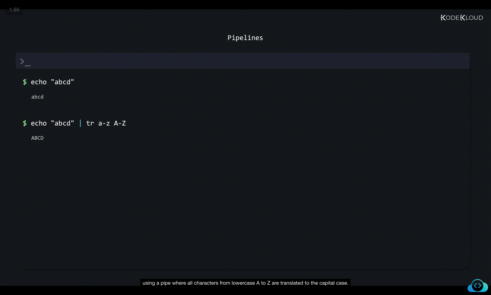
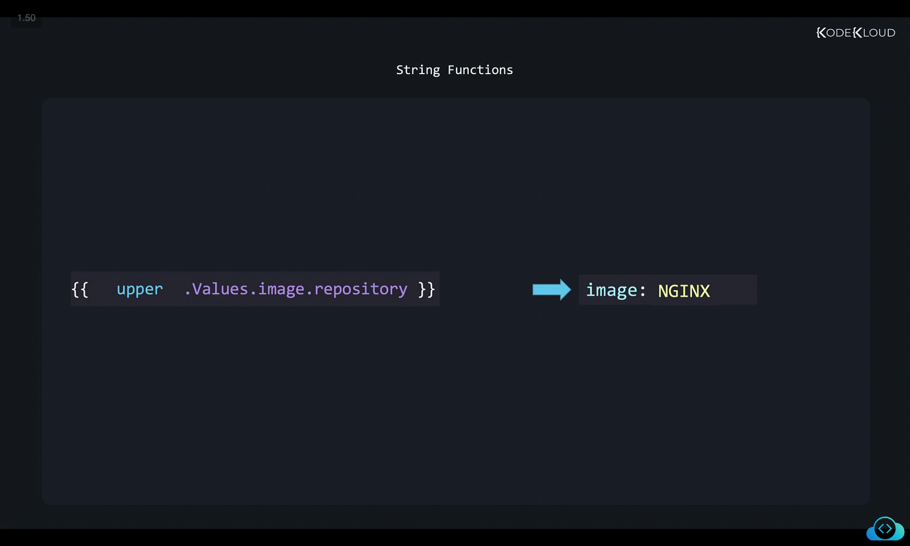
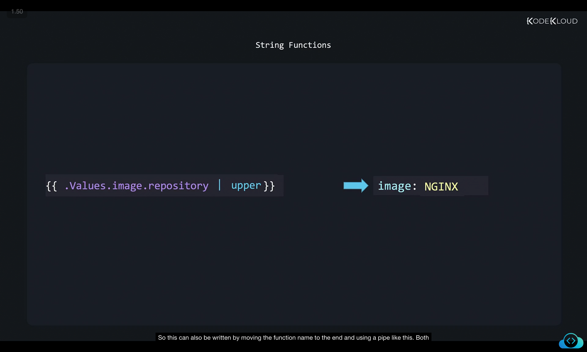

Let us now look at pipelines. In the Linux world, when you run this echo command, it prints the string that you pass in as a parameter as output on the screen. However, we want to take the output of this command and then process it in some way. In another command, we use pipes or pipelines. In this example, the output of the first command echo is passed through as input to the translate command, using a pipe where all characters from lowercase A to Z are translated to the capital case. 

```
$ echo "abcd"
abcd
$ echo "abcd" | tr a-z A-Z
ABCD
```

We have seen Functions in Helm, we write the function name before the variable names like this.

```
{{ upper .Values.image.repository }}
# Output: image: NGINX
```

But another way to write this and one that you will see most commonly used is using Pipelines. So this can also be written by moving the function name to the end and using a pipe like this. Both of these will result in the same output. 

```
{{ .Values.image.repository | upper }}
# Output: image: NGINX
```

With pipelines, you can now pipe multiple functions one after the other. For example, you can pipe the output of the upper function as input to the code function. This adds a quote around the output of the uppercase function. And you could then pipe that output to the input of a shuffle function. And that shuffles the output. So now the nginx word is first converted to uppercase. And then quotes are added around it. And then finally, it is shuffled. 

```
{{ .Values.image.repository | upper | quote | shuffle }}
# Output: image: GN"XNI"
```

Well, that's all for now. Head over to the labs and practice working with functions and pipelines and I will see you in the next one.