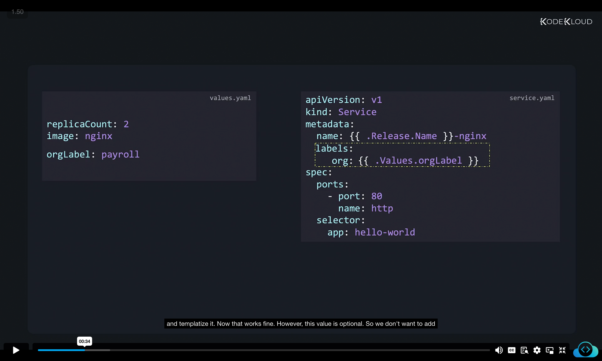
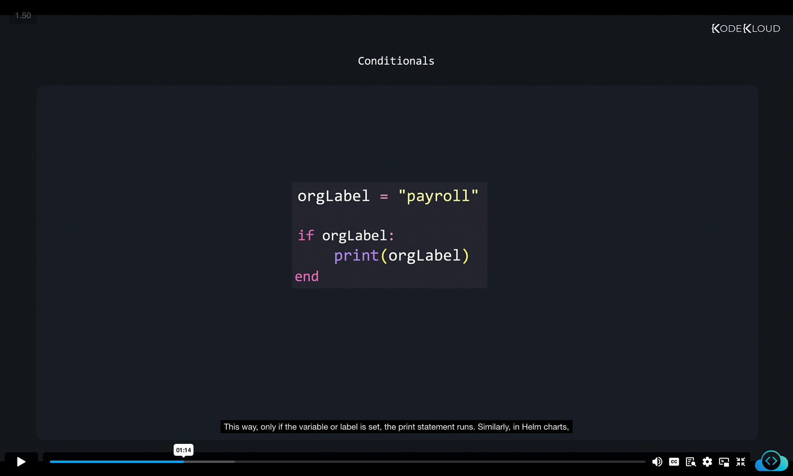
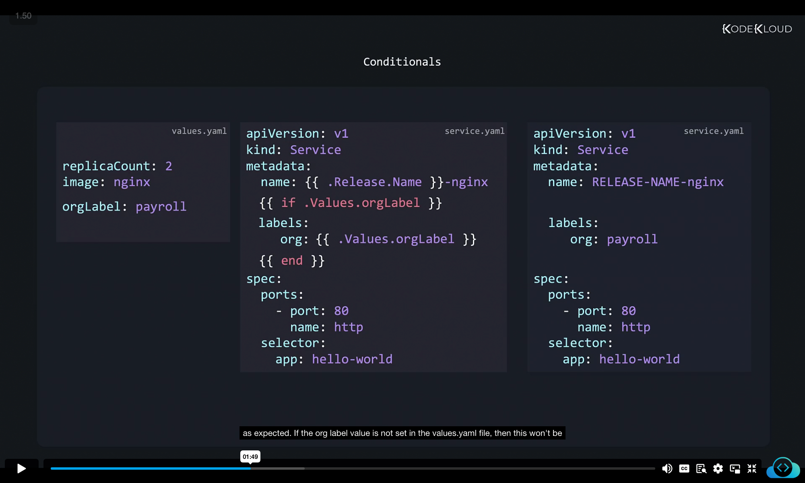
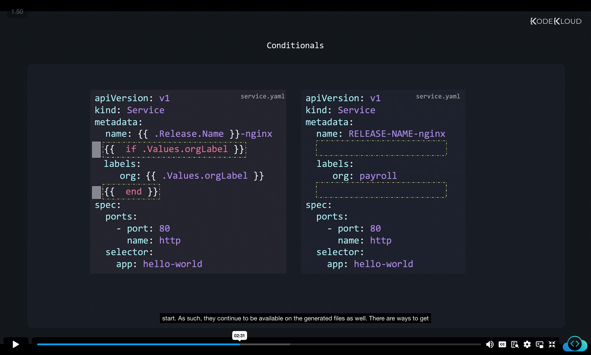
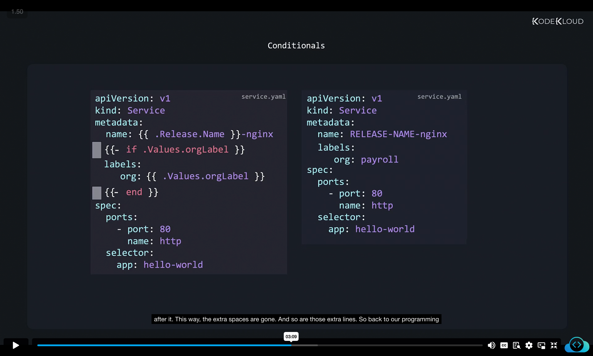
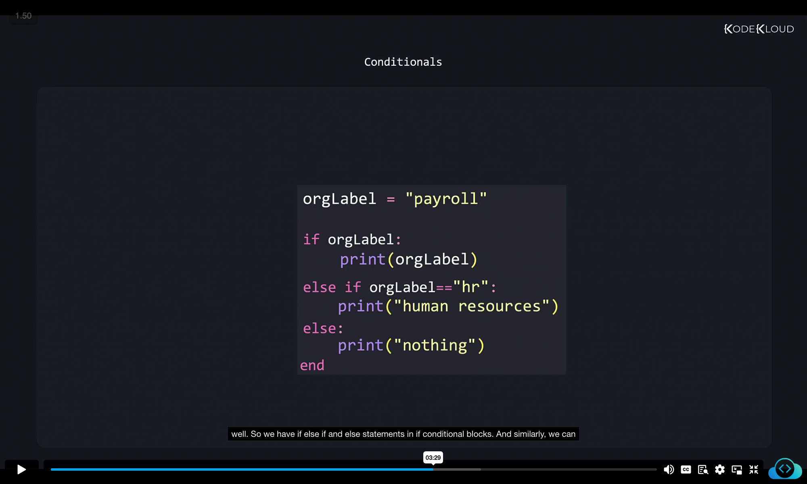
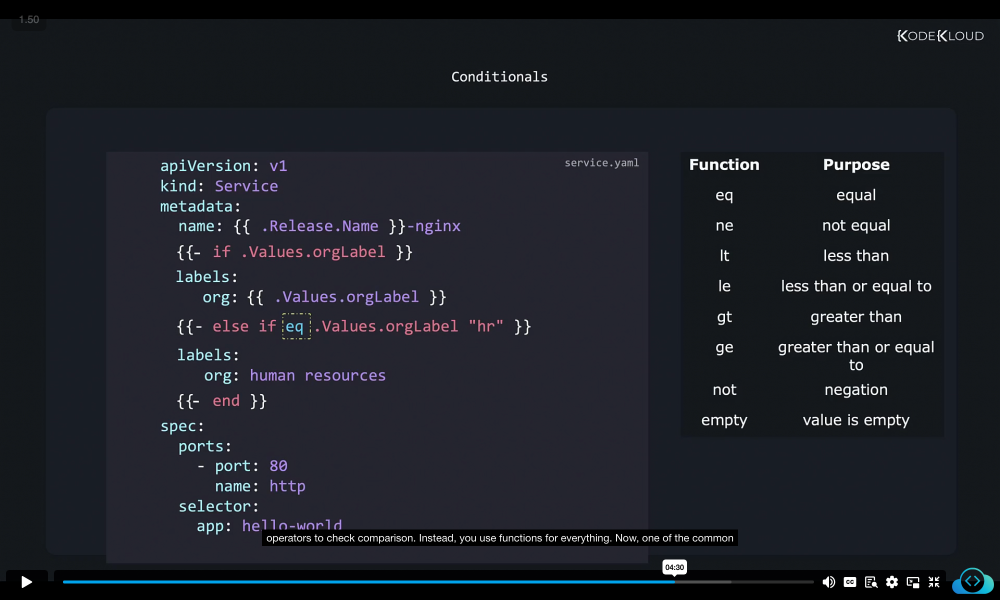
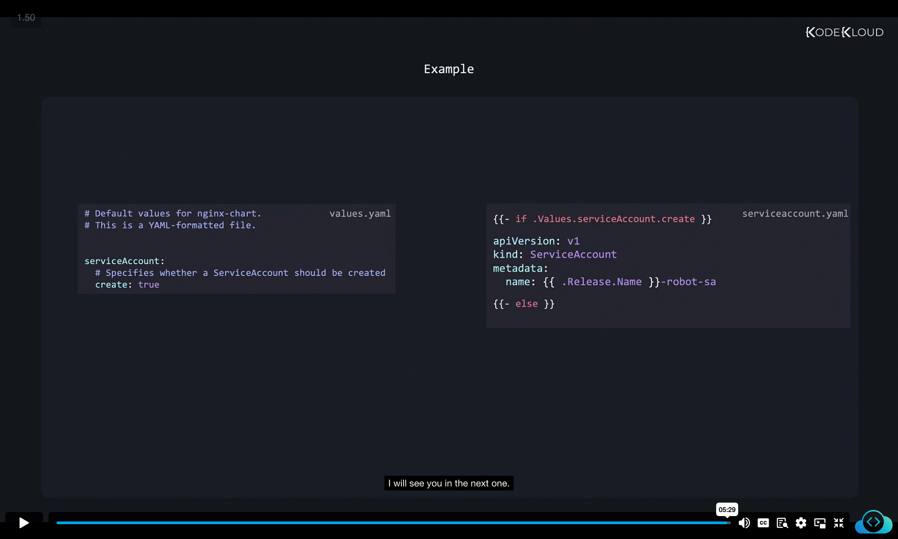

Let's now talk about conditionals. So here we have a simple service.yaml file, part of the template of our chart. And we have a values file that has some default values set. We're planning to add some custom labels that help group objects based on organization. So we add a label section. However, this could be different for different releases. So we create a property under values.yaml, and templatize it. 



values.yaml
```
replicaCount: 2
image: nginx
orgLabel: payroll
```


service.yaml
```
apiVersion: v1
kind: Service
metadata:
  name: {{ .Release.Name }}-nginx
  labels:
    org: {{ .Values.orgLabel }}
spec:
  ports:
    - port: 80
      name: http
  selector:
    app: hello-world
```


Now that works fine. However, this value is optional. So we don't want to add the org label, or these lines if this value was not specified in the values.yaml file. So we want to conditionally add these lines depending upon whether the variable was defined or not. 


In the programming world, we use if statements for conditional blocks. So here's a simple program that prints a variable called org_label. If we want to conditionally run the print statement, only if the variable is set, then we encapsulate the print statement within an if conditional block. This way, only if the variable or label is set, the print statement runs. 

```
orgLabel = "payroll"
if orgLabel:
    print(orgLabel)
end
```

Similarly, in Helm charts, we can encapsulate the lines that we want to be available in an if conditional block, only if the org label value is defined. The if conditional block is similar to any scripting or programming languages that you may be familiar with. The only exception is that it is also within the curly braces as it's part of the templating language. So this gives us this YAML file with the org labels set as expected. 


values.yaml
```
replicaCount: 2
image: nginx
orgLabel: payroll
```

service.yaml
```
apiVersion: v1
kind: Service
metadata:
  name: {{ .Release.Name }}-nginx
  {{ if .Values.orgLabel }}
  labels:
    org: {{ .Values.orgLabel }}
  {{ end }}
spec:
  ports:
    - port: 80
      name: http
  selector:
    app: hello-world
```

generated
service.yaml
```
apiVersion: v1
kind: Service
metadata:
  name:  RELEASE.NAME-nginx
  
  labels:
    org: payroll
  
spec:
  ports:
    - port: 80
      name: http
  selector:
    app: hello-world
```


If the org label value is not set in the values.yaml file, then this won't be available in the output file either. Okay, so let's add it back. And let's look at the conditional statements in a bit more detail. As you can see, there are two empty lines in the generated file. This is because when the template is converted to a manifest file, everything between the curly braces are removed. However, there are still white spaces left on those lines before the curly braces start. As such, they continue to be available on the generated files as well. 



There are ways to get rid of white spaces. In this case, since the white spaces are before the template directive starts or near to the beginning of the curly braces, we can add a dash right after the curly braces to indicate Helm to trim those out when the files are generated. And note that the dash should be right after the second curly brace. And also there should be a space between the dash and anything that comes after it. This way, the extra spaces are gone. And so are those extra lines. 


service.yaml
```
apiVersion: v1
kind: Service
metadata:
  name: {{ .Release.Name }}-nginx
  {{- if .Values.orgLabel }}
  labels:
    org: {{ .Values.orgLabel }}
  {{- end }}
spec:
  ports:
    - port: 80
      name: http
  selector:
    app: hello-world
```

generated
service.yaml
```
apiVersion: v1
kind: Service
metadata:
  name:  RELEASE.NAME-nginx
  labels:
    org: payroll
spec:
  ports:
    - port: 80
      name: http
  selector:
    app: hello-world
```


So back to our programming language example, if there is an if statement, then we know that there is an else statement as well. And if there is an if and else statement, then there has to be an else if statement as well. So we have if else if and else statements in if conditional blocks. 


```
orgLabel = "payroll"


if orgLabel:
    print(orgLabel)
elif orgLabel == "hr":
    print("human resources")
else:
    print("nothing")
end
```

And similarly, we can have else if and else statements within conditional blocks in Helm charts like this. Note that the equality is checked using the EQ function like this. So EQ is a function that takes two arguments and returns true if they are equal. In this case, it takes the value of the org label variable and the text HR for comparison. There are many other functions as well, such as the NE for not equal LT for less than LE for less than or equal to GT for greater than G for greater than or equal to NOT for negation, and EMPTY, which is where the value is empty. So you don't usually use the equal to operators to check comparison. Instead, you use functions for everything. 


service.yaml
```
apiVersion: v1
kind: Service
metadata:
  name: {{ .Release.Name }}-nginx
  {{- if .Values.orgLabel }}
  labels:
    org: {{ .Values.orgLabel }}
  {{- else if eq .Values.orgLabel "hr" }}
  labels:
    org: human resources
  {{- end }}
spec:
  ports:
    - port: 80
      name: http
  selector:
    app: hello-world
```
Now, one of the common examples or use cases where you will see conditionals used a lot is whether to create objects of certain kinds or not. For example, here I have a service account template file as part of the templates of our chart, among the many other template files that are available. However, I don't always want this to be created, I want to provide an option for the user to customize the creation of the service account based on a setting in the values.yaml file. So I add a section called service account with a field create set to true. And I only want to create the service account if this field is set to true. So we add a conditional block around the entire template file to only be created if this value is set to true in the YAML file. Well, that's all for now. I will see you in the next one.


values.yaml
```
# Default values for nginx-chart.
serviceAccount:
  # Specifies whether a ServiceAccount should be created
  create: true
```

serviceaccount.yaml
```
{{- if .Values.serviceAccount.create }}
apiVersion: v1
kind: ServiceAccount
metadata:
  name: {{ .Release.Name }}-robot-sa
{{- end }}
```
