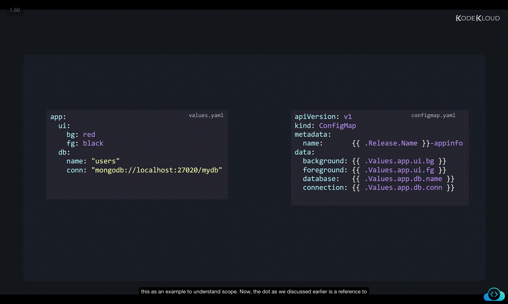
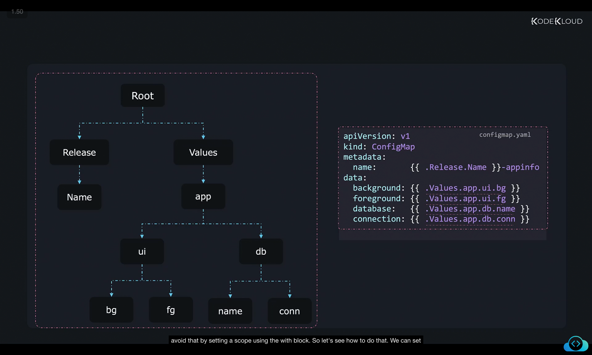
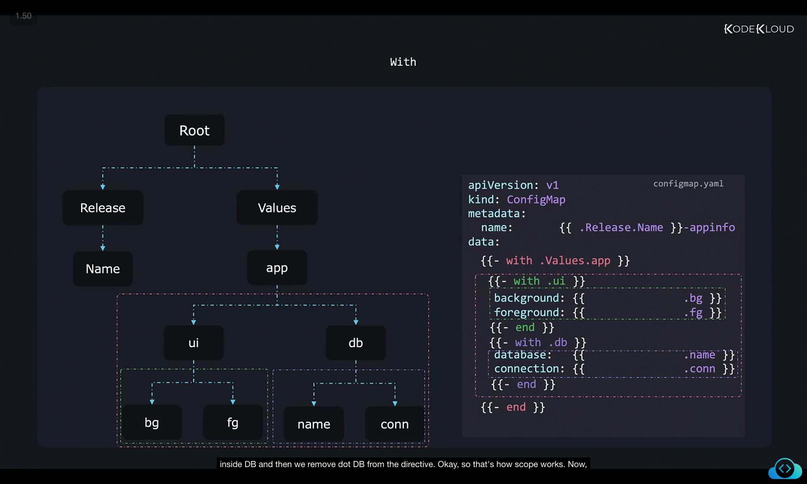
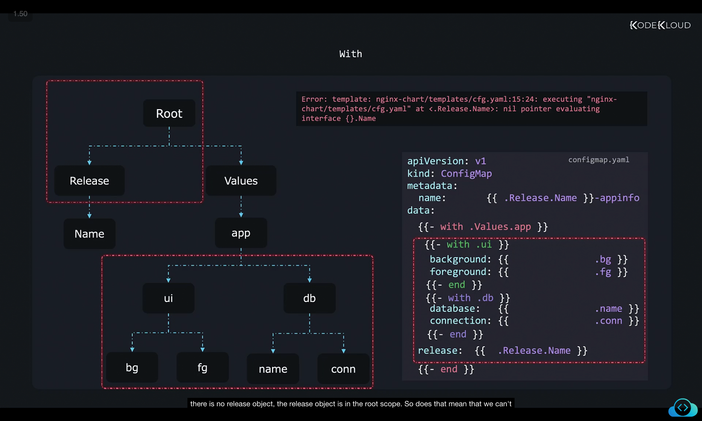
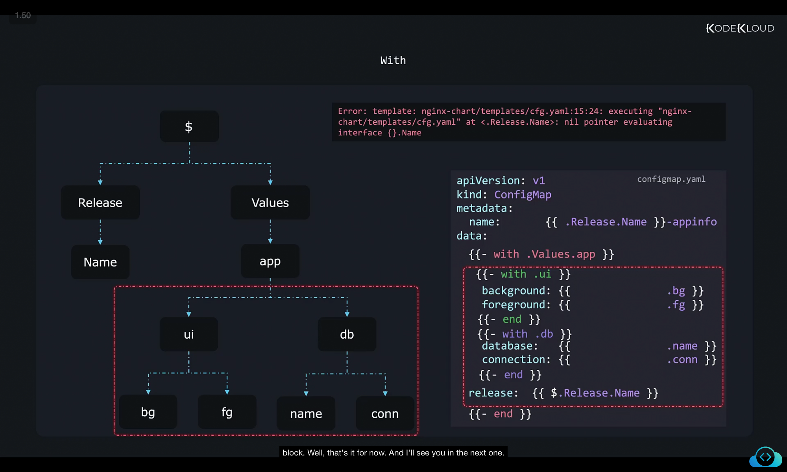

Let's now talk about scope. Now let's look at this example to understand scopes in Helm charts. So here I have a config map dot yaml as part of templates in the template directory. It stores details to be used by our applications such as the background color of the UI, the foreground color, the database name, connection details, etc. These are defined and picked from the values dot yaml file. And we have the top level dictionary app, under which we have UI and DB. Under UI, we have BG for background, FG for foreground, and name and connection details under the DB section, which stands for database. So it's a dictionary object that has multiple levels. And let's use this as an example to understand scope. 


values.yaml
```
app:
  ui:
    bg: red
    fg: black
  db:
    name: "users"
    conn: "mongodb://localhost:27020/mydb"
```

configmap.yaml
```
apiVersion: v1
kind: ConfigMap
metadata:
  name: {{ .Release.Name }}-appinfo
data:
  background: {{ .Values.app.ui.bg }}
  foreground: {{ .Values.app.ui.fg }}
  database: {{ .Values.app.db.name }}
  connection: {{ .Values.app.db.conn }}
```

Now, the dot as we discussed earlier is a reference to the current scope. So everything falls under the root scope. And so at this point, dot means the root scope. And then under that we have release and values. And under release, we have name. And under values, we have app. And similarly, under app, we have UI DB, and then BG and FG under UI and name and connection under DB. So that's kind of the scope hierarchy. So as to call it, if you don't specifically set a scope, or play around with the scope within a file, we'll see how to do that in a bit. But if you don't set a scope, the current scope in the file is set to the root scope by default. And that is why to access any of these objects, we must traverse all the way from the root scope. So you can see, there is duplication of dot values dot app, and many times, and we can avoid that by setting a scope using the with block. 



So let's see how to do that. We can set a scope using the with block by specifying the path to dot values dot app like this. This way, within the with block, the scope is set to values.app. So you no longer have to specify .values.app. Here as the . within this block implies the current scope, which is already values.app, you could take this one step further by setting an additional scope within this block. So as you can see, the UI and DB each have two lines where the UI and DB are repeated. So we can set a scope to UI. So we add an additional with block within the existing width block and move the background and foreground lines under it. And this sets a new scope within the internal with block, where dot would mean the current scope and that is dot values dot app dot UI. So you could just say dot BG, and that would refer to the BG value, and FG that would refer to the values dot app dot UI dot FG. And we shouldn't have to specify dot UI. And we do the same for the DB section as well. So we set a new with block to set a current the current scope inside DB and then we remove dot DB from the directive. Okay, so that's how scope works. 


```
apiVersion: v1
kind: ConfigMap
metadata:
  name: {{ .Release.Name }}-appinfo
data:
{{- with .Values.app }}
  background: {{ .ui.bg }}
  foreground: {{ .ui.fg }}
  database: {{ .db.name }}
  connection: {{ .db.conn }}
{{- end }}
```

```
apiVersion: v1
kind: ConfigMap
metadata:
  name: {{ .Release.Name }}-appinfo
data:
{{- with .Values.app }}
  {{- with .ui }}
  background: {{ .bg }}
  foreground: {{ .fg }}
  {{- end }}
  {{- with .db }}
  database: {{ .name }}
  connection: {{ .conn }}
  {{- end }}
{{- end }}
```

Now, let's say we'd like to pass through the release name as a config parameter called release. So we set release and then we pass in dot release dot name. And we try to access the release name as we did in the first line in the under the name of the config map. Now this will result in an error that states that there is a nil pointer while evaluating release dot name. Now this is because within the with block, we are currently under the scope of values dot app. And within this scope, there is no release object, the release object is in the root scope. 


```
apiVersion: v1
kind: ConfigMap
metadata:
  name: {{ .Release.Name }}-appinfo
data:
{{- with .Values.app }}
  {{- with .ui }}
  background: {{ .bg }}
  foreground: {{ .fg }}
  {{- end }}
  {{- with .db }}
  database: {{ .name }}
  connection: {{ .conn }}
  {{- end }}
  release: {{ .Release.Name }}
{{- end }}
```
```
Error: template: nginx-chart/templates/cfg.yaml:15:24: executing "nginx-chart/templates/cfg-yaml" at < Release.Name>: nil pointer evaluating interface {}. Name
```

So does that mean that we can't refer to anything outside of the current scope? No root is also represented as dollar. So you can access anything in the root scope using dollar like this. So you just have to put dollar before the dot. And that would take you all the way to the root and then you can just say dollar dot release dot name and that would help you access the release name from within the with block. Well, that's it for now. And I'll see you in the next one.


```
apiVersion: v1
kind: ConfigMap
metadata:
  name: {{ .Release.Name }}-appinfo
data:
{{- with .Values.app }}
  {{- with .ui }}
  background: {{ .bg }}
  foreground: {{ .fg }}
  {{- end }}
  {{- with .db }}
  database: {{ .name }}
  connection: {{ .conn }}
  {{- end }}
  release: {{ $.Release.Name }}
{{- end }}
```
