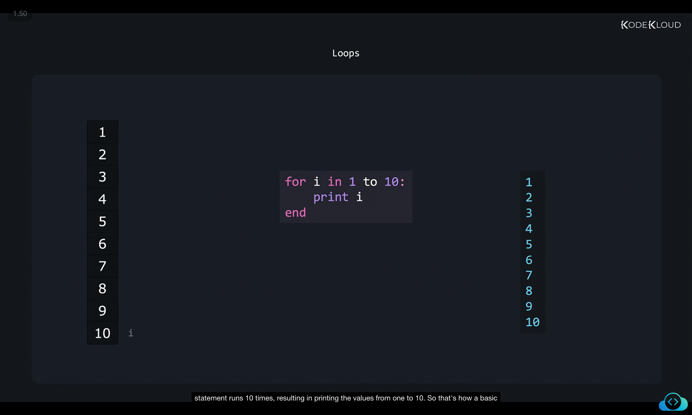
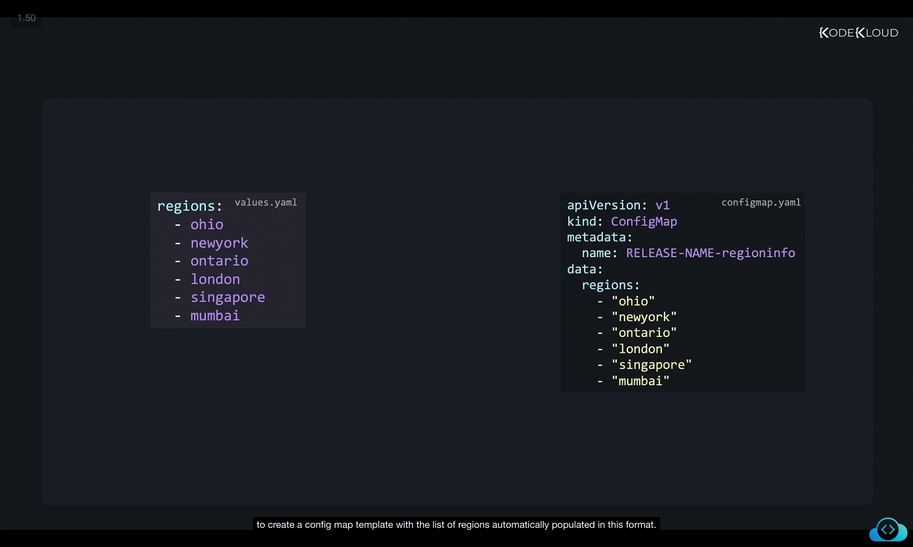
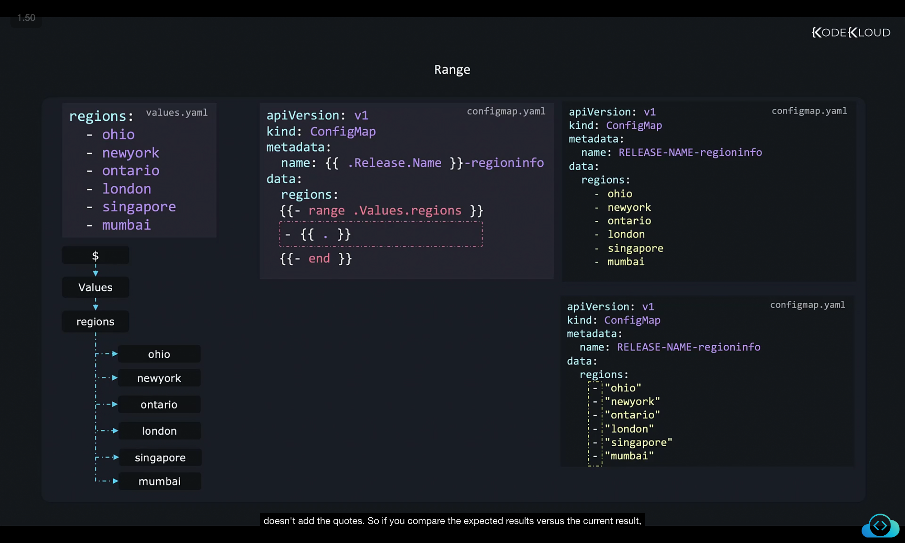
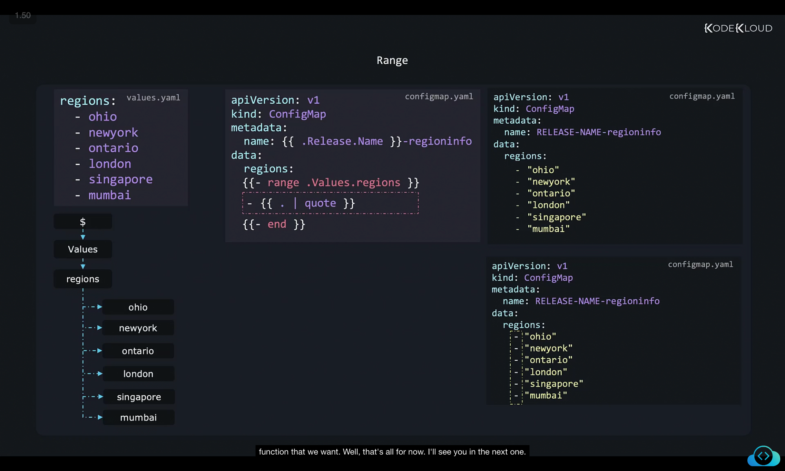

Let's now talk about loops and ranges. In the programming world, a loop such as a for loop is one that executes the same lines of code within its block multiple times by iterating through a set of data that it has to work with. In this case, the data to work with is one to ten. And with each iteration of the loop, the value of i iterates from one to 10. And the print statement runs 10 times, resulting in printing the values from one to 10. So that's how a basic loop works. 

```
for i in 1 to 10:
    print i
end
```

We have a list of regions in the values.yaml file like this. So our goal is to create a config map template with the list of regions automatically populated in this format. 


values.yaml
```
regions:
  - ohio
  - newyork
  - ontario
  - london
  - singapore
  - mumbai
```

goal 
configmap.yaml
```
apiVersion: v1
kind: ConfigMap
metadata:
  name: RELEASE-NAME-regioninfo
data:
  regions:
    - "ohio"
    - "newyork"
    - "ontario"
    - "london"
    - "singapore"
    - "mumbai"
```


So how do we achieve this? So we create a basic structure for the config map. And this is how it looks. This is a very basic structure of the config map, it has a region section, but there's nothing under the region section. And all that is doing is adding the name called region info with the release name in it. And this template file is going to create an output like this with simply the release name replaced.

configmap.yaml 
```
apiVersion: v1
kind: ConfigMap
metadata:
  name: {{ .Release.Name }}-regioninfo
data:
  regions:
```
```
apiVersion: v1
kind: ConfigMap
metadata:
  name: RELEASE-NAME-regioninfo
data:
  regions:
```

Now we need to look into the regions part and make sure we list the regions under it in the form of a list or an array with each region inside a quote. Okay, so that's that's our requirement. So we need to iterate through the list in the values or YAML file. So for that, we need a loop. So we create a for loop using the range operator, we specify the list regions from the values file, and we add the end block. Now this creates a block with a loop, everything that we specify inside, this will be repeated each time the loop iterates. But what do we put inside this? Now we know that we need a dash first. So we put a dash as is. And then we need the region. So how do we get the region within this range block? So here's a graphical representation of the scope of the data in the values file, we have the dollar or root at the top. And we have values under it and then regions and then a list of strings. So just like the with block, the range block sets the scope each time it iterates through the list. As such, the current scope, that is the dot refers to the value of the object in that list, which happens to be Ohio in the first time. So all we need to do to refer to the value is to just say dot, and that's it. So each time it iterates through the range block, the next value is traversed, and the scope is set to that value. So this gives us the desired results, or almost the desired results, 

```
apiVersion: v1
kind: ConfigMap
metadata:
  name: {{ .Release.Name }}-regioninfo
data:
  regions:
    {{- range .Values.regions }}
    - {{ . }}
    {{- end }}
```

```
apiVersion: v1
kind: ConfigMap
metadata:
  name: RELEASE-NAME-regioninfo
data:
  regions:
    - ohio
    - newyork
    - ontario
    - london
    - singapore
    - mumbai
```


except that it doesn't add the quotes. So if you compare the expected results versus the current result, you'll see that it's generated the array as expected, but it's missing the quotes. For this, all we have to do is simply pipe the dot to the quotes function like this. And so and that's it. So you can consider the dot just as any other object, and then we can pipe it through any function that we want. Well, that's all for now. I'll see you in the next one.



```
apiVersion: v1
kind: ConfigMap
metadata:
  name: {{ .Release.Name }}-regioninfo
data:
  regions:
    {{- range .Values.regions }}
    - {{ . | quote }}
    {{- end }}
```

```
apiVersion: v1
kind: ConfigMap
metadata:
  name: RELEASE-NAME-regioninfo
data:
  regions:
    - "ohio"
    - "newyork"
    - "ontario"
    - "london"
    - "singapore"
    - "mumbai"
```
