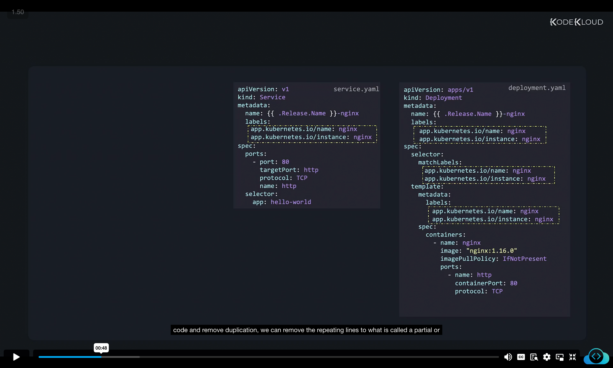
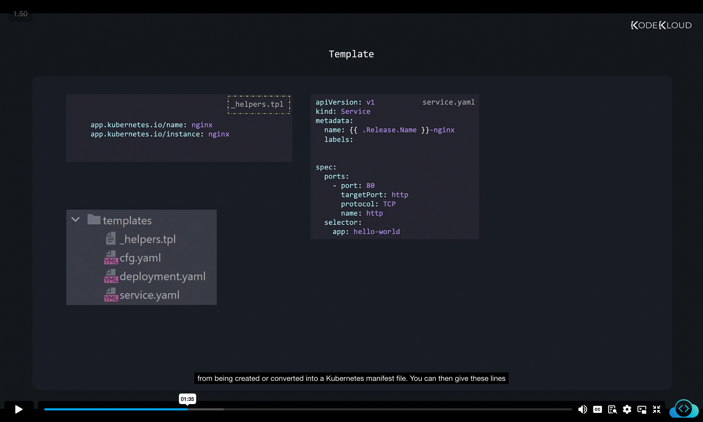
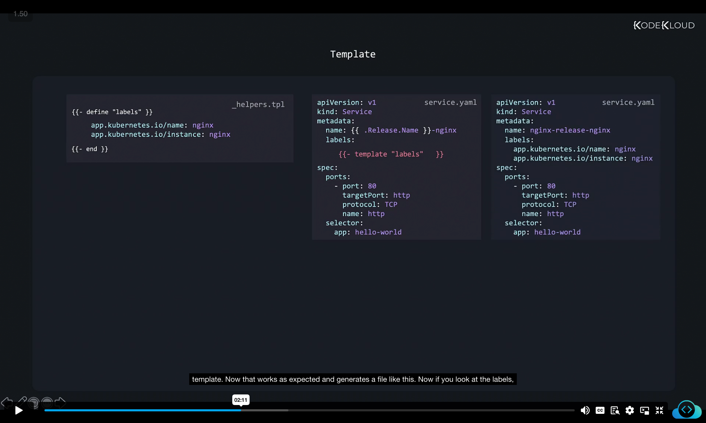
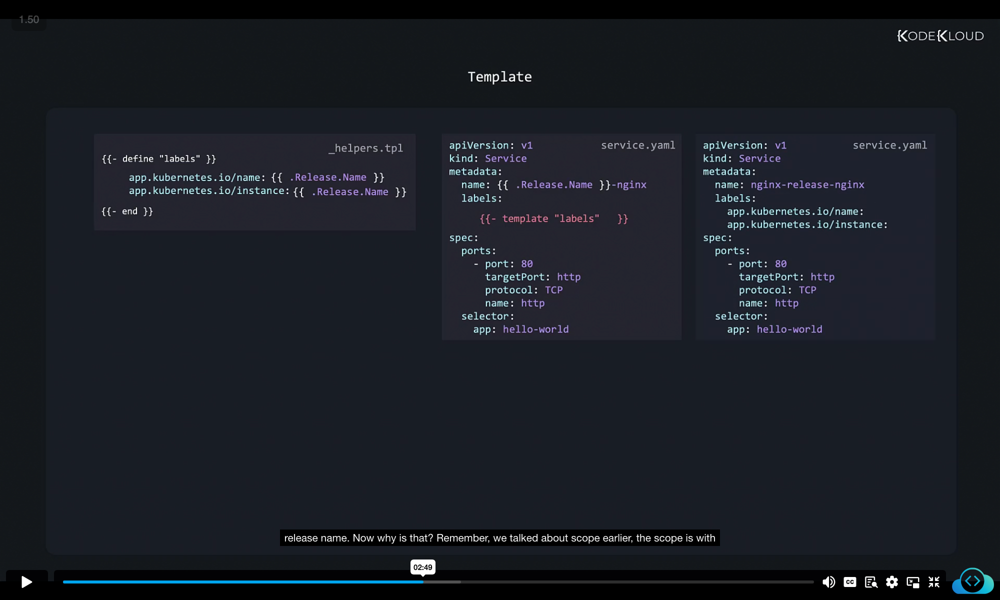
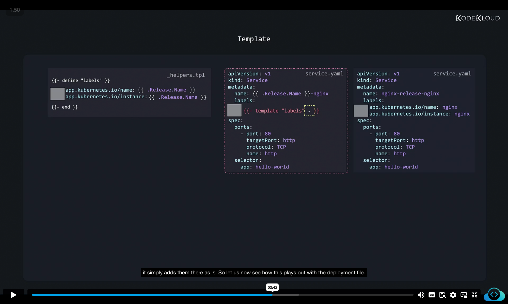
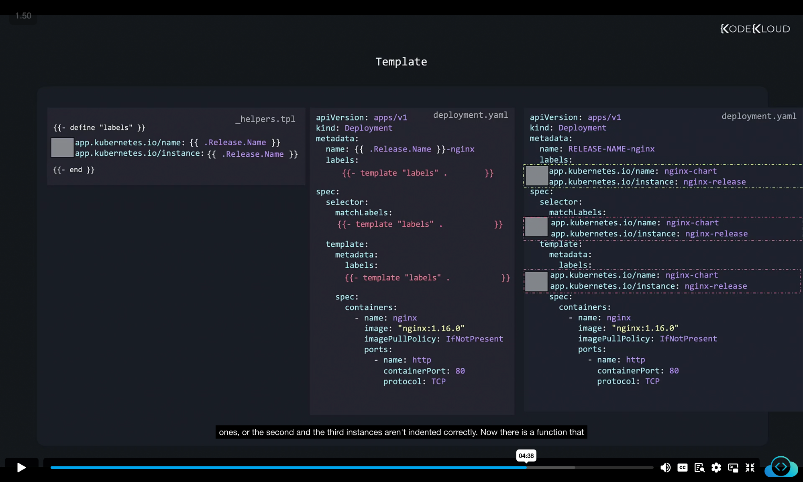
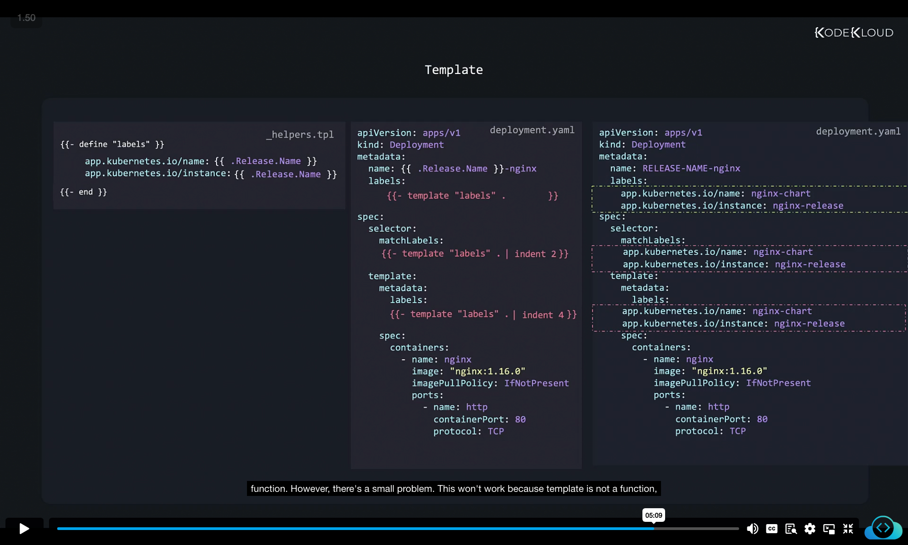
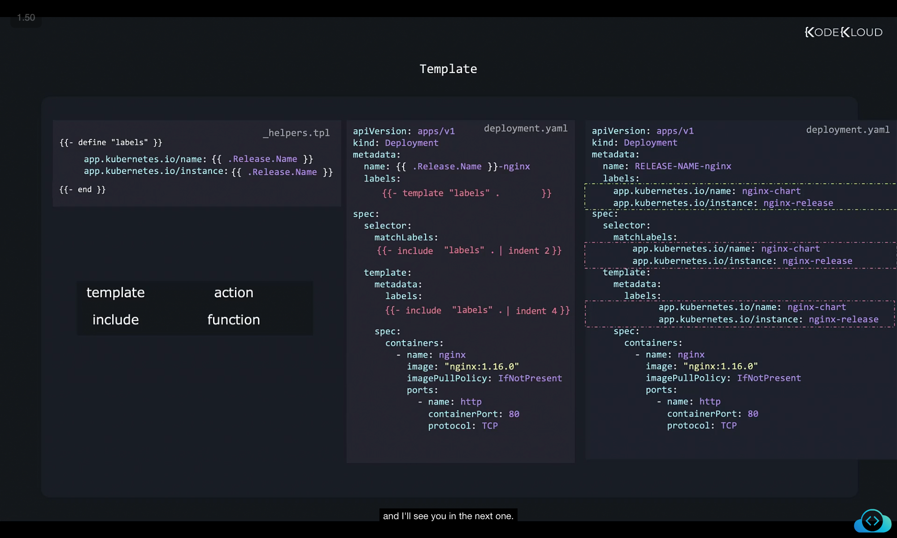

Let's talk about named templates. Let's look at this deployment file. So here we have a bunch of labels defined. And they're all the same lines that are repeated multiple times throughout this file. And these may also be present in other objects. For example, this service file, these are very repetitive. And for now, these are only a few and it might be easy to write. However, when there are many lines such as these, repeating things can get complicated. And we might mix things up and get them wrong. So how do we ensure that it's the same lines used everywhere? 


service.yaml
```
apiVersion: v1
kind: Service
metadata:
  name: {{ .Release.Name }}-nginx
  labels:
    app.kubernetes.io/name: nginx
    app.kubernetes.io/instance: nginx
spec:
  ports:
    - port: 80
      targetPort: http
      protocol: TCP
      name: http
  selector:
    app: hello-world
```

deployment.yaml
```
apiVersion: apps/v1
kind: Deployment
metadata:
  name: {{ .Release.Name }}-nginx
  labels:
    app.kubernetes.io/name: nginx
    app.kubernetes.io/instance: nginx
spec:
  selector:
    matchLabels:
      app.kubernetes.io/name: nginx
      app.kubernetes.io/instance: nginx
  template:
    metadata:
      labels:
        app.kubernetes.io/name: nginx
        app.kubernetes.io/instance: nginx
    spec:
      containers:
        - name: nginx
          image: "nginx:1.16.0"
          imagePullPolicy: IfNotPresent
          ports:
            - name: http
              containerPort: 80
              protocol: TCP

```

How can we be consistent and reuse code and remove duplication, we can remove the repeating lines to what is called a partial or named template. Let's start with the service file for now. We move the repeating lines to a file called _helpers.tpl. Now the underscore in the file name tells Helm not to consider this file as a usual template file. Because when we run the helm create command, Helm reads all the files in the templates directory and converts them to Kubernetes manifests. In this case, this is only a helper file. And we don't want this file to end up as a Kubernetes manifest file, because it's going to be invalid. So all files starting with an underscore are skipped from being created or converted into a Kubernetes manifest file.

_helpers.tpl
```
app.kubernetes.io/name: nginx
app. kubernetes.io/instance: nginx
```

You can then give these lines or this template a name using the define statement like this. Now here, we name these lines labels because these are labels. Now these lines can now be imported, or rather included anywhere we want using a simple template statement like this. To the template statement, you tell what helper template you'd like to use, we named it labels. This is called a named template. Now that works as expected and generates a file like this. 

_helpers.tpl
```
{{- define "labels" }}
    app.kubernetes.io/name: nginx
    app. kubernetes.io/instance: nginx
{{- end }}
```
```
apiVersion: v1
kind: Service
metadata:
  name: {{ .Release.Name }}-nginx
  labels:
    {{- template "labels" . }}
spec:
  ports:
    - port: 80
      targetPort: http
      protocol: TCP
      name: http
  selector:
    app: hello-world
```

generates
```
apiVersion: v1
kind: Service
metadata:
  name: {{ .Release.Name }}-nginx
  labels:
    app.kubernetes.io/name: nginx
    app.kubernetes.io/instance: nginx
spec:
  ports:
    - port: 80
      targetPort: http
      protocol: TCP
      name: http
  selector:
    app: hello-world
```

Now if you look at the labels, we have defined in the helpers file, they have the release name hard coded. Now we know that that's going to create an issue when we install multiple releases. What if we had a template directive within the helper file like this. So instead of hard coding the name, we add a template directive .Release.Name, and we expect it to be replaced by the actual release name. And doing that, in fact, gives a result like this, where it takes out the expected release name. 


_helpers.tpl
```
{{- define "labels" }}
    app.kubernetes.io/name: {{ .Release.Name }}
    app. kubernetes.io/instance: {{ .Release.Name }}
{{- end }}
```
```
apiVersion: v1
kind: Service
metadata:
  name: {{ .Release.Name }}-nginx
  labels:
    {{- template "labels" }}
spec:
  ports:
    - port: 80
      targetPort: http
      protocol: TCP
      name: http
  selector:
    app: hello-world
```

generates
```
apiVersion: v1
kind: Service
metadata:
  name: {{ .Release.Name }}-nginx
  labels:
    app.kubernetes.io/name: 
    app.kubernetes.io/instance: 
spec:
  ports:
    - port: 80
      targetPort: http
      protocol: TCP
      name: http
  selector:
    app: hello-world
```


Now why is that? Remember, we talked about scope earlier, the scope is with in the template file and does not get transferred to the helper file. So the helper file has no data to work with. To transfer the current scope to the template file, add a dot to the end of the template statement, like this. dot, as we learned refers to the current scope, and it is then accessible from within the helper file. Now, when you move lines of code to templates, remember that you must have the same indentation or the number of spaces before these lines as you'd expect it to have in the actual output file. This is because when the template statement adds the lines defined in the template, it simply adds them there as is. 


_helpers.tpl
```
{{- define "labels" }}
    app.kubernetes.io/name: {{ .Release.Name }}
    app. kubernetes.io/instance: {{ .Release.Name }}
{{- end }}
```
```
apiVersion: v1
kind: Service
metadata:
  name: {{ .Release.Name }}-nginx
  labels:
    {{- template "labels" . }}
spec:
  ports:
    - port: 80
      targetPort: http
      protocol: TCP
      name: http
  selector:
    app: hello-world
```

generates
```
apiVersion: v1
kind: Service
metadata:
  name: {{ .Release.Name }}-nginx
  labels:
    app.kubernetes.io/name: 
    app.kubernetes.io/instance: 
spec:
  ports:
    - port: 80
      targetPort: http
      protocol: TCP
      name: http
  selector:
    app: hello-world
```


So let us now see how this plays out with the deployment file. Now in the deployment.yaml file, there are multiple places where the template has to be used. So we replace all of them with the template statement that we used before. However, when the file is generated, it is not formatted as expected. The template statement added the lines from the helper file. However, it added the same indentation for all the instances, and is resulting in a file that's not formatted correctly. It works as expected with the first instance, because we had added the correct indentation for the first one. However, the later ones, or the second and the third instances aren't indented correctly. 

_helpers.tpl
```
{{- define "labels" }}
    app.kubernetes.io/name: {{ .Release.Name }}
    app. kubernetes.io/instance: {{ .Release.Name }}
{{- end }}
```
deployment.yaml
```
apiVersion: apps/v1
kind: Deployment
metadata:
  name: {{ .Release.Name }}-nginx
  labels:
    {{- template "labels" . }}
spec:
  selector:
    matchLabels:
    {{- template "labels" . }}
  template:
    metadata:
      labels:
      {{- template "labels" . }}
    spec:
      containers:
        - name: nginx
          image: "nginx:1.16.0"
          imagePullPolicy: IfNotPresent
          ports:
            - name: http
              containerPort: 80
              protocol: TCP

```
generated
```
apiVersion: apps/v1
kind: Deployment
metadata:
  name: RELEASE-NAME-nginx
  labels:
    app.kubernetes.io/name: nginx-chart
    app.kubernetes.io/instance: nginx-release
spec:
  selector:
    matchLabels:
    app.kubernetes.io/name: nginx-chart
    app.kubernetes.io/instance: nginx-release
  template:
    metadata:
      labels:
    app.kubernetes.io/name: nginx-chart
    app.kubernetes.io/instance: nginx-release
    spec:
      containers:
        - name: nginx
          image: "nginx:1.16.0"
          imagePullPolicy: IfNotPresent
          ports:
            - name: http
              containerPort: 80
              protocol: TCP
```


Now there is a function that helps fix the indentation. Guess what it's called indent. So to fix the first error, we must indent the lines by an additional two spaces. And to fix the second error, we must indent the lines by an additional four spaces. So here we are piping the output of the template statement to the indent function. 

_helpers.tpl
```
{{- define "labels" }}
    app.kubernetes.io/name: {{ .Release.Name }}
    app. kubernetes.io/instance: {{ .Release.Name }}
{{- end }}
```
deployment.yaml
```
apiVersion: apps/v1
kind: Deployment
metadata:
  name: {{ .Release.Name }}-nginx
  labels:
    {{- template "labels" . }}
spec:
  selector:
    matchLabels:
    {{- template "labels" . | indent 2}}
  template:
    metadata:
      labels:
      {{- template "labels" . | indent 4 }}
    spec:
      containers:
        - name: nginx
          image: "nginx:1.16.0"
          imagePullPolicy: IfNotPresent
          ports:
            - name: http
              containerPort: 80
              protocol: TCP

```

However, there's a small problem. This won't work because template is not a function, it is an action. And like functions, you can't pipe its output to another function. So what's shown here doesn't really work. So another function that does the same job as the template is the include function, it can import named templates, and also pipe it to another function. So replacing the template function with the include statements now helps in adding the right indentation to these lines. Well, that's all about templates and functions, and I'll see you in the next one.


_helpers.tpl
```
{{- define "labels" }}
    app.kubernetes.io/name: {{ .Release.Name }}
    app. kubernetes.io/instance: {{ .Release.Name }}
{{- end }}
```
deployment.yaml
```
apiVersion: apps/v1
kind: Deployment
metadata:
  name: {{ .Release.Name }}-nginx
  labels:
    {{- template "labels" . }}
spec:
  selector:
    matchLabels:
    {{- include template "labels" . | indent 2}}
  template:
    metadata:
      labels:
      {{- include template "labels" . | indent 4 }}
    spec:
      containers:
        - name: nginx
          image: "nginx:1.16.0"
          imagePullPolicy: IfNotPresent
          ports:
            - name: http
              containerPort: 80
              protocol: TCP

```
generated
```
apiVersion: apps/v1
kind: Deployment
metadata:
  name: RELEASE-NAME-nginx
  labels:
    app.kubernetes.io/name: nginx-chart
    app.kubernetes.io/instance: nginx-release
spec:
  selector:
    matchLabels:
      app.kubernetes.io/name: nginx-chart
      app.kubernetes.io/instance: nginx-release
  template:
    metadata:
      labels:
        app.kubernetes.io/name: nginx-chart
        app.kubernetes.io/instance: nginx-release
    spec:
      containers:
        - name: nginx
          image: "nginx:1.16.0"
          imagePullPolicy: IfNotPresent
          ports:
            - name: http
              containerPort: 80
              protocol: TCP
```
