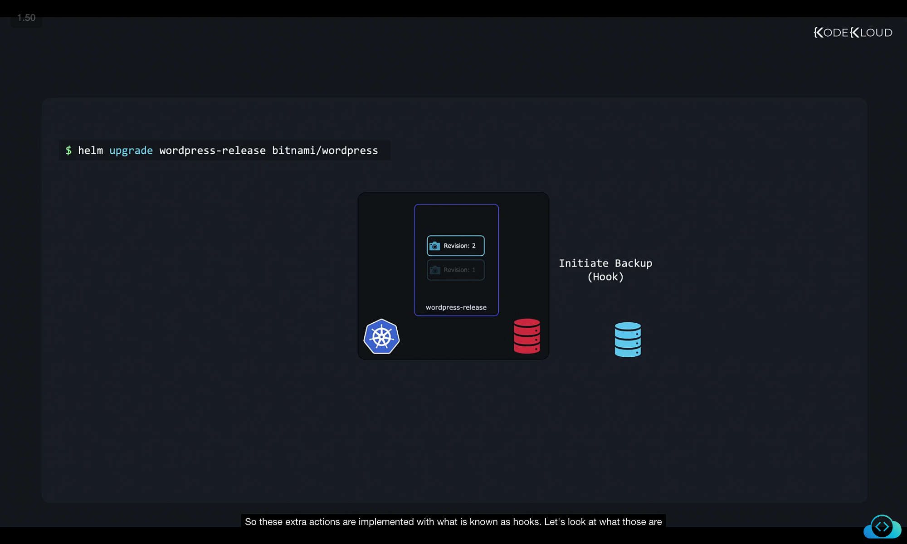
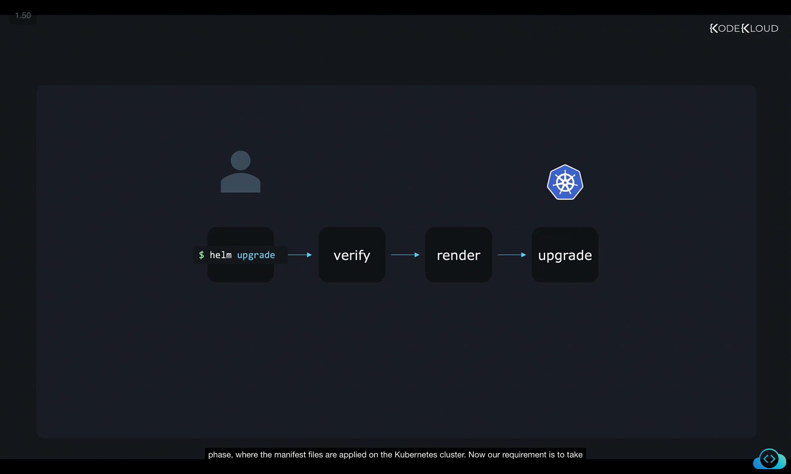
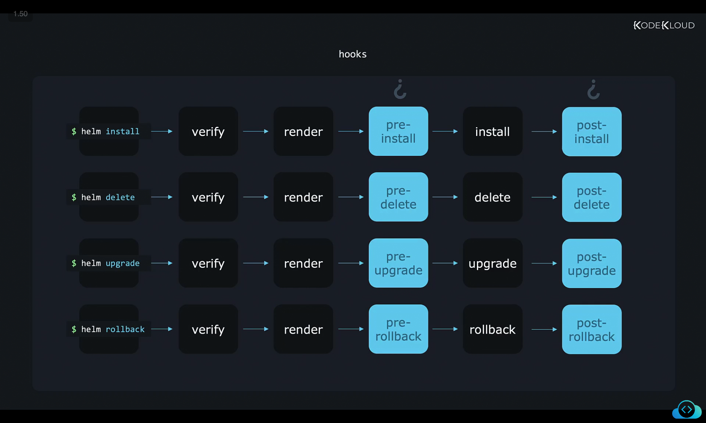
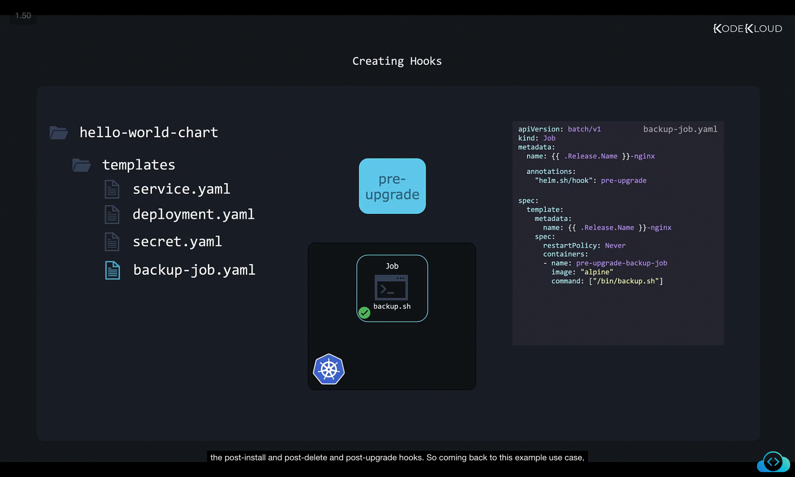

# captions and images and code 

Let's talk about chart hooks. Now earlier, we discussed that, besides just installing various Kubernetes objects to get our app up and running, they can do some extra stuff too. For example, we can write the charts in such a way that whenever we do a Helm upgrade, a database can be automatically backed up before the upgrade. So we have a way to restore from backup in case something goes wrong.

```
$ helm upgrade wordpress-release bitnami/wordpress
```
Or it could be sending an email alert before an upgrade operation or putting up a site-wide announcement bar or something and removing it after the upgrade, right. So these extra actions are implemented with what is known as hooks. 



Let's look at what those are in this video. So here's the typical workflow of events in Helm. So when a user installs or upgrades a Helm chart, using helm install or upgrade command, Helm verifies the files and templates in the chart, and then renders the manifest files in their final form. And in the final step installs services on the cluster. So that's what is called as the install or upgrade phase, where the manifest files are applied on the Kubernetes cluster. 


```
helm upgrade/install -> verify -> render -> upgrade/install on cluster   
```

Now our requirement is to take a backup of the database before the chart is actually installed before the upgrade phase. So we use the pre-upgrade hook. The pre-upgrade hook runs a predefined action, which could really be anything. In our case, it is to take a backup of the database with a pre-install hook in place. Helm waits for this action to be completed. And for it to be ready in a ready state before proceeding to the final phase of installation or upgrading applications on Kubernetes. 


Now after the upgrade phase, we'd like to perform some kind of cleanup activity or send out announcements of some kind. For this, we add a post-upgrade hook. The post-upgrade hook runs after the install phase is successful, and performs actions configured, such as sending an email status update of some sorts. 


Now apart from the pre-upgrade and post-upgrade hooks, there are pre-install and post-install hooks that run during the install operations, the pre-delete and post-delete hooks that run during deletion requests, the pre-rollback and post-rollback hooks that run during rollbacks. 

```

Command	Phases Sequence
helm install	verify → render → pre-install → install → post-install
helm delete	    verify → render → pre-delete → delete → post-delete
helm upgrade	verify → render → pre-upgrade → upgrade → post-upgrade
helm rollback	verify → render → pre-rollback → rollback → post-rollback

```

So let's now see how these hooks are configured. So how do you get something done in Kubernetes, say you have a script to backup the database called backup.sh. Now how do you get that script executed by Kubernetes? So you develop the script, and then run it as a pod. Now we know that a pod runs forever. But we only want the script to be run once. So if you only wanted it to run once, then you create a job instead of a pod. So it is through Kubernetes objects such as Pods or Jobs that we configure hooks in Helm charts. So here's a manifest file to create a Job that runs the backup script using an Alpine image. And this file is placed along with the other templates in the templates directory. 

Now we know that all the files in the templates directory are rendered as Kubernetes manifests files when the chart is installed to deploy the services. But this job shouldn't work like that it has to be run before the install phase as a pre-install hook and not during the install or upgrade phase with the rest of the application. It has to be run during the pre upgrade as part of the pre-upgrade process. So how do we differentiate the chart hook from the normal template files? How do you tell Helm that this job that we've created is a pre-upgrade hook and not a usual template? For this we add an annotation. Annotations are a way for us to add additional metadata to an object which may be used by clients of Kubernetes, in this case Helm, to store data about that object and perform some kind of actions. So we add an annotation with the key Helm.sh/hook and the value set to pre-upgrade. This configures this job as a pre-upgrade hook and Helm no longer considers this file as a regular template file. Now this job will run before the upgrade step when a chart is upgraded. And similarly, by changing the setting in this annotation, we can configure a job to be a pre-install hook or a pre-delete hook, pre-upgrade or pre-rollback hook. And the same goes for the post hooks like the post-install and post-delete and post-upgrade hooks.

```
hello-world-chart/
└── templates/
    ├── service.yaml
    ├── deployment.yaml
    ├── secret.yaml
    └── backup-job.yaml

```

backup-job.yaml
```
apiVersion: batch/v1
kind: Job
metadata:
  name: {{ .Release.Name }}-nginx
  annotations:
    "helm.sh/hook": pre-upgrade
spec:
  template:
    metadata:
      name: {{ .Release.Name }}-nginx
    spec:
      restartPolicy: Never
      containers:
        - name: pre-upgrade-backup-job
          image: "alpine"
          command: ["/bin/backup.sh"]
```


So coming back to this example use case, we have now understood how hooks work and when they are run and how they can be configured. We can have multiple hooks configured for each step. For example, we can have multiple pre-upgrade hooks configured. And this could be for performing other activities such as making an external API call to kick off some automation to, let's say, add a banner on the site and send out an email announcement. And these may need to be done in some particular order. The email announcement has to go first, then the site-wide banner has to be displayed and finally the backup to be started. So how do we define in what order these hooks are to be executed, we can set weights for each hook, these could be negative or positive numbers. So we set a weight for each job in the order they should be run. During the chart installation phase Helm sorts these in ascending order and executes them in that order. So to set a weight for a hook, add the annotation helm.sh slash hook dash weight, and then set the value as a string. Note that you can set the same weight for multiple hooks. And if you do so, they will be sorted by resource kind. And finally, by name in ascending order and then executed that way. 

```
apiVersion: batch/v1
kind: Job
metadata:
  name: {{ .Release.Name }}-nginx
  annotations:
    "helm.sh/hook": pre-upgrade
    "helm.sh/hook-weight": "5"

spec:
  template:
    metadata:
      name: {{ .Release.Name }}-nginx
    spec:
      restartPolicy: Never
      containers:
        - name: pre-upgrade-backup-job
          image: "alpine"
          command: ["/bin/backup.sh"]
```

Now, what happens after the backup job is completed, the resource created for the hook, which is in this case is the job resource is going to stay on as a resource on the cluster, we can configure them to be cleaned up by setting hook deletion policies. For this, we add the annotation hook delete policy and set a supported value. Now hook succeeded deletes the resource after the hook is successfully executed. Of course, this means that if the hook fails to execute, the resources won't be deleted, which might actually be useful, as maybe we'd want to debug such a failure, see what went wrong. So it's advantageous that we still have the resource around. Hook failed deletes the resource even if the hook failed execution. And the default value, if no hook deletion policy is specified, is the last one that is the before hook creation policy. Now this deletes the previous resource before a new hook is launched. So the first time this runs, there won't be a resource to be deleted. So it doesn't matter. But say this pre-upgrade hook creates the backup job object. And the next time we upgrade, the pre-upgrade hook will delete the old Kubernetes object that was left hanging around after the last upgrade. And after it deletes the old object, the new object is created and this too is left hanging around until the next upgrade command is run. So this also helps avoid situations where the hook would try to create a duplicate object with the same name and Kubernetes might complain that that object already exists. Well, that's all for now. And I will see you in the next one.


```
apiVersion: batch/v1
kind: Job
metadata:
  name: {{ .Release.Name }}-nginx
  annotations:
    "helm.sh/hook": pre-upgrade
    "helm.sh/hook-weight": "5"
    "helm.sh/hook-delete-policy": hook-succeeded
spec:
  template:
    metadata:
      name: {{ .Release.Name }}-nginx
    spec:
      restartPolicy: Never
      containers:
        - name: pre-upgrade-backup-job
          image: "alpine"
          command: ["/bin/backup.sh"]
```


# notes by other student
Chart Hooks
In this article, we explore how Helm chart hooks can extend the functionality of Kubernetes deployments. Beyond deploying Kubernetes objects to run an application, hooks allow you to automate additional actions. For instance, before performing a Helm upgrade, you might want to back up your database to ensure a reliable recovery point. You can do this by executing:

```
$ helm upgrade wordpress-release bitnami/wordpress
```
This backup process can be complemented by other operations, such as sending an email alert or displaying a temporary site-wide announcement.

Understanding the Workflow

When you install or upgrade a Helm chart using commands like helm install or helm upgrade, Helm first validates the chart’s files and templates. It then renders the manifest files in their final form before applying them as resources in your Kubernetes cluster. This overall process is typically broken down into several phases:

Verification Phase: Ensures all files and templates are correct.
Rendering Phase: Transforms templates into deployable manifest files.
Execution Phase: Applies these manifests to the Kubernetes cluster.
To perform specific tasks—such as backing up a database before an upgrade—a pre-upgrade hook is used. This hook triggers a predefined action, and Helm waits until the action is complete and the resources are ready before continuing with the upgrade.

After the upgrade phase, you may want to perform cleanup or notify stakeholders. A post-upgrade hook comes into play at this stage, running after a successful install and executing additional tasks like sending a notification email.

Other available hooks include:

Pre-install and Post-install Hooks: Execute during the installation.
Pre-delete and Post-delete Hooks: Run during resource deletion.
Pre-rollback and Post-rollback Hooks: Operate during rollback operations.
A typical lifecycle for these operations can be summarized as follows:

Command	Phases Sequence
helm install	verify → render → pre-install → install → post-install
helm delete	verify → render → pre-delete → delete → post-delete
helm upgrade	verify → render → pre-upgrade → upgrade → post-upgrade
Configuring Hooks

Consider a scenario where you have a script named backup.sh designed to perform a one-time database backup. In Kubernetes, instead of running this script as a continuously running pod, you can run it as a Job.

Below is an example manifest file that creates a Job using an Alpine image. This file should be placed in the chart’s templates directory alongside your other Kubernetes manifests. To ensure the Job runs as a hook (e.g., a pre-upgrade hook), you need to add specific annotations that instruct Helm to treat the file differently from standard templates.

Tip

To designate a resource as a hook, add the annotation key helm.sh/hook with a value such as pre-upgrade. This tells Helm to execute the Job as part of the pre-upgrade process rather than a regular installation.
Below is the manifest file for a Job configured as a pre-upgrade hook:

```
apiVersion: batch/v1
kind: Job
metadata:
  name: {{ .Release.Name }}-nginx
  annotations:
    "helm.sh/hook": pre-upgrade
    "helm.sh/hook-weight": "5"
    "helm.sh/hook-delete-policy": hook-succeeded
spec:
  template:
    metadata:
      name: {{ .Release.Name }}-nginx
    spec:
      restartPolicy: Never
      containers:
        - name: pre-upgrade-backup-job
          image: "alpine"
          command: ["/bin/backup.sh"]
```

In the above manifest:

The annotation "helm.sh/hook": pre-upgrade signals that the Job should run before the upgrade phase.
The "helm.sh/hook-weight": "5" annotation controls the execution order. Hooks with lower weights execute before those with higher weights. If hooks share the same weight, they are sorted by resource kind and name.
The "helm.sh/hook-delete-policy": hook-succeeded annotation ensures that the Job resource is deleted after successfully running, which prevents potential conflicts from duplicate objects during future upgrades.
Warning

If the hook fails, the Job resource will not be deleted automatically. This can be useful for debugging, but be mindful of lingering resources that might require manual cleanup.
Other available deletion policies include:

hook-failed: Deletes the resource even if the hook fails.
before-hook-creation: Deletes any existing resource before launching a new hook.
Using the default deletion policy (before-hook-creation) helps avoid conflicts with duplicate resources during subsequent Helm upgrades.

By using hooks strategically, you ensure that necessary pre- and post-deployment actions are executed, making your Helm deployments more robust and reliable.

That concludes our comprehensive look at Helm chart hooks, their role in the deployment lifecycle, and how to configure them for various Kubernetes operations. Happy charting, and see you in the next article!

