Let's talk about packaging and uploading charts. We now have our charts built and ready to be shared with the world. First, we package it, and then we upload it to the online chart repository so other users can download and install them. 
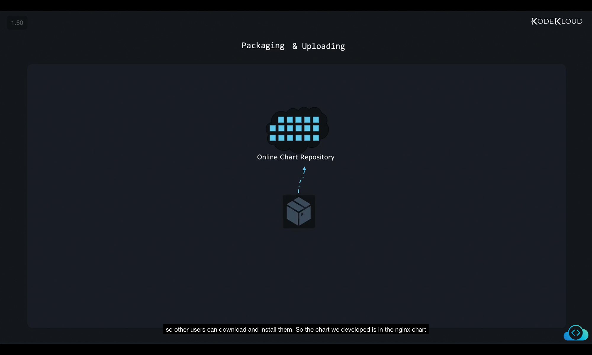

So the chart we developed is in the nginx chart directory with a Chart.yaml, values.yaml, README.md, and the license files and the templates and chart directories. 

To package it, run the helm package command. And that's basically it. This packages the chart into an archive format named nginx chart-0.1.0.tgz. The version number 0.1.0 is picked from the version within the chart.yaml file. The .tgz extension points out that this is a tar archive compressed with gzip. We can open this up with almost any archive manager like, you know, WinRAR in Windows or 7-Zip or any other kind of archive utilities in Linux and so on. Inside, we'll see all the files and directories that we added to this chart in our exercises neatly grouped together in a single file that is much easier to move around. So we now have the packaged Helm chart and the next step is to upload it to a chart repository. However, it is not recommended to just upload this file as is, we must also consider signing it to make sure users know that the package they are downloading is legit. 
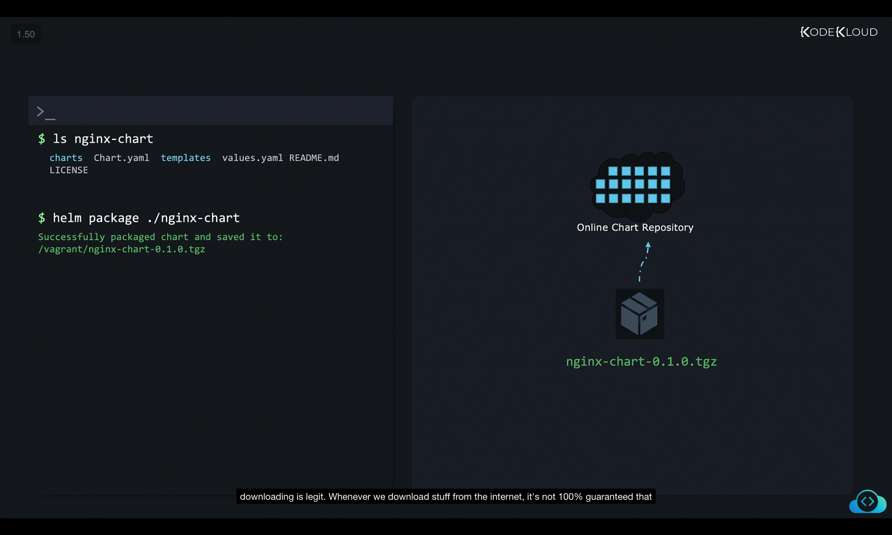
```
$ ls nginx-chart
charts  Chart.yaml  templates  values.yaml  README.md  LICENSE

$ helm package ./nginx-chart
Successfully packaged chart and saved it to:
/vagrant/nginx-chart-0.1.0.tgz
```

Whenever we download stuff from the internet, it's not 100% guaranteed that what we get is actually what the developer or maintainer uploaded. That's because servers can be hacked and files can be replaced with malicious content. And one of the ways to make downloads safer is to cryptographically sign files and packages. For example, in this case, we built our chart, we know our content is good and safe to use. But how can the users that download our chart be sure that they get exactly what we built for them, and not some malicious file uploaded by some hacker?
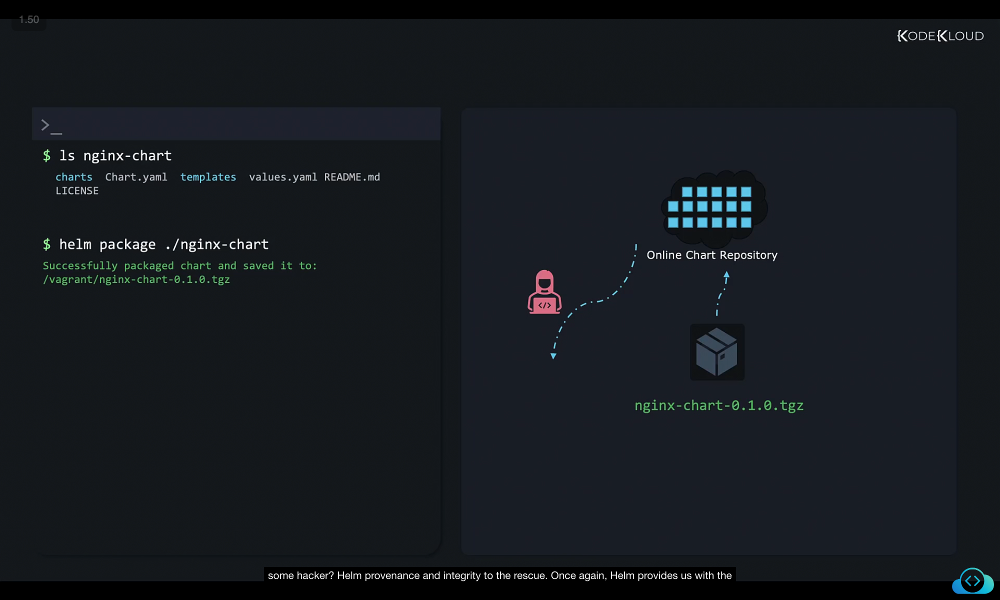

Helm provenance and integrity to the rescue. Once again, Helm provides us with the necessary tools to fix this. Helm uses a private key that only we, the chart developers, have access to. And with this key, it produces a digital signature and adds it to what is called a provenance file. We'll look at that in a bit. Now users download our chart and provenance file and look for the signature with a public key that they know belongs to us, they can verify if the chart is correctly signed. If the signature is valid, they know that this chart was manually signed by us, the chart developers. 
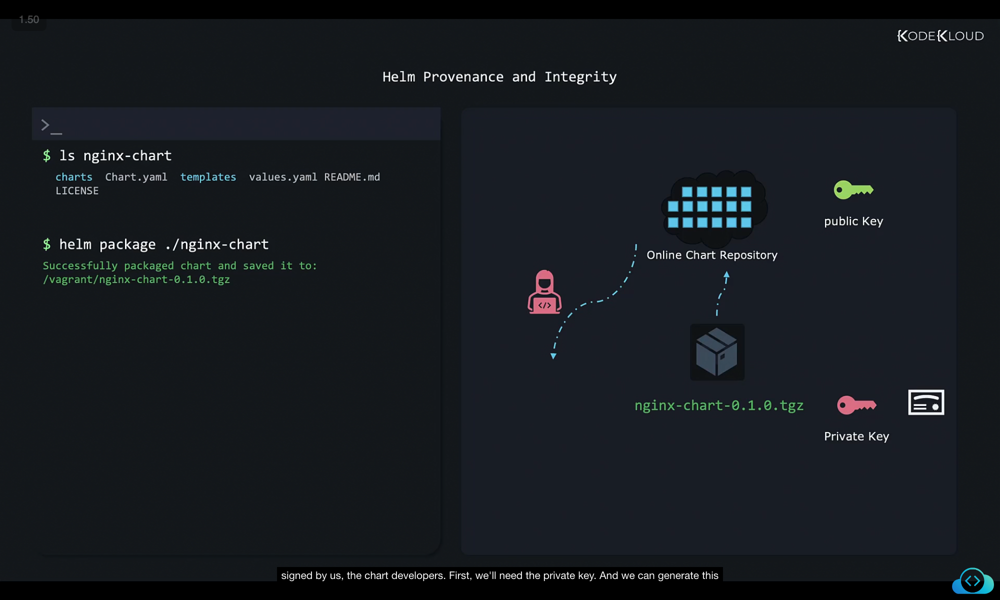


First, we'll need the private key. And we can generate this private key and public key pair with the GNU Privacy Guard or GPG utility included by default in most Linux distributions. And for this purpose of our exercise, we'll choose the quickest method to generate these files with the command GPG quick-generate-key followed by a name, let's call it John Smith. If you get a prompt to password protect this, you can just use an empty password for the sake of simplicity for now. But in a real-world scenario, it's recommended that you use a strong password to protect your private key. It'll be encrypted with this password. And even if someone somehow steals your file, they can't use it without the correct password. Now when the keys have been generated, we'll see an output similar to this. And the pub section at the bottom shows us the unique identifier of our public key. This could be uploaded to an open PGP key server, like keyserver.ubuntu.com or something and users would be able to download it by using this unique identifier, and then verify our signatures. 
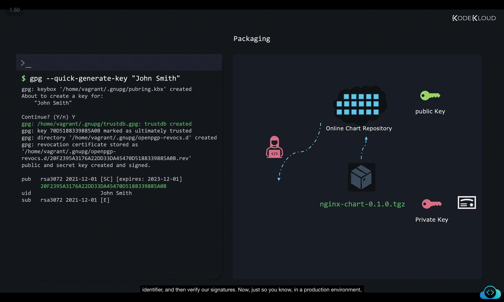
```
$ gpg --quick-generate-key "John Smith"
gpg: keybox '/home/vagrant/.gnupg/pubring.kbx' created
About to create a key for:
"John Smith"
Continue? (Y/n) Y
gpg: /home/vagrant/.gnupg/trustdb.gpg: trustdb created
gpg: key 70D5188339885A0B marked as ultimately trusted
gpg: directory '/home/vagrant/.gnupg/openpgp-revocs.d' created
gpg: revocation certificate stored as '/home/vagrant/.gnupg/openpgp-revocs.d/20F2395A3176A22DD33D45470D5188339885A0B.rev'
public and secret key created and signed.


pub   rsa3072 2021-12-01 [SC] [expires: 2023-12-01]
      20F2395A3176A22DD33D45470D5188339885A0B
uid           John Smith
sub   rsa3072 2021-12-01 [E]
```

Now, just so you know, in a production environment, you should use another command to generate your keys and something like the GPG full-generate-key would be better since it asks you for more details. And you can fine-tune cryptographic settings, expiration dates, set an email address associated with the key and so on. 
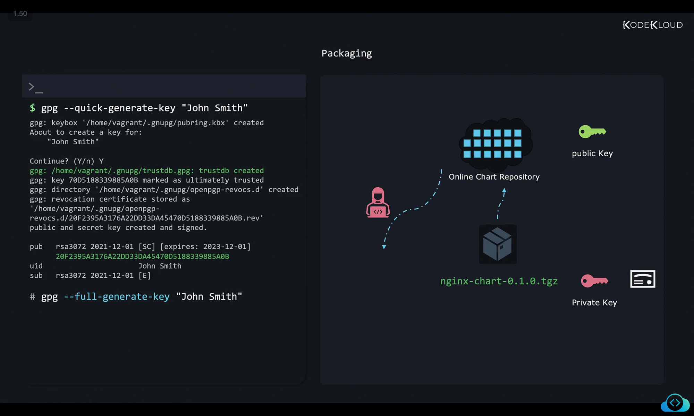
```
$ gpg --full-generate-key "John Smith"
```

Most Linux distributions nowadays use GNU PG v2, which stores keys in a different format than the previous version. To sign charts Helm currently prefers the older format, we can convert the new secret keyring format to the old format and store it in a file called secring.gpg with the following command. GPG export secret keys, and then redirected to secret.gpg file. 
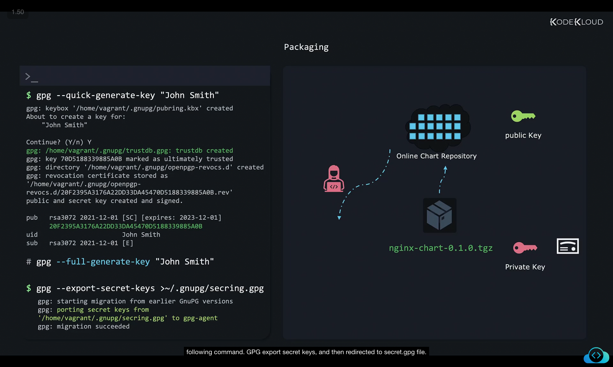
```
$ gpg --export-secret-keys >~/.gnupg/secring.gpg
gpg: starting migration from earlier GnuPG versions
gpg: exporting secret keys from '/home/vagrant/.gnupg/secring.gpg' to gpg-agent
gpg: migration succeeded
```

Now that we have the key ready, we package it again using the same helm package command, but with the sign option and by passing in the key that we created in the previous step, the key parameter expects to receive either the full name that we associated with our key or the email address. If we ever forget these details, we can list key details with the command GPG list keys like this. 
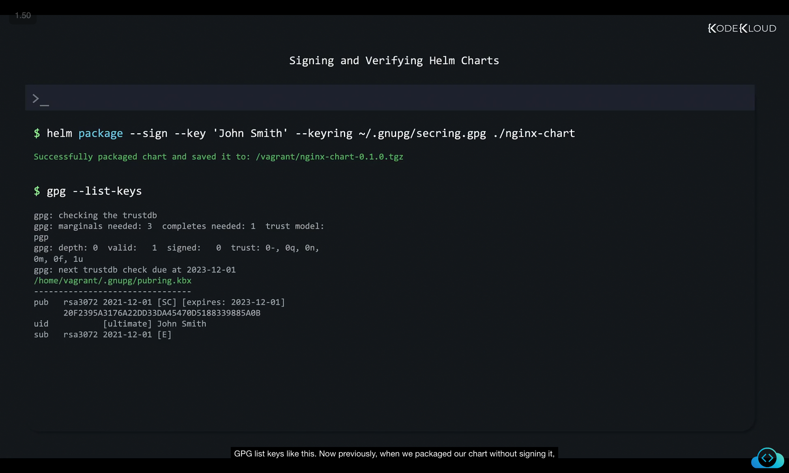

```
$ helm package --sign --key 'John Smith' --keyring ~/.gnupg/secring.gpg ./nginx-chart
Successfully packaged chart and saved it to: /vagrant/nginx-chart-0.1.0.tgz

$ gpg --list-keys
gpg: checking the trustdb gpg:
gpg: marginals needed: 3 completes needed: 1 trust model:
pgp
gpg: depth: 0 valid:  1 signed:  0 trust: 0-, 0q, On,
0m, 0f, 1u
gpg: next trustdb check due at 2023-12-01
/home/vagrant/.gnupg/pubring.kbx
- - - - - - - - - - - - - - - - - - - - - - - - - - - - - - - -
pub rsa3072 2021-12-01 [SC] [expires: 2023-12-01]
    20F2395A3176A22DD33DA45470D5188339885A0B
uid        [ultimate] John Smith
sub  rsa3072 2021-12-01 [E]

```

Now previously, when we packaged our chart without signing it, the nginx chart.tgz file was generated.
```
$ ls 
nginx-chart nginx-chart-0.1.0.tgz   nginx-chart-0.1.0.tgz.prov
```
But also signing an additional file is generated called the provenance file. In our case, this will be stored in the nginx.tgz. PROV extension. If you look inside this file, its contents look similar to this. 

```
$ ls 
-----BEGIN PGP SIGNED MESSAGE-----
Hash: SHA512

apiVersion: v2
appVersion: 1.16.0
description: A Helm chart for Kubernetes
maintainers:
  - email: john@example.com
    name: john smith
name: nginx-chart
type: application
version: 0.1.0
files:
  nginx-chart-0.1.0.tgz: sha256:b7d0502a9617ab953a3246bc7ba6a9de9d4286b2e78e3ea7975cc54698c4274
-----BEGIN PGP SIGNATURE-----
...
=kser
-----END PGP SIGNATURE-----
```


Now this file basically tells us that the file nginx chart-0.1.0.tgz should have this exact sha256 hash. So if we run the sha256sum with this file, 
```
$ sha256sum nginx-chart-0.1.0.tgz
b7d05022a9617ab953a3246bc7ba6a9de9d4286b2e78e3ea7975cc54698c4274    nginx-chart-0.1.0.tgz
```

we'll see that indeed this hash is an exact match. So if we change even one byte in the whole file, the hash would change entirely. So this tells us that this file is exactly the one that the provenance file tells us we should have. But the provenance file has been downloaded from the internet too. So maybe a hacker just generated a corrupted nginx dot TGC file, and then edited the provenance and then switching the hash of the genuine file with the hash of their corrupted file. However, the BEGIN PGP signature section at the top is where the real magic happens. This is a signature for the entire provenance file saying something like this. I John Smith, the owner of public key, so and so have signed the entire contents of this file. And you can rest assured that the hash you see here is the correct one. If you can verify the signature with my public key, and it is valid. So now the hash in the file cannot be changed as that would invalidate the signature, and the attacker cannot produce a signature that could be verified with your public key. 
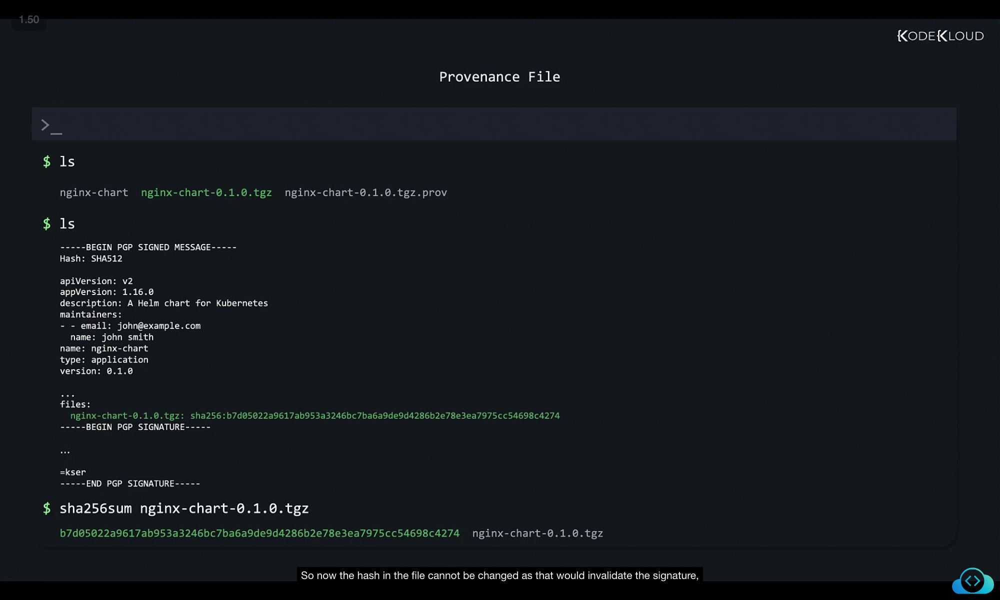


So when uploading your chart to some online repository, you should copy both the TGC chart archive and also the TGC.prov.provenance file. And we'll see how to do that in the next lesson. So when users have both of these files available, they can verify the integrity of the chart with the helm verify command with GPG v2. 

```
$ helm verify •/nginx-chart-0.1.0.tgz
Error: failed to load keyring: open /home/vagrant/•gnupg/pubring.gpg: no such file or directory
```
This will also complain because the newer GPG tool stores public keys in the newer format in the pubring.kbx file instead of the older pubring.gpg file that helm expects. So as a quick workaround, just so we're able to see how verify in action we can do this, we export our public key to a file called my public key, and then use helm verify command again, but also point helm to the location of the public key that can be used to verify the signature. 
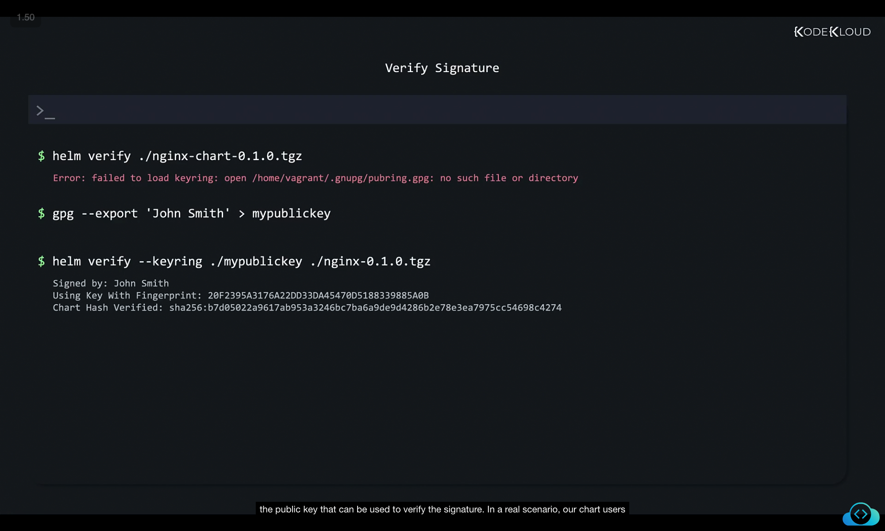

```
$ gpg --export 'John Smith' > mypublickey

$ helm verify --keyring ./mypublickey ./nginx-chart-0.1.0.tgz
Signed by: John Smith
Using Key With Fingerprint: 20F2395A3176A22DD33DA45470D518839885A0B
Chart Hash Verified: sha256:b7d5022a9617ab953a3246bc7ba6a9de9d4286b2e78e3ea7975cc54698c4274

```
In a real scenario, our chart users would first download our public key with a command like this. 
```
gpg --recv-keys --keyserver keyserver.ubuntu.com 8D40FE0CACC3FED4AD1C217180BA57AAFAAD1CA5
```
And only afterwards, they'd be able to use a helm verify command. So this assumes that we first uploaded our public key to the keyserver dot ubuntu.com key server. 
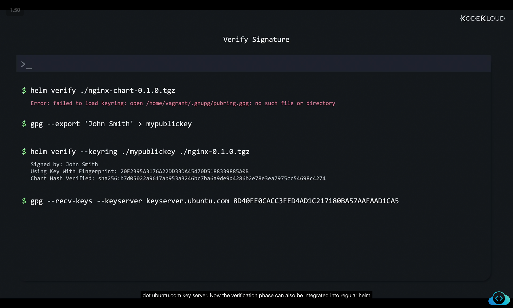

Now the verification phase can also be integrated into regular helm commands that we use so far, for example, to verify when we download a chart from the internet, or when installing a chart, we just add the --verify parameter to our commands. Now, of course, if the verification of signature fails, the install phase is abandoned. So we don't install charts that we can't trust. 
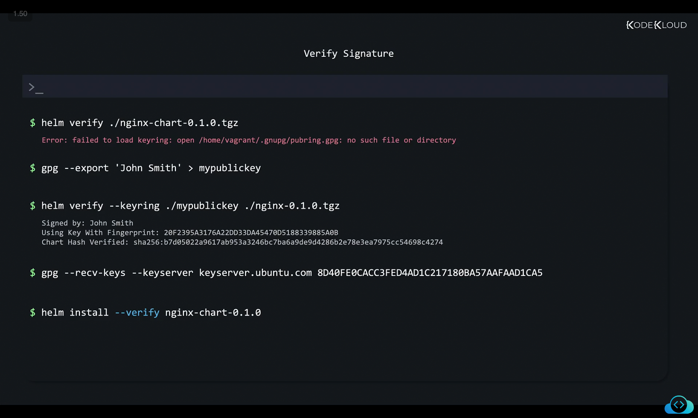

```
$ helm install --verify nginx-chart-0.1.0
```


Well, that's all for now about packaging and signing charts. And in the next video, we'll talk about uploading charts.

