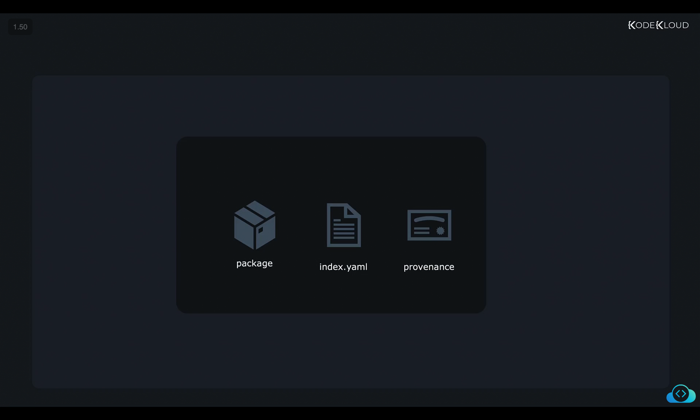
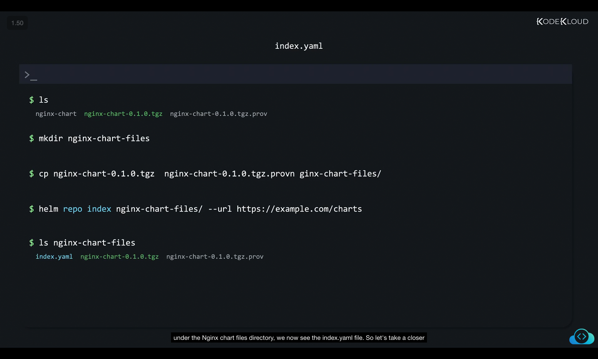
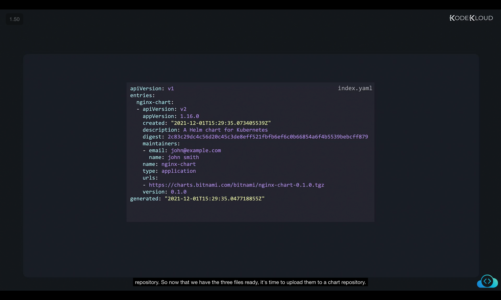
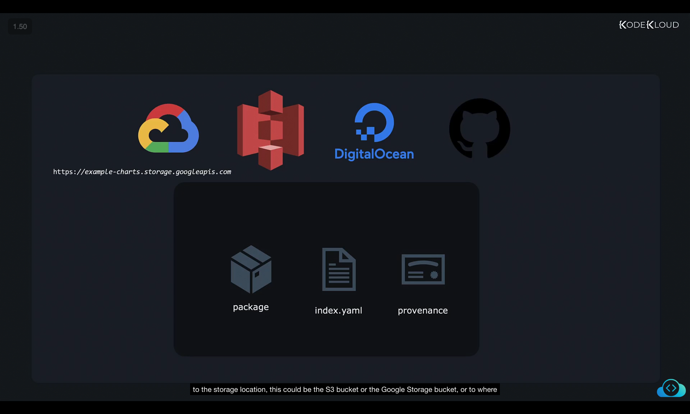
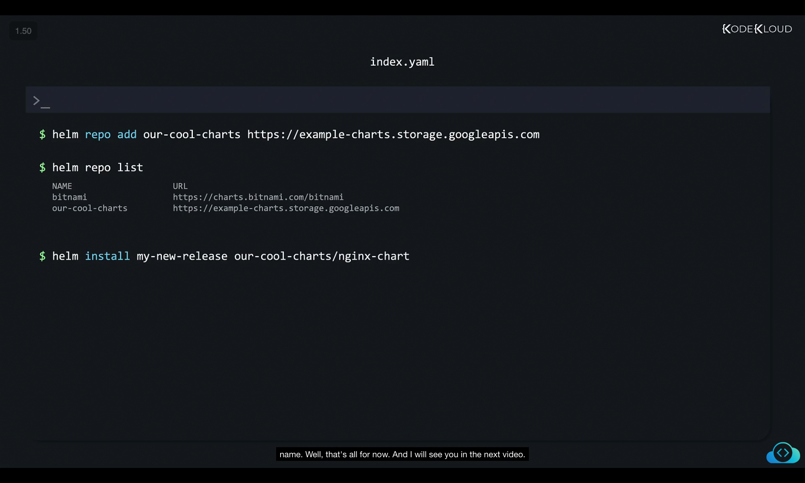

Now that we have packaged our chart and signed it, it's time to upload all of our hard work online so that our users can easily install it with a simple command like helm install my release, the repo / nginx or whatever it is that we have created. 

Now generally, our chart repositories will contain these things, the packaged chart in our case, this is the nginx chart.tgz file that we have created in the previous lesson, the index file and index.yaml file that we will soon create will contain information about the chart repository, the charts, it contains the checksums for our TGZ files, descriptions and so on. And this is the file that Helm will read when we add a new repository with a command like helm repo, where we add a repo to and point it to the chart repository, we'll soon take a look at what contents we have here so that we understand better. And finally, the provenance file we generated earlier in case users want to verify cryptographic signatures so that they can be sure that they download the content that was approved by us and not some potentially malicious content that some attacker could have uploaded to a compromised server. 


So currently, we have the package which ends with the .tgz extension, the provenance file with the .prov extension. And what we are missing is the index.yaml file. 
```
$ ls
nginx-chart  nginx-chart-0.1.0.tgz  nginx-chart-0.1.0.tgz.prov
```
To generate the index .yaml file, we first create a directory to group the required files together. And then we create a directory called nginx chart files and move these two files under it. 
```
$ mkdir nginx-chart-files
$ cp nginx-chart-0.1.0.tgz nginx-chart-0.1.0.tgz.prov nginx-chart-files/

```
Finally, we generate the index file, which is rather easy just using the Helm repo index command and passing the location of the directory that we just created, which has the necessary files, as well as point to the URL of the chart repository that we will be uploading this to under the Nginx chart files directory, we now see the index.yaml file.
```
$ helm repo index nginx-chart-files/ --url https://example.com/charts
```

```
$ ls
index.yaml nginx-chart-0.1.0.tgz  nginx-chart-0.1.0.tgz.prov
```



So let's take a closer look at that index.yaml file. The info we see here is pretty straightforward. As far as Helm is concerned, the URLs section is what is most important. So this tells it the locations from where it can download charts whenever users want to install something from this repository. And it also lists all the entries that are the charts that are available in this particular repository. 

index.yaml
```
apiVersion: v1
entries:
  nginx-chart:
    - apiVersion: v2
      appVersion: 1.16.0
      created: "2021-12-01T15:29:35.073405539Z"
      description: A Helm chart for Kubernetes
      digest: 2c83c29dc4c56d20c45c3de8ef521fbfbe6f6c0b66854a6f4b5339bebcff879
      maintainers:
        - email: john@example.com
          name: john smith
      name: nginx-chart
      type: application
      urls:
        - https://charts.bitnami.com/bitnami/nginx-chart-0.1.0.tgz
      version: 0.1.0
generated: "2021-12-01T15:29:35.047718855Z"
```


So now that we have the three files ready, it's time to upload them to a chart repository. Now, the upload just works like any upload, you could just upload your charts to wherever you want, such as a web server that you control or a service like Google Cloud Storage bucket or Amazon S3 bucket, a DigitalOcean object storage and so on. And so these services are very cost effective and super easy to maintain, you could upload the files to GitHub Pages as well. And there's a process for that. So when you upload, once you upload these files, get the URL to the storage location, this could be the S3 bucket or the Google Storage bucket, or to where you have uploaded the file. And then all that you need is share that URL to those who need to download your chart. 


And so as we discussed earlier, add the repository to the local Helm repos list. So run the Helm repo add command to add the new repository, and then run the Helm repo list command to confirm that the new repository has been added. And then we install our new cool chart using the Helm install command, and then specify the repository name slash the chart name. 



```
$ helm repo add our-cool-charts https://example-charts.storage.googleapis.com
```

```
$ helm repo list
NAME            URL
bitnami         https://charts.bitnami.com/bitnami
our-cool-charts https://example-charts.storage.googleapis.com
```

```
$ helm install my-new-release our-cool-charts/nginx-chart
```

Well, that's all for now. And I will see you in the next video.
