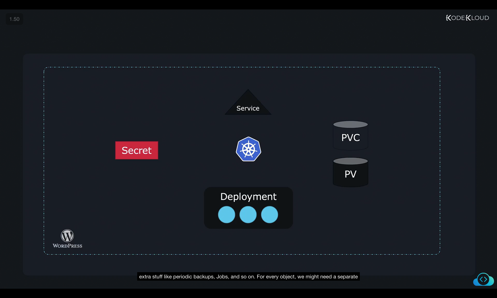
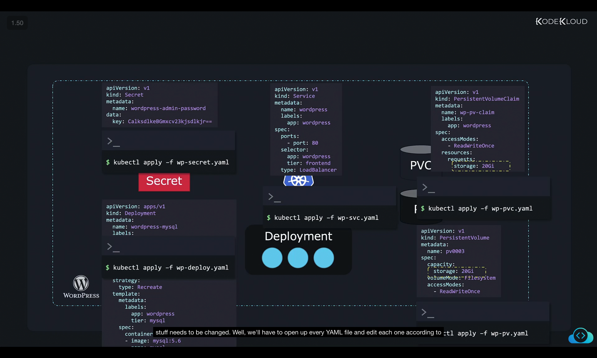
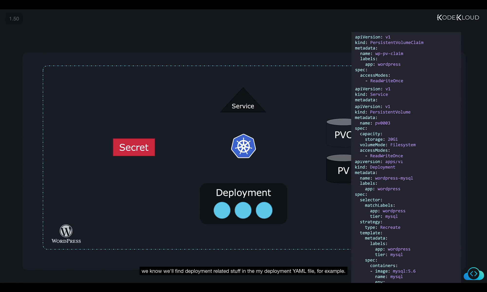
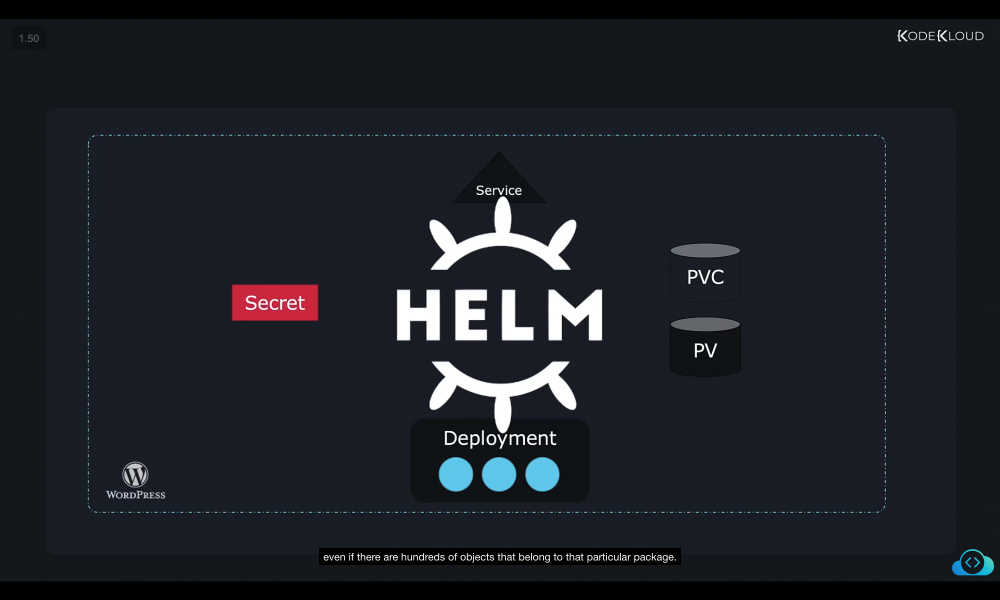
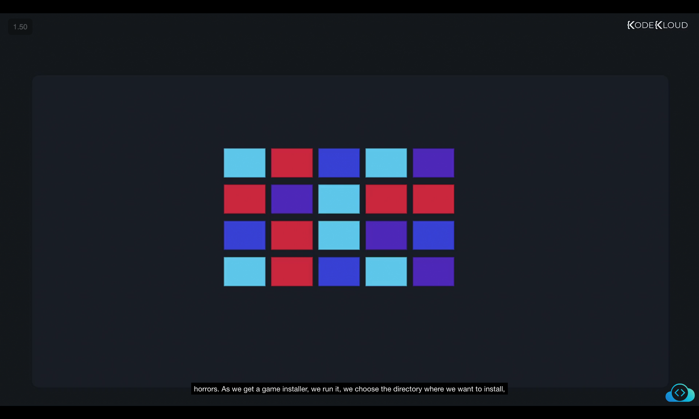
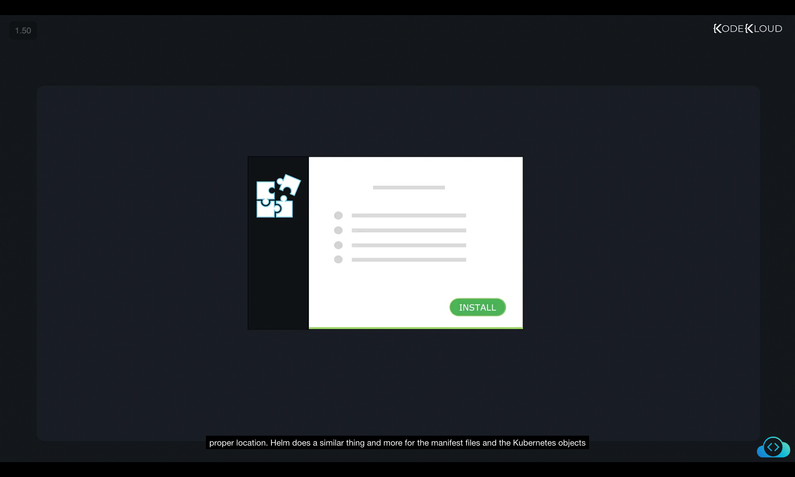
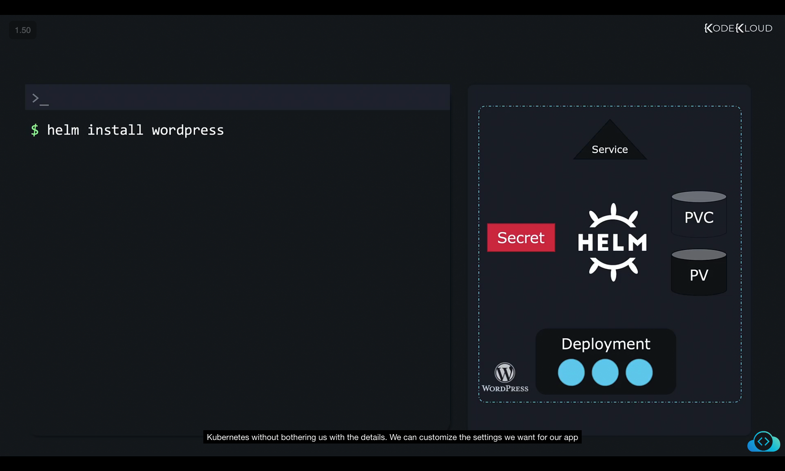
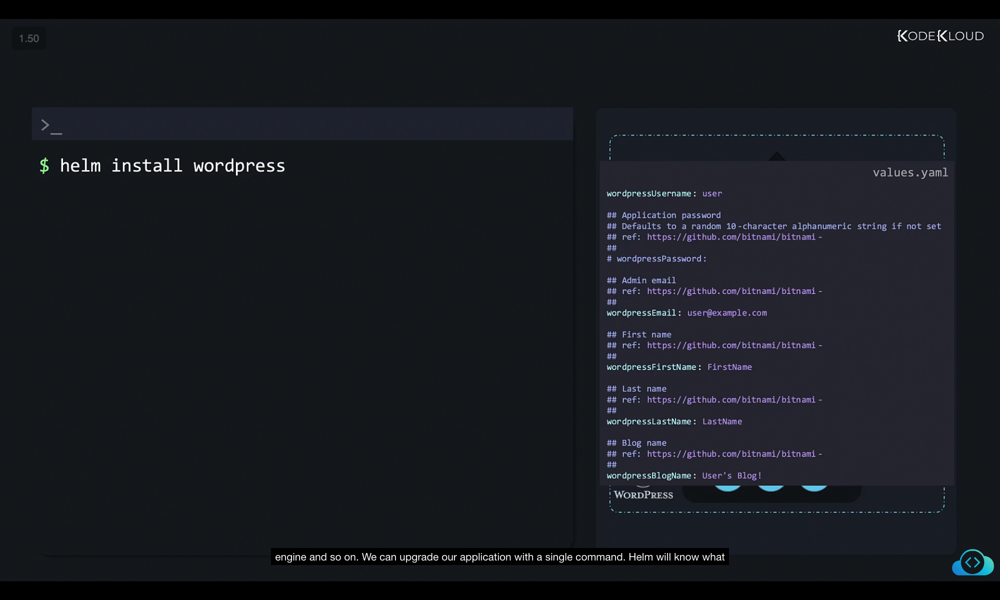
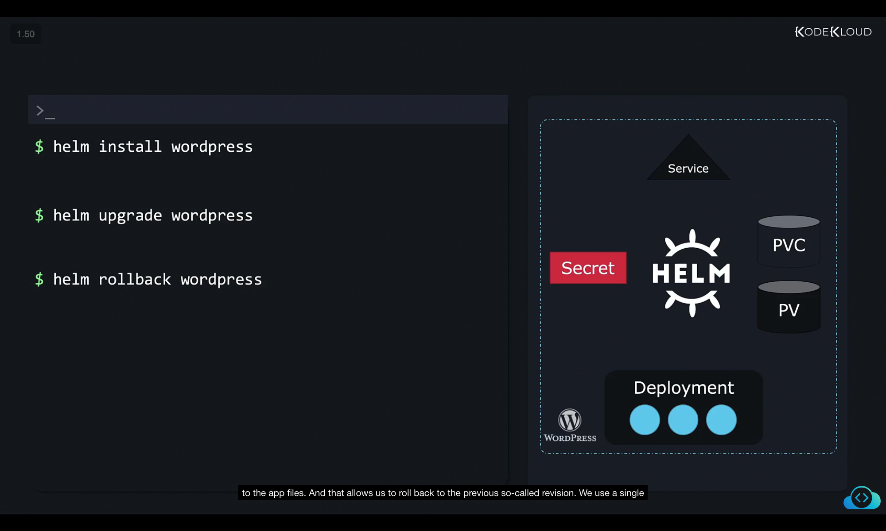

# Introduction to Helm

## 1. The Problem with Raw Kubernetes

Kubernetes is great at managing **complex infrastructures**, but humans struggle with managing complexity manually.

Applications in Kubernetes are made up of **many interconnected objects**.

### Example: WordPress Application

Even a simple WordPress site may require:

* **Deployment** → runs Pods (MySQL DB + WordPress web server).
* **PersistentVolume (PV)** → stores the database.
* **PersistentVolumeClaim (PVC)** → links Pods to PVs.
* **Service** → exposes the web server to the internet.
* **Secret** → stores credentials (admin passwords).
* **Jobs / CronJobs** → periodic backups, automation, etc.



---

### The YAML Problem

Each object requires its **own YAML file**.

* You apply them one by one:

  ```bash
  kubectl apply -f deployment.yaml
  kubectl apply -f service.yaml
  kubectl apply -f secret.yaml
  ...
  ```

#### Customization issues:

* Default YAMLs may not fit your needs.
* Example:

  * PV set to `20Gi`.
  * You need `100Gi`.
  * You must **open and edit the PV YAML file manually**.



---

### Maintenance Issues

1. **Upgrades** → When a component updates, you must carefully modify **multiple YAMLs** again.
2. **Uninstalls** → You must manually delete all YAML-defined objects.
3. **Single Huge YAML File** → Could combine everything into one file, but it might be 25+ pages long.

   * Hard to search.
   * Hard to troubleshoot.



---

## 2. Enter Helm

Kubernetes itself doesn’t know that:

* A PV, a Deployment, a Secret, and a Service all belong to the same app.
* It just creates objects individually.

👉 Helm solves this problem.

### What Helm Does

* Treats related objects as **one package** (called a **chart**).
* Helm is often called a **package manager for Kubernetes**.
* You don’t act on objects → you act on **apps (packages)**.
* Helm knows:

  * Which objects belong to the app.
  * How to install, upgrade, rollback, and delete them.



---

## 3. Analogy: Installing a Computer Game

A modern game consists of:

* Executables.
* Audio files.
* Graphics, textures, and images.
* Config files.



If you had to download and arrange each file manually → chaos.

Instead, you run an **installer**:

* Choose install directory.
* Click “Install”.
* The installer arranges thousands of files in the right places.



👉 Helm is like that **installer** for Kubernetes apps.

---

## 4. How Helm Works

### Install Applications Easily

```bash
helm install wordpress
```

* One command = deploys all required Kubernetes objects.
* Even if it needs **hundreds of objects**, Helm handles it.



---

### Customize with `values.yaml`

* Instead of editing multiple YAMLs manually…
* Use a **single file (`values.yaml`)** to override defaults.

Examples of values you can set:

* PV size (`100Gi`).
* Website name.
* Admin password.
* Database settings.



---

### Upgrade with One Command

```bash
helm upgrade wordpress
```

* Helm compares old vs new state.
* Changes only the necessary objects.


---

### Rollback to Previous Revision

```bash
helm rollback wordpress
```

* Reverts app back to the last working state.



---

### Uninstall Cleanly

```bash
helm uninstall wordpress
```

* Helm knows all objects created by this release.
* Deletes them all in one step.
* No need to remember every object.

---

## 5. Helm as a Tool

Helm plays **two roles**:

1. **Package Manager** (like apt, yum, or npm):

   * Install/uninstall apps.
   * Manage versions.
   * Keep apps consistent.

2. **Release Manager**:

   * Upgrade apps.
   * Rollback apps.
   * Keep track of revisions.

👉 Most importantly:

* Helm lets us treat Kubernetes apps as **apps**.
* No more micromanaging individual Kubernetes objects.

---

## 6. Key Takeaways

* Kubernetes apps = many YAMLs.
* Manual management = error-prone and tedious.
* Helm bundles objects into **charts** (packages).
* Helm commands:

  * Install → `helm install`
  * Upgrade → `helm upgrade`
  * Rollback → `helm rollback`
  * Uninstall → `helm uninstall`
* Use `values.yaml` for easy customization.

✅ With Helm, we manage apps → not scattered objects.

---

Would you like me to also make a **comparison table** (Manual Kubernetes vs Helm) at the end of these notes so you can quickly revise differences side by side?
