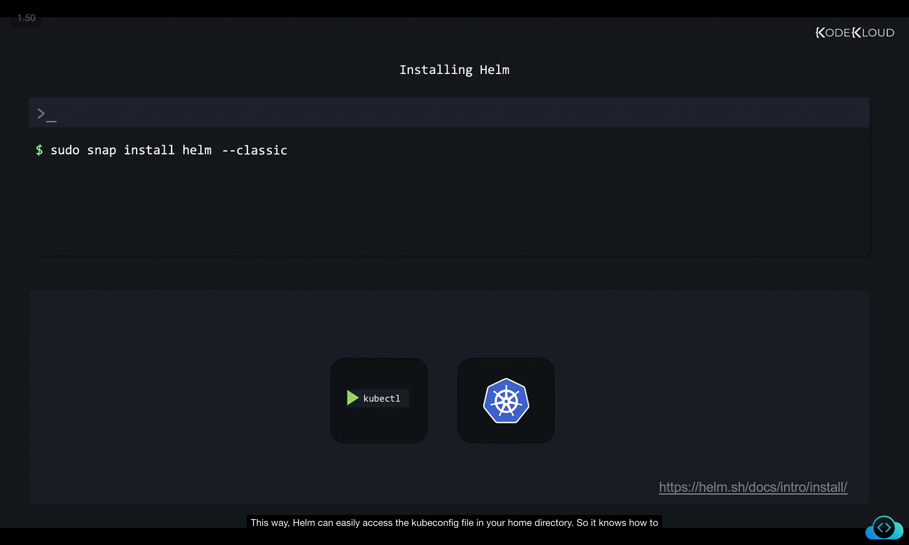

```
](../03-class-installation-and-configuration/image
](../03-class-installation-and-configuration/image
```
Got it 👍 Let’s rewrite and organize this section into **structured study notes** so it’s easier to review. I’ll preserve your screenshot reference and commands while making everything crisp, clear, and logically structured.

---

# Installing Helm

Before installing Helm, ensure that:

* You already have a **functional Kubernetes cluster**.
* `kubectl` is **installed and configured**.
* Your **kubeconfig file** has the correct login details for accessing the target cluster.

---

## 1. Installing Helm on Linux (via Snap)

```bash
sudo snap install helm --classic
```

* The `--classic` flag installs Helm in a **relaxed sandbox mode**, giving it more access to the host system.
* This is necessary so Helm can easily access the `~/.kube/config` file and connect to your Kubernetes cluster.



---

## 2. Installing Helm on Debian/Ubuntu (via APT)

For **apt-based systems** (Debian/Ubuntu), first add Helm’s GPG key and repository:

```bash
curl https://baltocdn.com/helm/signing.asc | sudo apt-key add -
sudo apt-get install apt-transport-https --yes
echo "deb https://baltocdn.com/helm/stable/debian/ all main" \  | sudo tee /etc/apt/sources.list.d/helm-stable-debian.list
sudo apt-get update
sudo apt-get install helm
```

---

## 3. Installing Helm on FreeBSD (via PKG)

```bash
pkg install helm
```


---

## 4. Other Operating Systems

* Helm can also be installed on **Windows** and **macOS**.
* Always refer to the [official Helm installation docs](https://helm.sh/docs/intro/install/) for the latest instructions tailored to your OS and package manager.

---

## ✅ Key Takeaway

* Snap → `sudo snap install helm --classic` (Linux with Snap support).
* APT → Add Helm repo + `sudo apt-get install helm` (Debian/Ubuntu).
* PKG → `pkg install helm` (FreeBSD).
* Documentation → Always check official Helm docs for updates.

---

👉 Next step after installation: **practice using Helm commands in your Kubernetes lab environment.**

---

Would you like me to also create a **flow diagram / quick reference cheatsheet** for Helm installation methods (Snap vs APT vs PKG vs Others) so you can recall them at a glance?
