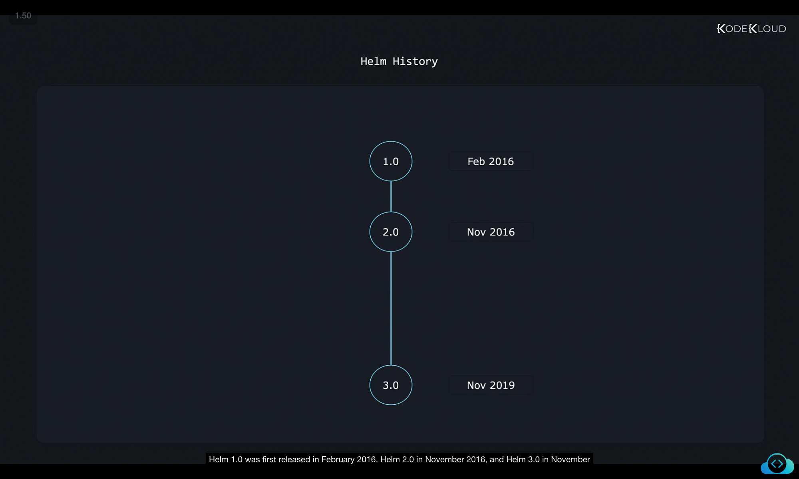
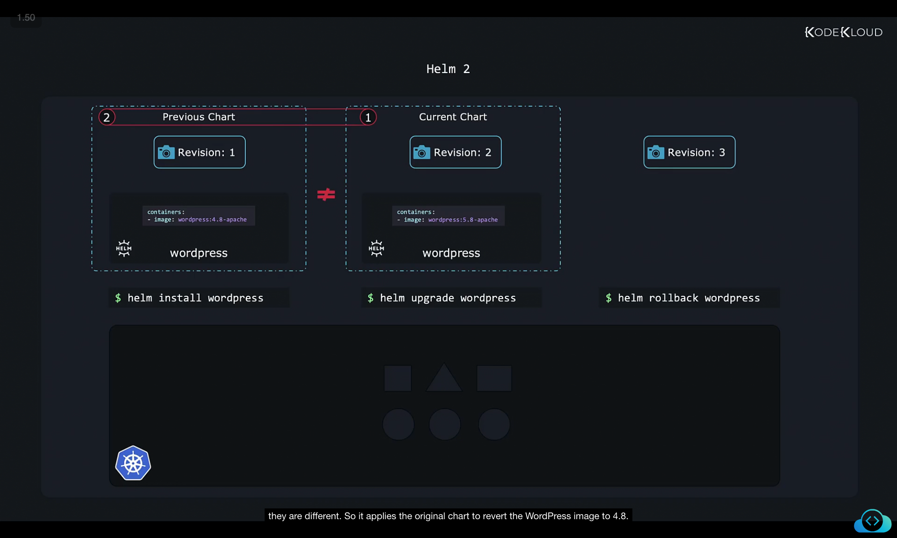

# Helm 2 vs Helm 3 — Detailed Notes

Helm has evolved significantly since its first release. Understanding the differences between Helm 2 and Helm 3 is crucial because you may encounter references to both versions in blogs, documentation, or charts.

---

## 1. Brief History of Helm

* **Helm 1.0** → Released in **February 2016**
* **Helm 2.0** → Released in **November 2016**
* **Helm 3.0** → Released in **November 2019**



Since its initial launch in 2016, Helm has matured alongside Kubernetes. As Kubernetes itself gained new features (e.g., Role-Based Access Control, Custom Resource Definitions), Helm also improved.

In our lessons, we’ll focus on **Helm 3**, which has:

* A **simpler** and **smarter** design
* Improved **security**
* Better **integration** with Kubernetes

---

## 2. Helm Architecture in Helm 2 vs Helm 3

### Helm CLI

Helm always had a **CLI client** installed locally. This client communicates with the Kubernetes cluster to install, upgrade, or manage charts.

### Helm 2: Use of Tiller

* Helm 2 introduced an **extra component** called **Tiller**.
* Why? Because Kubernetes (at that time) lacked key features like **RBAC** and **CRDs** (Role Based Access Control and Custom Resource Definitions).
* Tiller acted as a **middleman**:

  1. Helm client → sends request → Tiller
  2. Tiller → communicates with Kubernetes → executes request


#### Drawbacks of Tiller

* **Complexity** → Added an unnecessary layer.
* **Security issues** → By default, Tiller had **cluster-wide admin (God mode)** permissions.

  * Good: could install anything.
  * Bad: **anyone with Tiller access** could perform dangerous operations in the cluster.


---

### Helm 3: Removal of Tiller

As Kubernetes introduced **RBAC** and **CRDs**, Tiller became unnecessary.

* **Tiller was removed in Helm 3**.
* Now the Helm client communicates **directly** with Kubernetes.


#### Benefits

* **Simplified architecture** → fewer moving parts.
* **Improved security** with Kubernetes-native RBAC.
* Now, whether you use `kubectl` or `helm`, RBAC policies **apply equally**.


✅ **Key Difference #1**:

* Helm 2 = had Tiller
* Helm 3 = no Tiller (direct communication with Kubernetes)

---

## 3. Revisions and Rollbacks in Helm

Helm maintains **revisions** of releases, similar to **snapshots**.

### Example Workflow

```bash
helm install wordpress
```

* Creates **Revision 1**

```bash
helm upgrade wordpress
```

* Creates **Revision 2**

```bash
helm rollback wordpress
```

* Returns to **Revision 1** (new revision 3 also created)


Each action (install, upgrade, rollback) creates a **new revision**.

---

### Helm 2: Rollback Mechanism

Helm 2 rollback worked by:

1. Comparing the **current chart** with the **previous chart**.
2. Re-applying the previous chart if differences exist.



#### Problem

If changes were made **manually** (outside Helm), Helm 2 **could not detect them**.

Example:

```bash
$ helm install wordpress   # Revision 1

$ kubectl set image wordpress wordpress:5   # Manual change

$ helm rollback wordpress  # Does nothing
```


Because Helm 2 only compared charts, **manual changes were ignored**.

---

### Helm 3: Three-Way Strategic Merge Patch

Helm 3 introduced a **smarter rollback mechanism** called **three-way strategic merge patch**.

Helm 3 compares:

1. **Current chart**
2. **Target chart (to rollback/upgrade to)**
3. **Live state of Kubernetes objects**


#### Benefit

* Detects **manual changes** made outside Helm.
* Ensures rollbacks/upgrades preserve both:

  * Desired chart state
  * Live cluster changes

✅ **Key Difference #2**:

* Helm 2 → compared only current vs previous chart.
* Helm 3 → compares **current chart, target chart, and live state**.

---

## 4. Helm 2 vs Helm 3: Upgrades

* **Helm 2 Problem**:
  If you modified Kubernetes objects manually, upgrades would overwrite your changes (since Helm didn’t check live state).

* **Helm 3 Solution**:
  During upgrades, Helm 3 looks at **charts + live state**.

  * Preserves manual changes.
  * Applies new upgrades without discarding modifications.

---

## ✅ Summary: Key Differences Between Helm 2 and Helm 3

| Feature          | Helm 2                                     | Helm 3                                       |
| ---------------- | ------------------------------------------ | -------------------------------------------- |
| **Architecture** | Required **Tiller**                        | No Tiller (direct Helm → Kubernetes)         |
| **Security**     | Tiller had cluster-wide privileges         | Uses Kubernetes-native RBAC                  |
| **Rollbacks**    | Compared only charts (missed manual edits) | Three-way merge: chart + live state + target |
| **Upgrades**     | Overwrote manual changes                   | Preserves manual changes                     |
| **Complexity**   | More complex due to Tiller                 | Simplified, smarter design                   |

---

