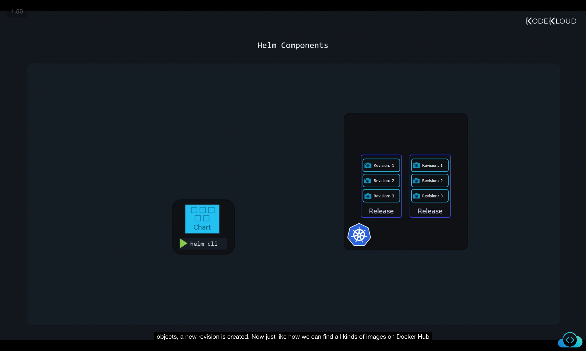
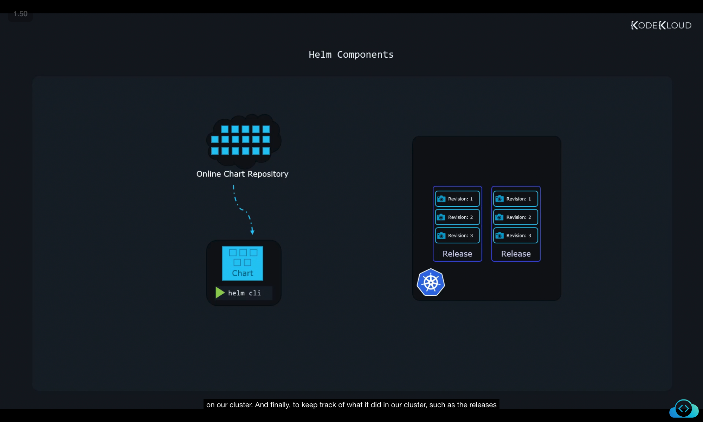
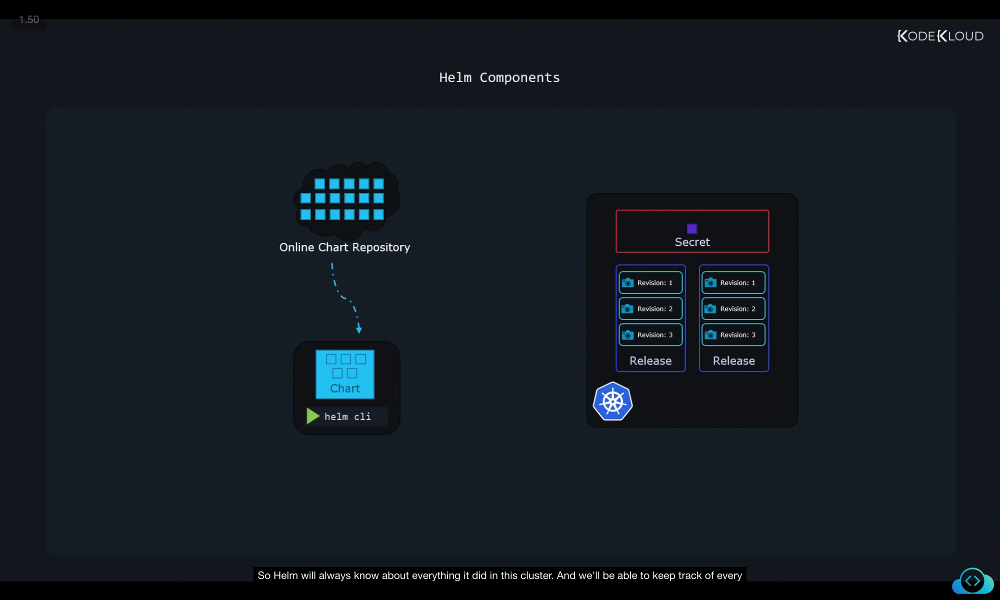
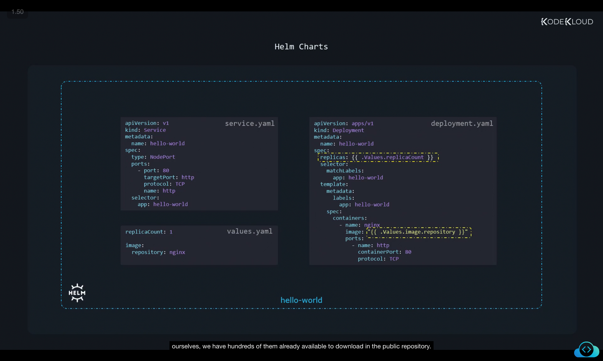
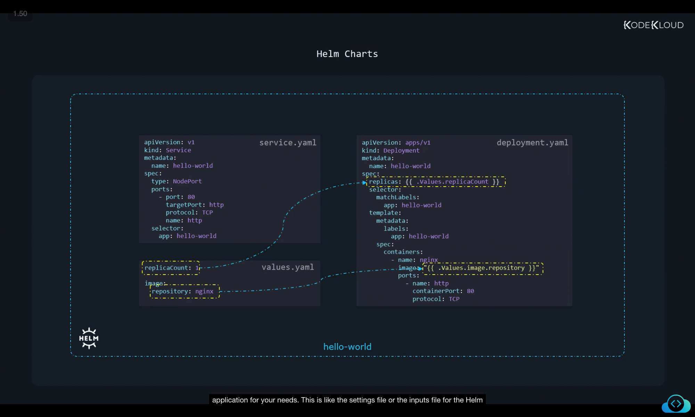
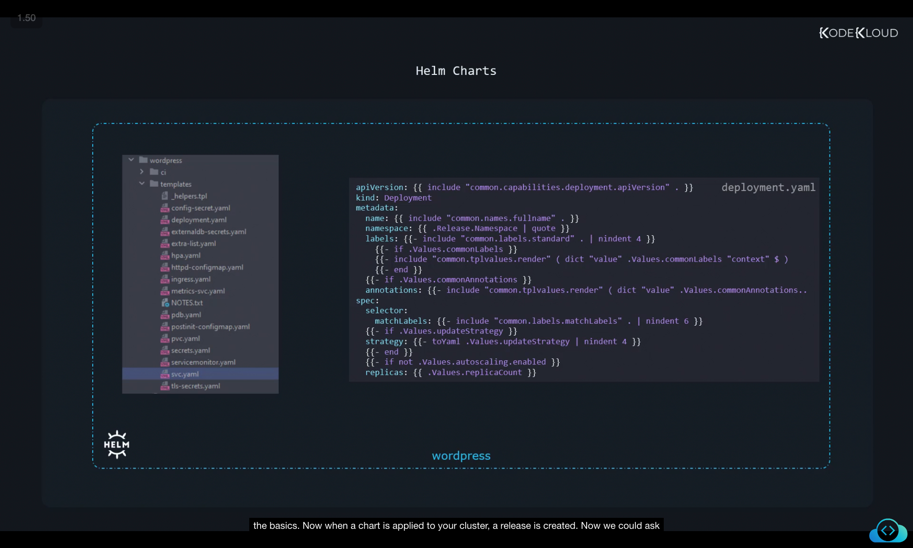
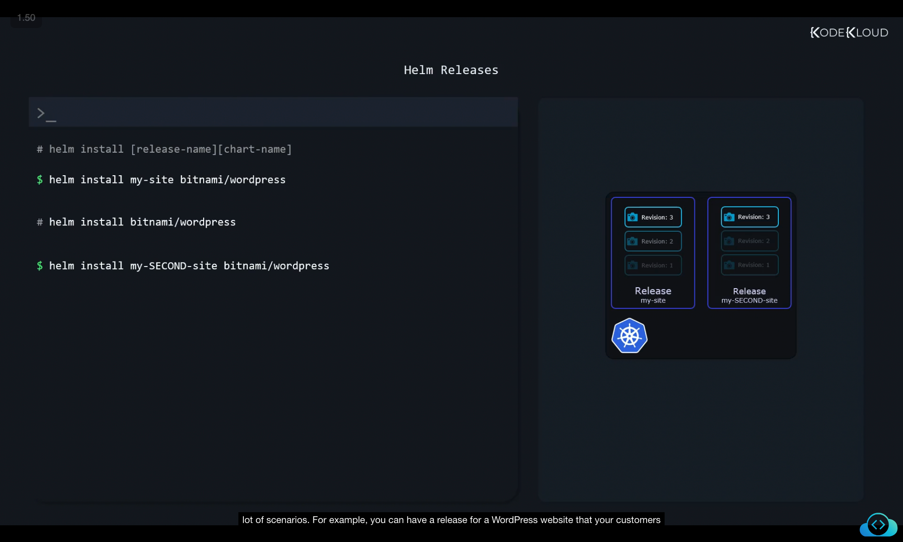
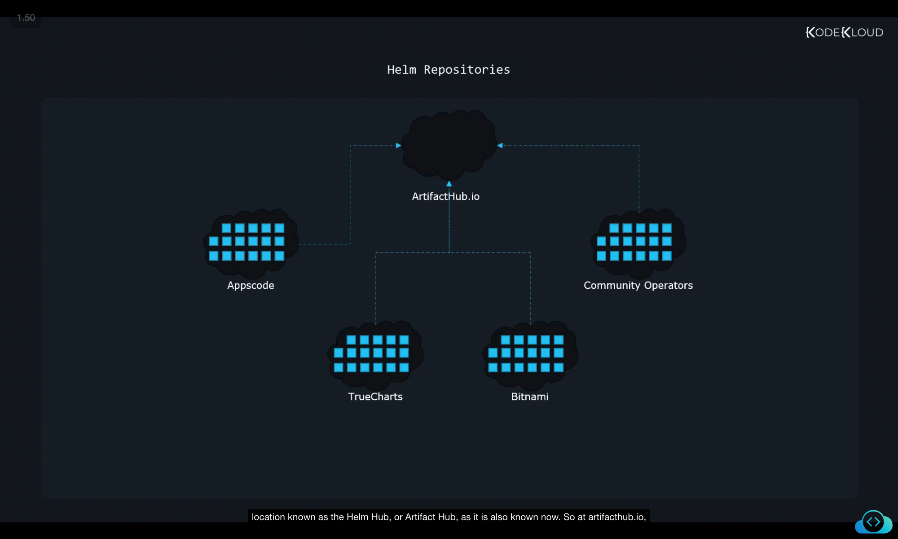
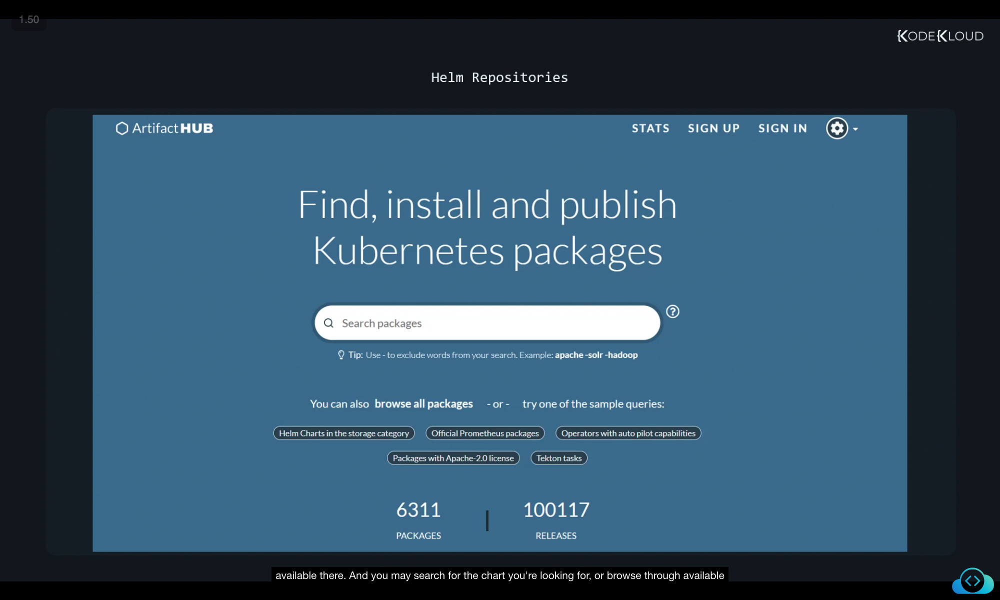
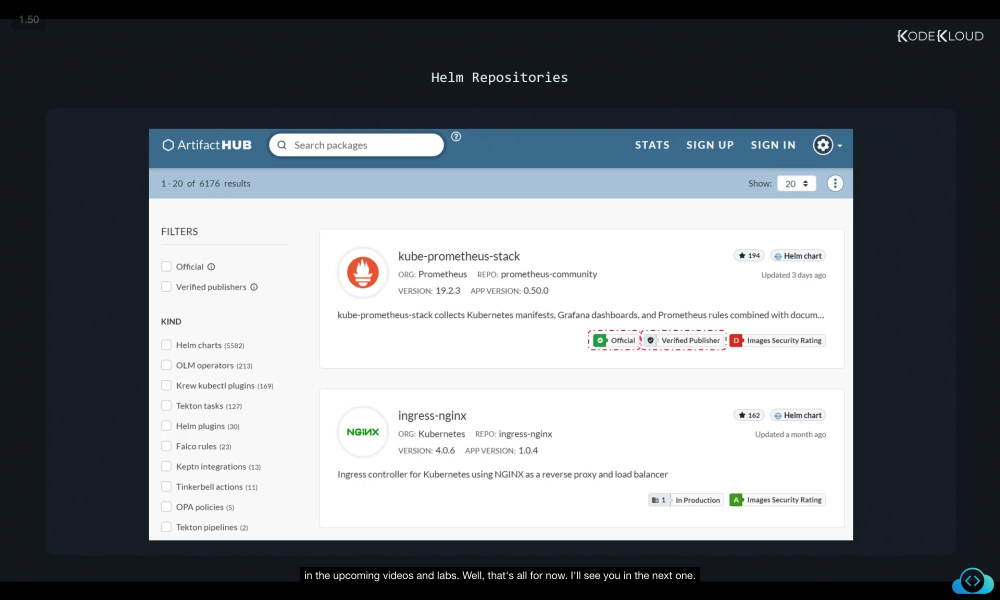

# Helm Components and Structure

Helm is made up of several components that work together to manage applications on Kubernetes. To understand Helm properly, let’s go through its **main pieces, concepts, and workflow** step by step.

---

## 1. Helm CLI (Command Line Interface)

* Helm provides a **CLI utility** that you install on your local system.
* Using this CLI, you can perform actions such as:

  * Installing a chart
  * Upgrading a release
  * Rolling back to a previous version
  * Managing repositories and releases

This is the main tool we will interact with when working with Helm.

---

## 2. Charts – The Building Blocks of Helm

* **Charts** are at the heart of Helm.
* A **Chart** is a collection of files that define:

  * What Kubernetes objects need to be created (Deployments, Services, ConfigMaps, etc.)
  * How these objects should be configured
* In other words:

  * A chart is like a **blueprint/template** for deploying an application on Kubernetes.
* When you install a chart, Helm follows the instructions in the chart to create the necessary Kubernetes objects.

---

## 3. Releases – Installing a Chart

* When you **install a chart**, Helm creates a **Release**.
* A **Release** = one installation of a chart.
* Each release is tracked independently and has its own:

  * **Name** (you assign this when you install it)
  * **History of revisions**

👉 Every time you modify a release (upgrade, rollback, reconfigure), Helm creates a **new revision** of that release.



---

## 4. Helm Repositories

* Just like:

  * **Docker images** are stored in Docker Hub
  * **Vagrant boxes** are stored in Vagrant Cloud
* **Helm charts** are stored in **repositories**.

You can:

* Download charts from public repositories (like Bitnami, Artifact Hub).
* Install them directly into your Kubernetes cluster.



---

## 5. Metadata Storage (Helm’s State Tracking)

* Helm needs to **track what it has done** in your cluster (e.g., releases, charts, revisions).
* This data is called **metadata** (i.e., data about data).
* Helm **does not store this locally**. Instead:

  * Helm stores metadata as **Kubernetes Secrets inside your cluster**.
  * This ensures:

    * State survives even if your local computer is lost.
    * Teams can collaborate since all Helm release data lives in the cluster itself.



---

# Deep Dive into Helm Components

Let’s now break down each component in more detail with examples.

---

## Charts in Detail

* A Helm chart = **a collection of YAML templates + a values file**.
* Templates contain placeholders (`{{ }}`) for variables.
* The **values.yaml** file provides the default values for those placeholders.

### Example: HelloWorld Application

**Service (service.yaml):**

```yaml
apiVersion: v1
kind: Service
metadata:
  name: hello-world
spec:
  type: NodePort
  ports:
    - port: 80
      targetPort: http
      protocol: TCP
      name: http
  selector:
    app: hello-world
```

**Deployment (deployment.yaml):**

```yaml
apiVersion: apps/v1
kind: Deployment
metadata:
  name: hello-world
spec:
  replicas: {{ .Values.replicaCount }}
  selector:
    matchLabels:
      app: hello-world
  template:
    metadata:
      labels:
        app: hello-world
    spec:
      containers:
        - name: nginx
          image: {{ .Values.image.repository }}
          ports:
            - name: http
              containerPort: 80
              protocol: TCP
```

**Values file (values.yaml):**

```yaml
replicaCount: 1
image:
  repository: nginx
```

* Notice how `replicaCount` and `image.repository` are not hardcoded.
* They are pulled from `values.yaml`.
* This makes charts reusable and configurable.



---

## Values.yaml – The Configuration File

* **values.yaml** = the central place for all configurable parameters of a chart.
* When you install a chart, you often only need to change this file to customize deployment.
* Think of it as the **settings file** for your Helm package.



---

## More Complex Charts (e.g., WordPress)

* Some charts (like WordPress) are **much more complex** than the simple HelloWorld chart.
* They include:

  * Multiple templates
  * Nested functions
  * Advanced templating logic

Example (WordPress deployment snippet):

```yaml
apiVersion: {{ include "common.capabilities.deployment.apiVersion" . }}
kind: Deployment
metadata:
  name: {{ include "common.names.fullname" . }}
  namespace: {{ .Release.Namespace | quote }}
  labels:
    {{- include "common.labels.standard" . | nindent 4 }}
```

* Don’t worry if this looks complicated — for now, focus on simple charts.
* We will explore **templating** and advanced usage later in the course.



---

## Releases in Action

### Install a Release:

```bash
helm install my-site bitnami/wordpress
```

* Here:

  * Chart = `bitnami/wordpress`
  * Release = `my-site`

### Install another release from the same chart:

```bash
helm install my-second-site bitnami/wordpress
```

* Two releases, both based on the same chart, but **tracked separately**.



📌 Why Releases?

* You can deploy multiple instances of the same chart.
* Example use case:

  * One WordPress release for production.
  * Another WordPress release for development/testing.

---

## Helm Repositories and Artifact Hub

* Helm charts are hosted by multiple providers (Bitnami, Apps Code, TrueCharts, etc.).
* Instead of browsing each one separately, all charts are aggregated at:

  * [Artifact Hub](https://artifacthub.io) (previously Helm Hub).



* As of now, **6300+ charts** are available.
* You can search, browse, and install charts directly from there.



* Some charts are **officially published by the project developers** themselves.
* These appear with **official/verified publisher badges**.
* Prefer these whenever possible.



---

# Summary

* **Helm CLI**: Tool for managing charts and releases.
* **Charts**: Templates that define Kubernetes applications.
* **Releases**: Installed instances of charts (trackable with revisions).
* **Values.yaml**: Configurable file for customizing charts.
* **Repositories**: Where charts are stored (Artifact Hub as central index).
* **Metadata**: Helm saves release state inside the Kubernetes cluster as Secrets.

This structure makes Helm a **powerful package manager for Kubernetes**, allowing easy deployment, upgrades, rollbacks, and collaboration.


