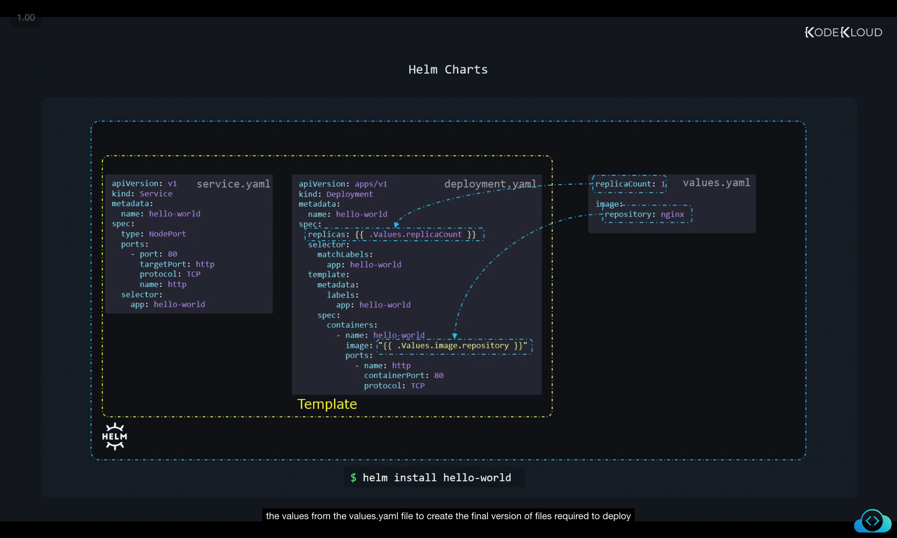
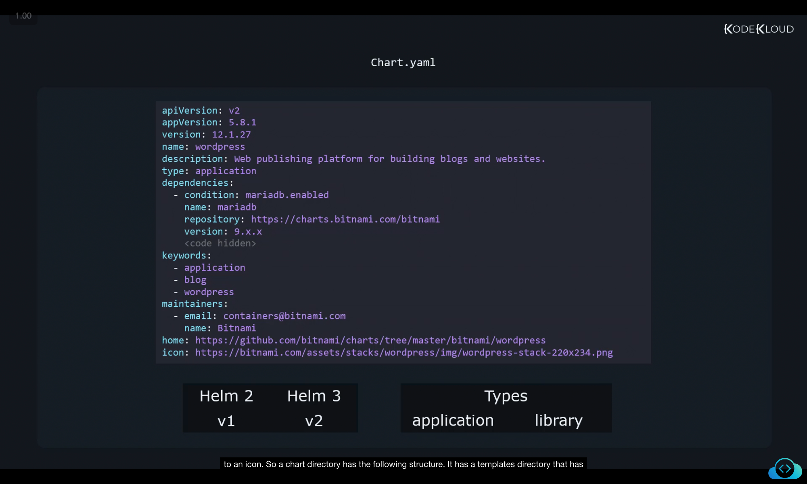
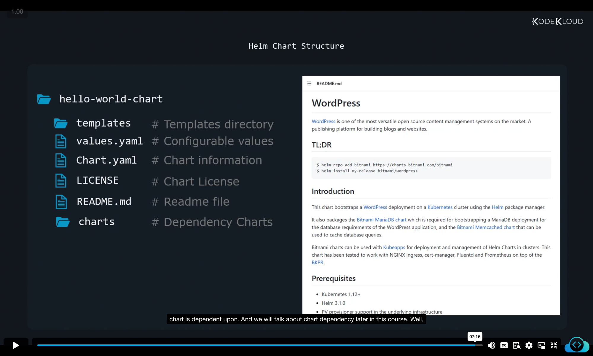

```
](../06-class-helm-charts/image
](../06-class-helm-charts/image
```
 Here’s a **structured, rewritten, and detailed version of your notes**. I’ve kept all screenshots (like ``) exactly as they are, and organized the content into **sections, bullet points, code snippets, and explanations** for clarity. You can paste this directly into your `.md` file.

---

# Helm Charts – Deep Dive Notes

Helm is a **powerful package manager** and automation tool for Kubernetes. It simplifies the process of deploying, upgrading, and managing applications in Kubernetes clusters.

---

## 1. Helm as an Automation Tool

* Helm acts as a **command-line tool** where we specify the *desired state* of an application.
* Example command:

  ```bash
  helm install hello-world
  ```
* Helm then:

  * Figures out all the Kubernetes objects needed.
  * Executes the necessary steps in the correct order.
  * Shields us from manually creating multiple YAML manifests.

➡️ Think of Helm as an **automation engine**:

* We specify *what* we want (`install`, `upgrade`, `rollback`).
* Helm takes care of *how* it happens.

---

## 2. The Role of Charts

* Helm works using **Charts**, which act like an **instruction manual**.
* Charts are collections of text/YAML files that define:

  * Kubernetes objects (Deployments, Services, ConfigMaps, etc.)
  * Configuration defaults
  * Metadata about the application

### Example: Installing with a Chart

```bash
helm install hello-world
```

Helm will look at the chart files → render templates with values → create Kubernetes manifests → apply them to the cluster.

---

## 3. Core Files in a Helm Chart

### (a) **values.yaml**

* Holds **configurable values** for the chart.
* This is usually the **only file users need to modify**.
* Example:

  ```yaml
  replicaCount: 1
  image:
    repository: nginx
  ```
* These values are **inserted into templates** using Helm's templating engine (`{{ ... }}`).

---

### (b) **Templates (service.yaml, deployment.yaml)**

Templates use **placeholders** (`{{ ... }}`) that are dynamically replaced with values from `values.yaml`.

#### service.yaml

```yaml
apiVersion: v1
kind: Service
metadata:
  name: hello-world
spec:
  type: NodePort
  ports:
    - port: 80
      targetPort: http
      protocol: TCP
      name: http
  selector:
    app: hello-world
```

#### deployment.yaml

```yaml
apiVersion: apps/v1
kind: Deployment
metadata:
  name: hello-world
spec:
  replicas: {{ .Values.replicaCount }}
  selector:
    matchLabels:
      app: hello-world
  template:
    metadata:
      labels:
        app: hello-world
    spec:
      containers:
        - name: hello-world
          image: "{{ .Values.image.repository }}"
          ports:
            - name: http
              containerPort: 80
              protocol: TCP
```

➡️ Notice how `replicas` and `image` are replaced using values from `values.yaml`.



---

### (c) **Chart.yaml**

* Provides **metadata about the chart** itself.
* Required in every Helm chart.

#### Example 1 – Simple Hello World

```yaml
apiVersion: v2
appVersion: "1.16.0"
name: hello-world
description: A web application
type: application
```

#### Example 2 – WordPress Chart

```yaml
apiVersion: v2
appVersion: 5.8.1
version: 12.1.27
name: wordpress
description: Web publishing platform for building blogs and websites.
type: application
dependencies:
  - condition: mariadb.enabled
    name: mariadb
    repository: https://charts.bitnami.com/bitnami
    version: 9.x.x
keywords:
  - application
  - blog
  - wordpress
maintainers:
  - email: containers@bitnami.com
    name: Bitnami
home: https://github.com/bitnami/charts/tree/master/bitnami/wordpress
icon: https://bitnami.com/assets/stacks/wordpress/img/wordpress-stack-220x234.png
```

---

## 4. Key Fields in `Chart.yaml`

1. **apiVersion**

   * Defines chart API version:

     * `v1`: Charts for Helm 2
     * `v2`: Charts for Helm 3 (supports new fields like `dependencies`, `type`)
   * ✅ Always set `apiVersion: v2` for new charts.

2. **appVersion**

   * Version of the application being deployed.
   * Informational only (does not control chart versioning).

3. **version**

   * Version of the **chart itself**.
   * Independent from `appVersion`.
   * Used to track changes in chart definitions.

4. **name & description**

   * Identifies the chart.

5. **type**

   * Two types:

     * `application`: default, for deployable applications.
     * `library`: provides helper functions/templates for other charts.

6. **dependencies**

   * Charts that this chart relies on.
   * Example: WordPress depends on MariaDB.
   * Instead of writing DB manifests inside the chart, simply declare it as a dependency.

   

7. **keywords**

   * Tags to help search the chart in public repos.

8. **maintainers**

   * List of maintainers with email/contact.

9. **home & icon**

   * Optional fields:

     * `home`: link to project homepage/repository.
     * `icon`: image representing the app.

---

## 5. Helm Chart Directory Structure

```
hello-world-chart/
├── templates/   # YAML template files
├── values.yaml  # Configurable values (user-modifiable)
├── Chart.yaml   # Metadata about the chart
├── LICENSE      # contains chart license.
├── README.md    # Documentation about the chart
└── charts/      # contains other charts if this chart has dependencies.
```

### Additional Files

* **LICENSE** → contains chart license.
* **README.md** → human-readable documentation.
* **charts/** → contains other charts if this chart has dependencies.
  

---

## 6. Summary

* **Helm** = automation tool for Kubernetes applications.
* **Charts** = packages of YAML templates + configuration values.
* **values.yaml** = main customization file.
* **Chart.yaml** = metadata (apiVersion, version, dependencies, maintainers, etc.).
* **Templates** = Kubernetes manifests with placeholders, rendered using `values.yaml`.
* Chart directory includes:

  * `Chart.yaml`
  * `values.yaml`
  * `templates/`
  * optional: `README.md`, `LICENSE`, `charts/`.

---

✅ With this knowledge, you can now:

* Understand the **anatomy of a Helm chart**.
* Modify `values.yaml` to customize apps.
* Explore dependencies and chart metadata.
* Identify differences between Helm 2 and Helm 3 charts.

---

Would you like me to also create a **visual diagram (flowchart)** that explains how Helm → reads charts → renders templates → installs resources into Kubernetes? That would complement these notes well.
