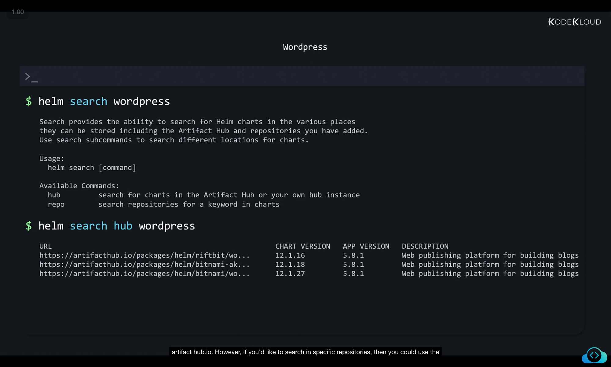

# Helm CLI – Structured Notes

With **Helm installed**, let’s explore what we can do with it. All operations are executed using the **Helm Command-Line Interface (CLI)**.

---

## 🔹 Helm CLI Basics

To check available commands and their usage:

```bash
$ helm --help
```

This displays helpful information such as available commands, their descriptions, and usage syntax.

```
The Kubernetes package manager

Common actions for Helm:
- helm search: search for charts
- helm pull: download a chart to your local directory for inspection
- helm install: deploy a chart onto Kubernetes
- helm list: list chart releases

Usage:
  helm [command]

Available Commands:
  completion  generate autocompletion scripts for the specified shell
  create      create a new chart with the given name
  dependency  manage a chart's dependencies
  env         helm client environment information
  get         download extended information of a named release
  help        Help about any command
  history     fetch release history
```

✅ This command is extremely useful as a **quick reference guide** to recall the correct Helm commands without searching online.

👉 Example:
If you forgot the command to restore a release after a failed upgrade, you might think it is `helm restore`. Running `helm --help` will remind you that the correct command is actually `helm rollback`.


---

## 🔹 Helm Help for Subcommands

Helm also provides detailed help for **subcommands**.

Example – working with repositories:

```bash
$ helm repo --help
```

```
This command consists of multiple subcommands to interact with chart repositories.
It can be used to add, remove, list, and index chart repositories.

Usage:
    helm repo [command]

Available Commands:
    add     add a chart repository
    index   generate an index file given a directory containing packaged charts
    list    list chart repositories
    remove  remove one or more chart repositories
    update  update information of available charts locally from chart repositories
```

This shows all possible actions related to repositories.

You can dig deeper into **sub-sub-commands** as well:

```bash
$ helm repo update --help
```

```
Update gets the latest information about charts from the respective chart repositories.
Information is cached locally, where it is used by commands like 'helm search'.

Usage:
    helm repo update [flags]

Aliases:
    update, up
```


---

## 🔹 Searching for Helm Charts

Charts are stored in **online chart repositories**, primarily at [Artifact Hub](https://artifacthub.io).

1. **Manual Search via Website**
   Visit Artifact Hub and search for charts.
   Example: searching for a **WordPress** chart.

   

   ✅ Look for charts from **official or verified publishers** for reliability.

   

   Each chart page provides:

   * Commands to install the chart
   * Information about components used
   * Important configurable settings

   

---

2. **Search via Command Line**

```bash
$ helm search wordpress
```

```
Search enables you to look for Helm charts in multiple locations,
including the Artifact Hub and locally added repositories.

Usage:
    helm search [command]

Available Commands:
    hub     search for charts in the Artifact Hub or your own hub instance
    repo    search repositories for a keyword in charts
```

* `hub` → Searches **Artifact Hub**
* `repo` → Searches **repositories you added locally**

Example:

```bash
$ helm search hub wordpress
```

```
URL
https://artifacthub.io/packages/helm/riftbit/wordpress
https://artifacthub.io/packages/helm/bitnami-ak...
https://artifacthub.io/packages/helm/bitnami/wordpress
```



---

## 🔹 Installing a Chart (WordPress Example)

Once the chart is identified, deployment is simple:

1. **Add the Repository**

```bash
$ helm repo add bitnami https://charts.bitnami.com/bitnami
"bitnami" has been added to your repositories
```

This registers the **Bitnami repository** locally so Helm can access its charts.

---

2. **Install the Chart**

```bash
$ helm install my-release bitnami/wordpress
```

Output:

```
NAME: my-release
LAST DEPLOYED: Wed Nov 10 18:03:50 2021
NAMESPACE: default
STATUS: deployed
REVISION: 1
TEST SUITE: None
NOTES:
CHART NAME: wordpress
CHART VERSION: 12.1.27
APP VERSION: 5.8.1

** Please be patient while the chart is being deployed **
Your WordPress site can be accessed through the following DNS name from within your cluster:
my-release-wordpress.default.svc.cluster.local (port 80)
```

✅ At the end, Helm provides instructions and useful details (like DNS names) to interact with the deployment.


---

## 🔹 Managing Releases

When a chart is deployed, it becomes a **release**.

1. **List Installed Releases**

```bash
$ helm list
```

Output:

```
NAME        NAMESPACE   REVISION    UPDATED                                  STATUS    CHART                APP VERSION
my-release  default     1           2021-11-10 18:03:50.414174217 +0000 UTC  deployed  wordpress-12.1.27   5.8.1
```

---

2. **Uninstall a Release**

```bash
$ helm uninstall my-release
release "my-release" uninstalled
```

👉 Without Helm, you’d have to manually delete multiple Kubernetes objects. Helm does this in **one step**.


---

## 🔹 Helm Repository Management

Helm provides commands to manage repositories:

### 1. List Repositories

```bash
$ helm repo list
```

```
NAME    	URL
bitnami  https://charts.bitnami.com/bitnami
```

---

### 2. Update Repositories

```bash
$ helm repo update
```

```
Hang tight while we grab the latest from your chart repositories...
...Successfully got an update from the "bitnami" chart repository
Update Complete. Happy Helming!
```

This is similar to `apt-get update` in Linux – it **refreshes local cache** of chart information.


---

## ✅ Summary

* `helm --help` → quick reference for all commands
* `helm repo` → manage repositories (add, list, update, remove)
* `helm search hub/repo <name>` → search for charts
* `helm install <release> <chart>` → install an application
* `helm list` → list installed releases
* `helm uninstall <release>` → remove an application

With Helm, deploying and managing Kubernetes applications becomes **fast, reliable, and simple**.

