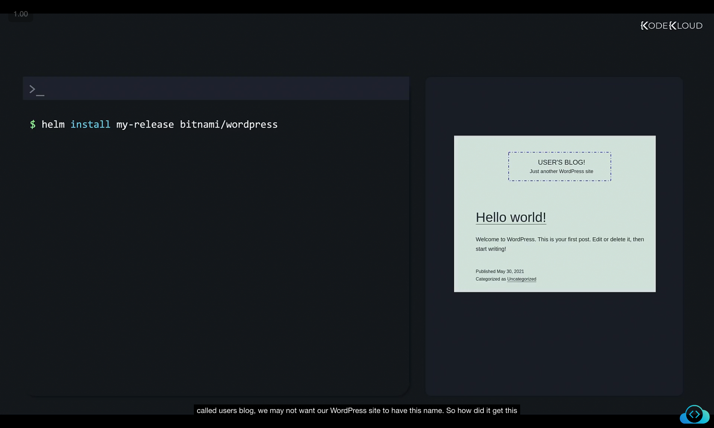

# Customizing Helm Chart Parameters

When we first installed WordPress with Helm, we used **default values**:

```bash
helm install my-release bitnami/wordpress
```



By default, Helm pulls values from the `values.yaml` file included inside the chart. For example, WordPress uses **`wordpressBlogName: User's Blog!`** as its default blog name.

---

## How Default Values Work

Helm charts are built from templates. These templates fetch their values from `values.yaml`.

### Example: `values.yaml`

```yaml
image:
  registry: docker.io
  repository: bitnami/wordpress
  tag: 5.8.2-debian-10-r0

wordpressUsername: user
wordpressPassword: ""
existingSecret: ""
wordpressEmail: user@example.com
wordpressFirstName: ""
wordpressBlogName: User's Blog!
```

Here, we can see the default blog name is **User's Blog!**.

---

### Example: `deployment.yaml` Template

```yaml
containers:
  - name: wordpress
    image: {{ template "wordpress.image" }}
    env:
      - name: WORDPRESS_DATABASE_NAME
        value: {{ include "wordpress.databaseName" | quote }}
      - name: WORDPRESS_USERNAME
        value: {{ .Values.wordpressUsername | quote }}
      - name: WORDPRESS_PASSWORD
        valueFrom:
          secretKeyRef:
            name: {{ include "wordpress.secretName" }}
            key: wordpress-password
      - name: WORDPRESS_BLOG_NAME
        value: {{ .Values.wordpressBlogName | quote }}
```

Notice how **`WORDPRESS_BLOG_NAME`** pulls its value from `.Values.wordpressBlogName`.
This means that whatever value is in `values.yaml` (or overridden by us) becomes the blog name.

---

## Option 1: Override with `--set`

We can override default values directly at install time using the **`--set`** flag:

```bash
helm install my-release bitnami/wordpress \
  --set wordpressBlogName="Helm Tutorials" \
  --set wordpressEmail="john@example.com"
```

✅ This immediately overrides values from `values.yaml`.
✅ Multiple values can be overridden by using multiple `--set` flags.


---

## Option 2: Use a Custom `values.yaml`

If there are many values to customize, it’s better to use your **own values file** instead of a long command.

### Example: `custom-values.yaml`

```yaml
wordpressBlogName: Helm Tutorials
wordpressEmail: john@example.com
```

Now install with:

```bash
helm install --values custom-values.yaml my-release bitnami/wordpress
```

This makes deployments **cleaner and more maintainable**.


---

## Option 3: Modify the Chart’s `values.yaml` Directly

If you want full control, you can **download and edit the chart** before installation.

### Step 1: Pull the chart

```bash
helm pull bitnami/wordpress
```

This downloads the chart as a compressed archive.

### Step 2: Extract directly with `--untar`

```bash
helm pull --untar bitnami/wordpress
```

This creates a **local directory** named `wordpress`:

```bash
$ ls wordpress
ci/
templates/
.helmignore
Chart.lock
Chart.yaml
README.md
values.schema.json
values.yaml
```


### Step 3: Edit `values.yaml`

Open and modify the **default `values.yaml`** inside the chart.

### Step 4: Install from local directory

```bash
helm install my-release ./wordpress
```

Now Helm installs using your **locally modified chart** instead of the remote repository version.

---

## Summary

* **Default values** come from `values.yaml`.
* **Option 1 (`--set`)** → Quick overrides for a few parameters.
* **Option 2 (`custom-values.yaml`)** → Best for multiple overrides.
* **Option 3 (edit local chart)** → Full control over the chart itself.

