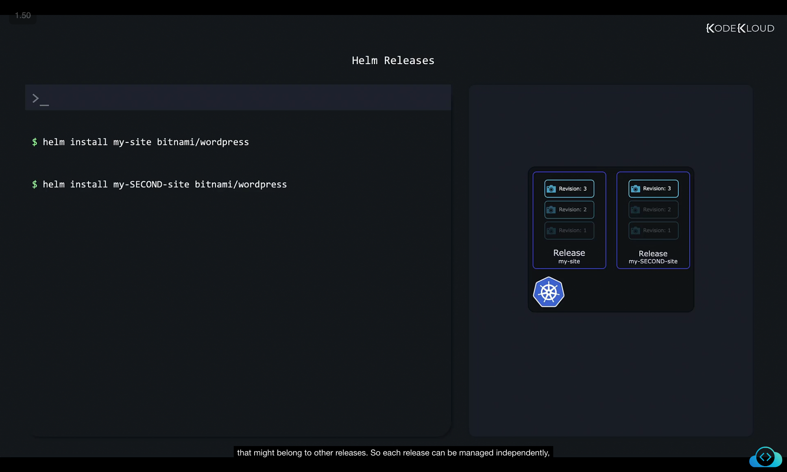
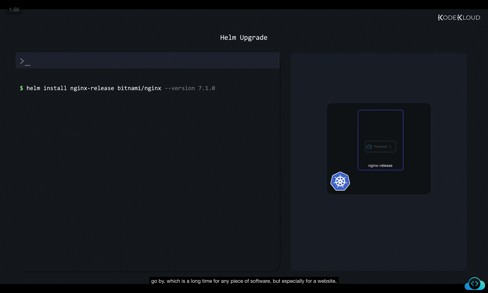
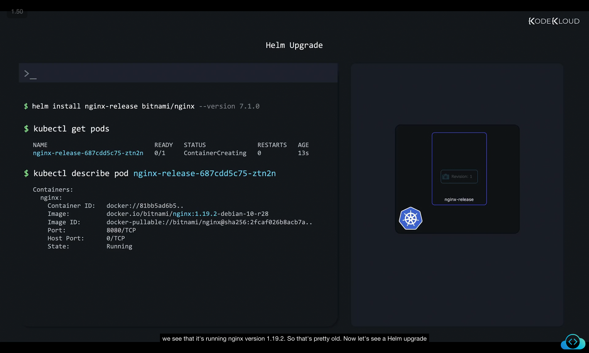
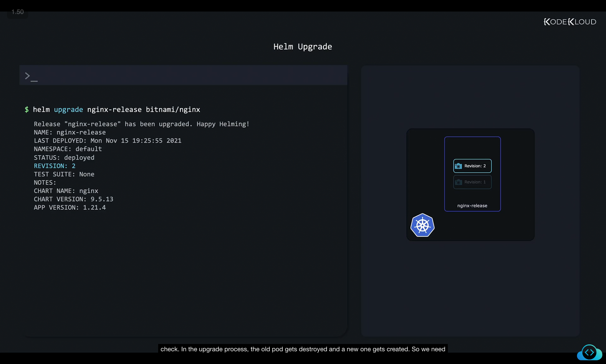
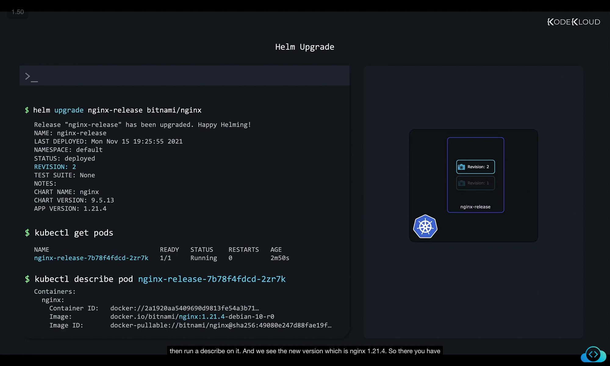
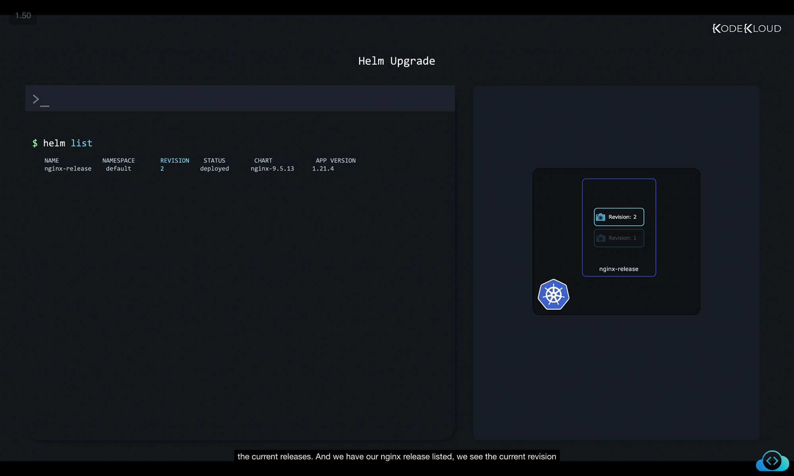
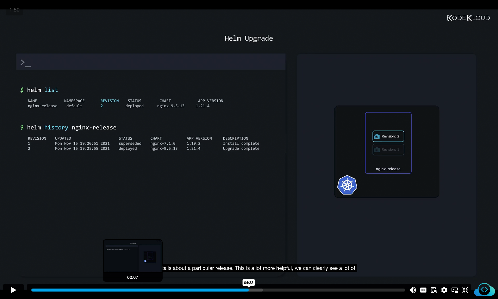
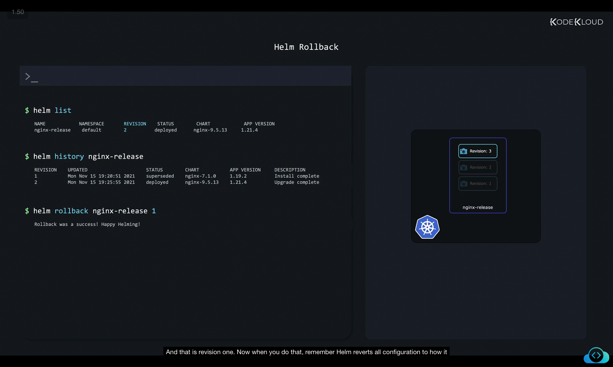
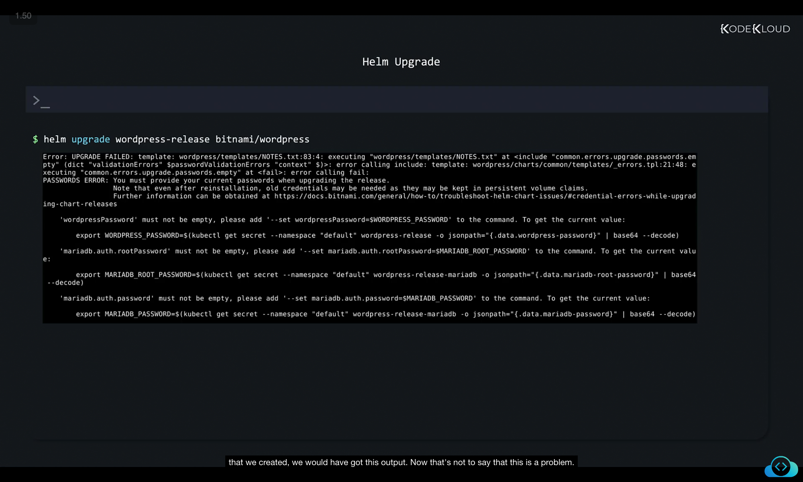
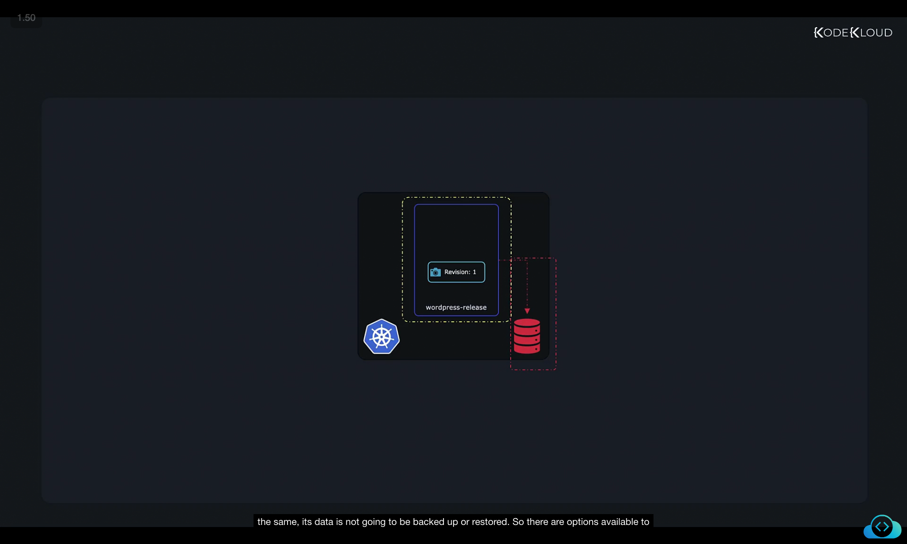

# Lifecycle Management with Helm

8Lifecycle management might sound like a big technical term, but in plain English, it simply means:
👉 **Installing, upgrading, downgrading, rolling back, and uninstalling applications over time.**

Helm makes this possible by managing **releases** (deployed instances of charts).

---

## 1. Helm Releases

When we install a chart, Helm creates a **release**.
A release is:

* Similar to an application instance.
* A package representing a **collection of Kubernetes objects**.
* Tracked and managed by Helm (so Helm knows which objects belong to which release).

### Example: Installing WordPress

```bash
helm install my-site bitnami/wordpress
```

* A release called `my-site` is created.
* Helm tracks its Kubernetes objects.

You can even install multiple releases from the same chart:

```bash
helm install my-SECOND-site bitnami/wordpress
```

👉 Each release is managed independently.



---

## 2. Installing a Specific Version

You can install a **specific version** of a chart using the `--version` flag.

```bash
helm install nginx-release bitnami/nginx --version 7.1.0
```

* Creates an NGINX release with an older chart version.
* This is useful when you need consistency across environments.



---

## 3. Why Upgrades are Needed

After months, new vulnerabilities and features are released.

* Applications like **NGINX** may require configuration changes in newer versions (new environment variables, secrets, or configs).
* Doing this manually is error-prone.

👉 Helm simplifies this with **`helm upgrade`**.

---

## 4. Checking Current Version

Before upgrading, let’s verify the NGINX version currently running.

1. List pods:

   ```bash
   kubectl get pods
   ```
2. Describe the Pod to check the image version:

   ```bash
   kubectl describe pod nginx-release-687cdd5c75-ztn2n
   ```



Result → Running **NGINX 1.19.2** (an old version).

---

## 5. Upgrading a Release

Upgrade with:

```bash
helm upgrade nginx-release bitnami/nginx
```

* Helm replaces **Revision 1** with **Revision 2**.
* Helm tracks revision numbers for every upgrade.



---

## 6. Verifying Upgrade

1. List pods again:

   ```bash
   kubectl get pods
   ```
2. Describe the new pod:

   ```bash
   kubectl describe pod nginx-release-7b78f4fdcd-2zr7k
   ```



👉 Now running **NGINX 1.21.4** (new version).

---

## 7. Helm Tracks State

Helm manages a release’s lifecycle by keeping track of **current and past states**.

* List releases:

  ```bash
  helm list
  ```

  

* See revision history:

  ```bash
  helm history nginx-release
  ```

  

This shows:

* Chart version per revision.
* App version per revision.
* Actions taken (install, upgrade, rollback).

---

## 8. Rolling Back

If an upgrade introduces problems, we can **rollback** to a previous revision.

```bash
helm rollback nginx-release 1
```



⚠️ Note:

* Helm doesn’t truly go back to revision 1.
* Instead, it creates **revision 3**, which mirrors revision 1’s configuration.

Now, running:

```bash
helm history nginx-release
```

will show:

* Revision 1 (install)
* Revision 2 (upgrade)
* Revision 3 (rollback to revision 1)

---

## 9. Upgrade Challenges

Some applications (like WordPress) need extra configuration to upgrade.

```bash
helm upgrade wordpress-release bitnami/wordpress
```



* Fails because Helm needs **admin credentials** (for the database and WordPress site).
* Solution: Provide required parameters (like passwords) during the upgrade.

---

## 10. Limitations of Rollback

Rollback ≠ Full backup restore.

* Helm rollbacks **restore manifests/configurations** only.
* They do **not** restore:

  * Persistent Volumes.
  * External Databases.
  * Application data (files, directories, or custom content).

Example: Rolling back a MySQL release:

* Pods and software versions revert.
* But database **data remains unchanged**.



👉 For consistent backups of data, you need **separate backup strategies** (often using **Chart Hooks**, which will be discussed later).

---

## 11. Summary of Lifecycle Management

* **Install:** `helm install <release-name> <chart>`
* **Upgrade:** `helm upgrade <release-name> <chart>`
* **List releases:** `helm list`
* **View history:** `helm history <release-name>`
* **Rollback:** `helm rollback <release-name> <revision>`
* **Uninstall:** `helm uninstall <release-name>`

Helm enables easy lifecycle management by:

* Keeping track of revisions.
* Automating upgrades.
* Allowing safe rollbacks.
* Managing applications as independent releases.

