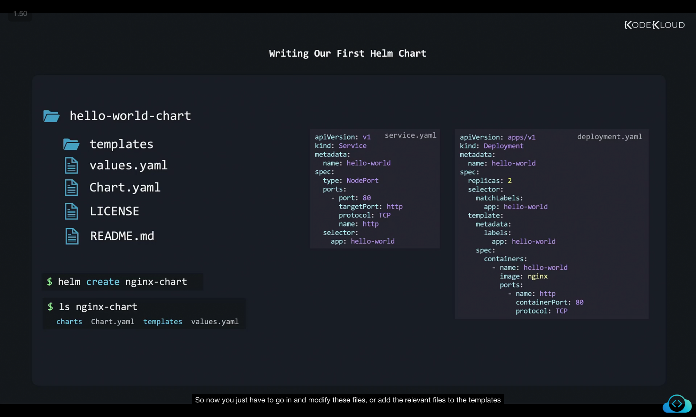

```
](../11-class-writing-a-helm-chart/image
](../11-class-writing-a-helm-chart/image
```
Here’s a **rewritten, structured, and detailed version of your notes**. I’ve broken the content into logical sections, added clear explanations, and preserved all screenshots (``) exactly where you had them. This will be ready for you to paste directly into your `.md` file.

---

# Writing Our Own Helm Charts

Helm charts are extremely powerful and flexible. They allow us to package, deploy, and manage Kubernetes applications with ease.

At their core, Helm charts are like **installation wizards** for Kubernetes:

* On operating systems, an installer not only extracts files but can also:

  * Add desktop shortcuts.
  * Configure auto-start behavior.
  * Install extra dependencies (libraries).

* Similarly, Helm charts can do much more than just deploy Kubernetes manifests. For example:

  * Before a Helm **upgrade**, the chart can be configured to automatically back up a database.
  * If the upgrade fails, Helm can restore the backup.

This makes Helm not only a **packaging tool** but also a **deployment automation system**.


In this section, we’ll learn how to write our own Helm chart by starting with a **simple Hello World application** (Nginx web server).

---

## 1. Defining the Hello World App (Without Helm)

Let’s say we want to deploy a simple Nginx app with:

* A **Deployment** (2 replicas).
* A **Service** (NodePort to expose it).

### service.yaml

```yaml
apiVersion: v1
kind: Service
metadata:
  name: hello-world
spec:
  type: NodePort
  ports:
    - port: 80
      targetPort: http
      protocol: TCP
      name: http
  selector:
    app: hello-world
```

### deployment.yaml

```yaml
apiVersion: apps/v1
kind: Deployment
metadata:
  name: hello-world
spec:
  replicas: 2
  selector:
    matchLabels:
      app: hello-world
  template:
    metadata:
      labels:
        app: hello-world
    spec:
      containers:
        - name: hello-world
          image: nginx
          ports:
            - name: http
              containerPort: 80
              protocol: TCP
```

---

## 2. Helm Chart Structure

Helm expects a specific **directory structure** for a chart:

```
hello-world-chart/
├── templates/     # Kubernetes manifests (templated)
├── values.yaml    # Configurable values
├── Chart.yaml     # Metadata about the chart
├── LICENSE
└── README.md
```

Instead of creating this manually, we use:

```bash
$ helm create nginx-chart
$ ls nginx-chart
charts  Chart.yaml  templates  values.yaml
```



This creates a **skeleton Helm chart**, ready to be customized.

---

## 3. Editing Chart.yaml

Move into the chart folder and edit `Chart.yaml`:

```bash
$ cd nginx-chart
$ vi Chart.yaml
```

Default content looks like this:

```yaml
apiVersion: v2
name: nginx-chart
description: A Helm chart for Kubernetes
type: application
version: 0.1.0
appVersion: "1.16.0"
```

We can customize it for our use case:

```yaml
apiVersion: v2
name: nginx-chart
description: Basic nginx website
type: application
version: 0.1.0
appVersion: "1.16.0"
maintainers:
  - name: john smith
    email: john@example.com
```


---

## 4. Cleaning Templates Directory

By default, Helm adds **sample manifests** inside `templates/`.
Since we want our own Deployment and Service, let’s remove them:

```bash
$ ls templates 
deployment.yaml  _helpers.tpl  hpa.yaml  ingress.yaml  NOTES.txt  serviceaccount.yaml  service.yaml  tests
$ rm -r templates/*
```


Now `templates/` is empty.
We will copy our original **service.yaml** and **deployment.yaml** here.

---

## 5. First Helm Chart Version (Static Values)

`templates/service.yaml`:

```yaml
apiVersion: v1
kind: Service
metadata:
  name: hello-world
spec:
  type: NodePort
  ports:
    - port: 80
      targetPort: http
      protocol: TCP
      name: http
  selector:
    app: hello-world
```

`templates/deployment.yaml`:

```yaml
apiVersion: apps/v1
kind: Deployment
metadata:
  name: hello-world
spec:
  replicas: 2
  selector:
    matchLabels:
      app: hello-world
  template:
    metadata:
      labels:
        app: hello-world
    spec:
      containers:
        - name: hello-world
          image: nginx
          ports:
            - name: http
              containerPort: 80
              protocol: TCP
```

We can now install it:

```bash
$ helm install hello-world-1 ./nginx-chart
$ kubectl get deployment
NAME          READY   UP-TO-DATE   AVAILABLE   AGE
hello-world   0/2     2            0           24s
```


But there’s a problem…

---

## 6. Problem: Static Names

If we install another release:

```bash
$ helm install hello-world-2 ./nginx-chart
```

We get an error:

```
Error: rendered manifests contain a resource that already exists.
Deployment "hello-world" in namespace "default" exists
and cannot be imported into the current release
```


This happens because our **deployment name is hardcoded** (`hello-world`).

---

## 7. Solution: Templating with Release.Name

Helm uses **Go templating language** to dynamically render manifest files.

Instead of a static name, we use:

```yaml
name: {{ .Release.Name }}-nginx
```

Now, the release name is appended automatically.


For example:

* `helm install hello-world-1 ./nginx-chart` → Deployment name: `hello-world-1-nginx`
* `helm install hello-world-2 ./nginx-chart` → Deployment name: `hello-world-2-nginx`


---

## 8. Built-in Objects in Helm Templates

Some useful Helm objects:

### Release objects

```
.Release.Name
.Release.Namespace
.Release.IsUpgrade
.Release.IsInstall
.Release.Revision
.Release.Service
```

### Chart objects

```
.Chart.Name
.Chart.ApiVersion
.Chart.Version
.Chart.Type
.Chart.Keywords
.Chart.Home
```


### Capabilities (cluster info)

```
.Capabilities.KubeVersion
.Capabilities.ApiVersion
.Capabilities.HelmVersion
.Capabilities.GitCommit
.Capabilities.GoVersion
```

### Values (from values.yaml)

```
.Values.replicaCount
.Values.image
```


⚠️ Note: **Case sensitivity matters**

* `.Release.Name` → Built-in objects start with capital letters.
* `.Values.replicaCount` → User-defined values from `values.yaml` usually lowercase.


---

## 9. Updating Templates to Use Values

### templates/service.yaml

```yaml
apiVersion: v1
kind: Service
metadata:
  name: {{ .Release.Name }}-svc
spec:
  type: NodePort
  ports:
    - port: 80
      targetPort: http
      protocol: TCP
      name: http
  selector:
    app: hello-world
```

### templates/deployment.yaml

```yaml
apiVersion: apps/v1
kind: Deployment
metadata:
  name: {{ .Release.Name }}-nginx
spec:
  replicas: {{ .Values.replicaCount }}
  selector:
    matchLabels:
      app: hello-world
  template:
    metadata:
      labels:
        app: hello-world
    spec:
      containers:
        - name: hello-world
          image: "{{ .Values.image }}"
          ports:
            - name: http
              containerPort: 80
              protocol: TCP
```

Now we can install with overrides:

```bash
$ helm install hello-world-1 ./nginx-chart \
    --set replicaCount=3 \
    --set image=nginx
```

Or define them in `values.yaml`:

```yaml
replicaCount: 2
image: nginx
```


---

## 10. Using Dictionaries for Image Configuration

Instead of flat values like `image_repository`, `image_tag`, it’s better to use a dictionary.

### values.yaml flat values 

```yaml
replicaCount: 2
image_repository: nginx
image_pullPolicy: IfNotPresent
image_tag: "1.16.0"
```

### values.yaml dictionary 

```yaml
replicaCount: 2
image:
  repository: nginx
  pullPolicy: IfNotPresent
  tag: "1.16.0"
```

### templates/deployment.yaml

```yaml
apiVersion: apps/v1
kind: Deployment
metadata:
  name: {{ .Release.Name }}-nginx
spec:
  replicas: {{ .Values.replicaCount }}
  selector:
    matchLabels:
      app: hello-world
  template:
    metadata:
      labels:
        app: hello-world
    spec:
      containers:
        - name: hello-world
          image: "{{ .Values.image.repository }}:{{ .Values.image.tag }}"
          imagePullPolicy: {{ .Values.image.pullPolicy }}
          ports:
            - name: http
              containerPort: 80
              protocol: TCP
```

This generates:

* `nginx:1.16.0` as image.
* `IfNotPresent` as pull policy.


---

## 11. How Helm Renders Templates

When we run `helm install`:

1. Helm takes **files from templates/**.
2. Replaces variables with:

   * Release info (`.Release.Name`, `.Release.Namespace`).
   * Chart info (`.Chart.Name`, `.Chart.Version`).
   * User values from `values.yaml` or `--set`.
   * Cluster capabilities.
3. Generates final Kubernetes manifests.
4. Applies them to the cluster.


---

✅ **Summary:**

* Always templatize values that must differ between releases (names, replicas, images, etc.).
* Use `values.yaml` for default configuration, override with `--set` or `-f custom-values.yaml`.
* Use dictionaries for structured configs (like images).
* Helm templates = Go templates + Helm built-in objects.

---

Would you like me to also create a **side-by-side before & after comparison table** (Static YAML vs. Templatized YAML) so it’s easier to quickly see the improvements?
