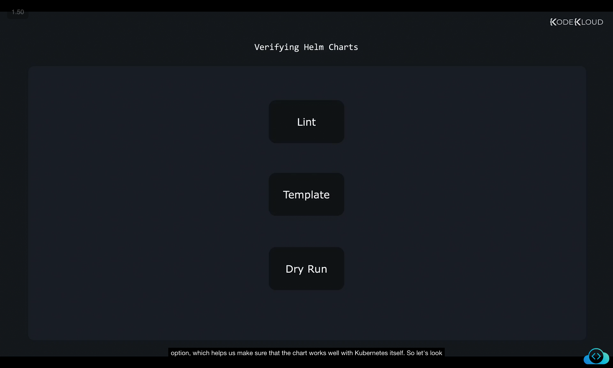
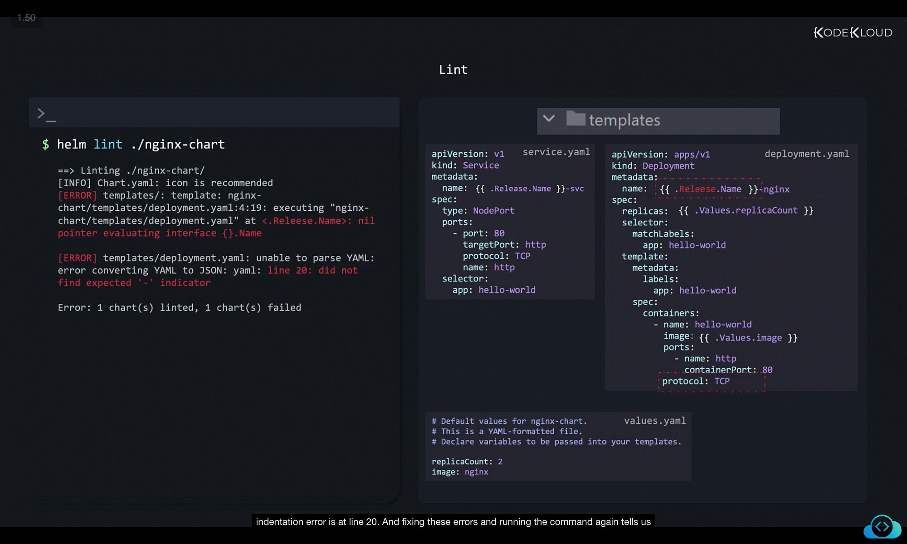
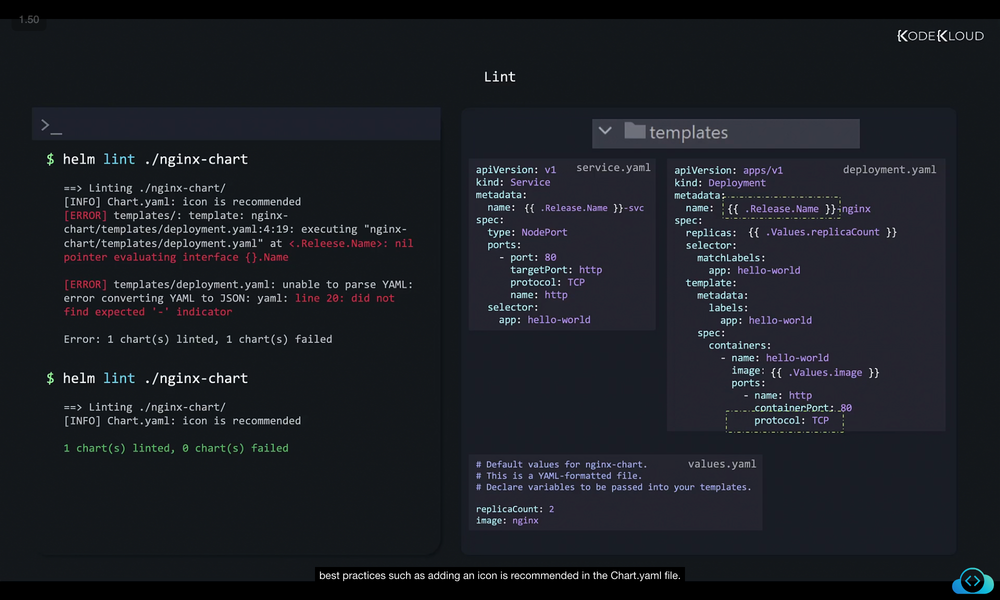
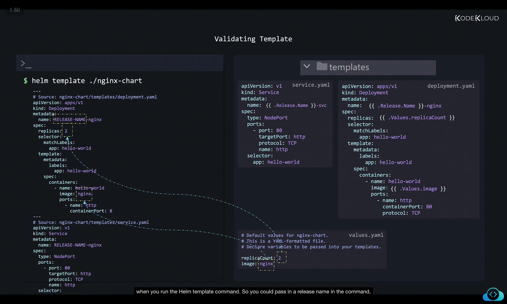
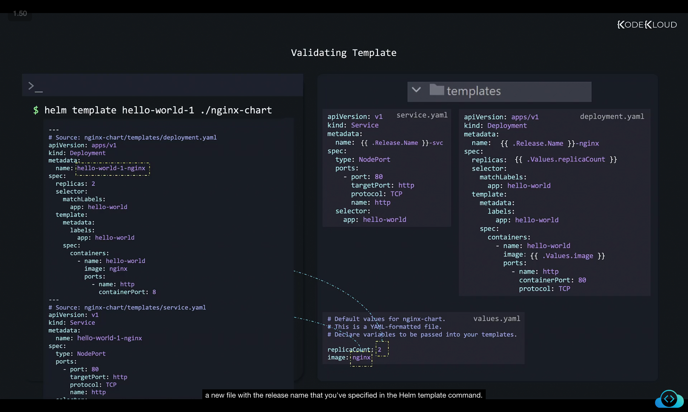
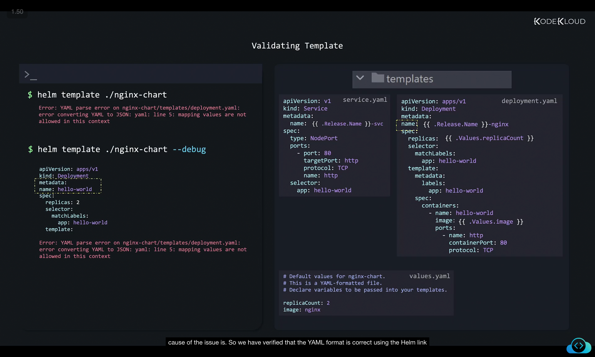
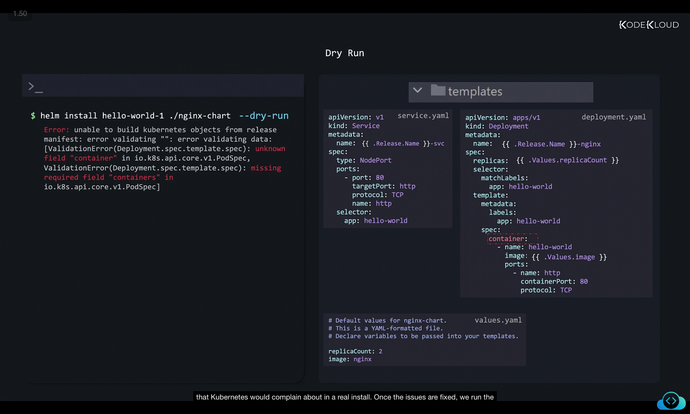
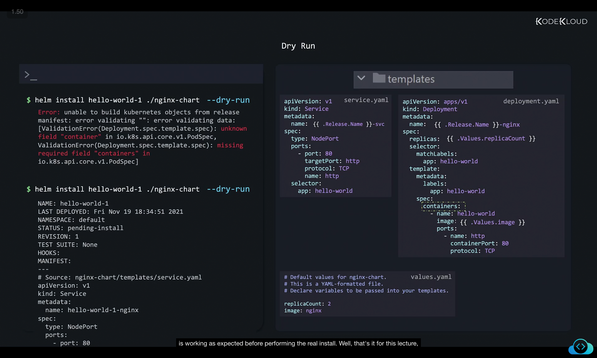

# Verifying Helm Charts Before Installation

When you develop your own Helm chart, it’s very important to **validate and test the chart** before actually installing it on a Kubernetes cluster. Helm provides **three main ways** to verify charts:

1. **Linting** – Check for YAML formatting errors and Helm chart best practices.
2. **Templating** – Render templates locally to verify that values are substituted correctly.
3. **Dry Run** – Validate against Kubernetes API without actually deploying.

These three steps ensure that your chart is both valid and deployable.



---

## 1. Linting Helm Charts

Linting is the **first step** in verifying your Helm chart. It checks for:

* Incorrect YAML formatting (e.g., indentation issues).
* Typographical mistakes in template variables.
* Helm chart best practices.

### Example of Issues

Imagine we made mistakes while creating our chart:

* Wrong indentation in YAML (missing spaces).
* Typo in a variable (`.Releease.Name` instead of `.Release.Name`).

Run the **lint command**:

```bash
$ helm lint ./nginx-chart
```

This will scan the chart and list errors:



### Example Files

#### `templates/service.yaml`

```yaml
apiVersion: v1
kind: Service
metadata:
  name: {{ .Release.Name }}-svc
spec:
  type: NodePort
  ports:
    - port: 80
      targetPort: http
      protocol: TCP
      name: http
  selector:
    app: hello-world
```

#### `templates/deployment.yaml`

```yaml
apiVersion: apps/v1
kind: Deployment
metadata:
  name: {{ .Releease.Name }}-nginx   # Typo here: "Releease"
spec:
  replicas: {{ .Values.replicaCount }}
  selector:
    matchLabels:
      app: hello-world
  template:
    metadata:
      labels:
        app: hello-world
    spec:
      containers:
        - name: hello-world
          image: "{{ .Values.image }}"
          ports:
            - name: http
              containerPort: 80
          protocol: TCP      # Indentation Error
```

#### `values.yaml`

```yaml
replicaCount: 2
image: nginx
```

### Output with Errors

```bash
$ helm lint ./nginx-chart
==> Linting ./nginx-chart/
[INFO] Chart.yaml: icon is recommended
[ERROR] templates/: template: nginx-chart/templates/deployment.yaml:4:19: executing "nginx-chart/templates/deployment.yaml" at <.Release.Name>: nil pointer evaluating interface {}.Name
[ERROR] templates/deployment.yaml: unable to parse YAML: error converting YAML to JSON: yaml: line 20: did not find expected '-' indicator
Error: 1 chart(s) linted, 1 chart(s) failed
```

After fixing the typo and indentation, linting passes:

```bash
$ helm lint ./nginx-chart
==> Linting ./nginx-chart/
[INFO] Chart.yaml: icon is recommended
1 chart(s) linted, 0 chart(s) failed
```



✅ **Linting ensures format and syntax are correct before going further.**

---

## 2. Rendering Templates with `helm template`

After ensuring there are no lint errors, the next step is to verify how Helm templates will be rendered. This is done with:

```bash
$ helm template ./nginx-chart
```

This renders the chart **locally**, substituting values from `values.yaml` into templates.

### Example Output



```yaml
# Source: nginx-chart/templates/deployment.yaml
apiVersion: apps/v1
kind: Deployment
metadata:
  name: RELEASE-NAME-nginx
spec:
  replicas: 2
  selector:
    matchLabels:
      app: hello-world
  template:
    metadata:
      labels:
        app: hello-world
    spec:
      containers:
      - name: hello-world
        image: nginx
        ports:
        - name: http
          containerPort: 80

# Source: nginx-chart/templates/service.yaml
apiVersion: v1
kind: Service
metadata:
  name: RELEASE-NAME-nginx
spec:
  type: NodePort
  ports:
    - port: 80
      targetPort: http
```

⚡ Notice:

* If you don’t specify a release name, Helm uses the default `RELEASE-NAME`.

You can pass a release name explicitly:

```bash
$ helm template hello-world-1 ./nginx-chart
The rendered output may look similar to this:

apiVersion: apps/v1
kind: Deployment
metadata:
  name: hello-world-1-nginx
spec:
  replicas: 2
  selector:
    matchLabels:
      app: hello-world
  template:
    metadata:
      labels:
        app: hello-world
    spec:
      containers:
      - name: hello-world
        image: nginx
        ports:
        - name: http
          containerPort: 80
---
apiVersion: v1
kind: Service
metadata:
  name: hello-world-1-nginx
spec:
  type: NodePort
  ports:
    - port: 80
      targetPort: http
      protocol: TCP
      name: http
  selector:
    app: hello-world
---
# Default values for nginx-chart.
# This is a YAML-formatted file.
# Declare variables to be passed into your templates.
replicaCount: 2
image: nginx
```




This updates the generated manifests with the actual release name (`hello-world-1`).

---

### Debugging Template Errors

If your YAML has an **indentation error**, Helm template might fail without showing details:

Example (wrong indentation under `metadata`):

```yaml
apiVersion: apps/v1
kind: Deployment
metadata:
name: {{ .Release.Name }}-nginx   # Incorrect indentation
```

Running:

```bash
$ helm template ./nginx-chart
Error: YAML parse error on nginx-chart/templates/deployment.yaml: error converting YAML to JSON: yaml: line 5: mapping values are not allowed in this context
```

Use the **debug flag** to see the rendered YAML:
```
```bash
$ helm template ./nginx-chart --debug
apiVersion: apps/v1
kind: Deployment
metadata:
name: hello-world
spec:
  replicas: 2
  selector:
    matchLabels:
      app: hello-world
  template:

Error: YAML parse error on nginx-chart/templates/deployment.yaml: error converting YAML to JSON: yaml: line 5: mapping values are not allowed in this context
```




This makes it easier to spot the issue.

---

## 3. Validating with Kubernetes (Dry Run)

Even if linting and templating succeed, you might still have **logical errors** in your Kubernetes manifests.

For example, using `container` instead of `containers` in the spec:

```yaml
spec:
  container:   # ❌ Incorrect
    - name: hello-world
      image: "{{ .Values.image }}"
```

Helm won’t detect this since YAML is valid, and templating is correct. But Kubernetes will reject it.

To catch these issues, run Helm with the **dry run option**:

```bash
$ helm install hello-world-1 ./nginx-chart --dry-run
```

### Example Error

```bash
Error: unable to build kubernetes objects from release manifest: 
error validating data: 
[ValidationError(Deployment.spec.template.spec): unknown field "container" in io.k8s.api.core.v1.PodSpec, 
ValidationError(Deployment.spec.template.spec): missing required field "containers" in io.k8s.api.core.v1.PodSpec]
```



✅ Once fixed, running `--dry-run` shows what would be applied without actually deploying:

```bash
$ helm install hello-world-1 ./nginx-chart --dry-run
```



Output includes generated Kubernetes objects, but nothing is deployed.

---

## Summary

To verify Helm charts before real installation:

1. **Lint (`helm lint`)** → Catches YAML/formatting errors.
2. **Template (`helm template`)** → Shows rendered manifests with values substituted.
3. **Dry Run (`helm install --dry-run`)** → Validates with Kubernetes API without deploying.

By combining these three steps, you ensure that:

* Your YAML syntax is correct.
* Templating works properly.
* Kubernetes accepts the manifests.

---

📌 **Next step:** Head over to the labs and practice building and validating your own Helm charts.

---

