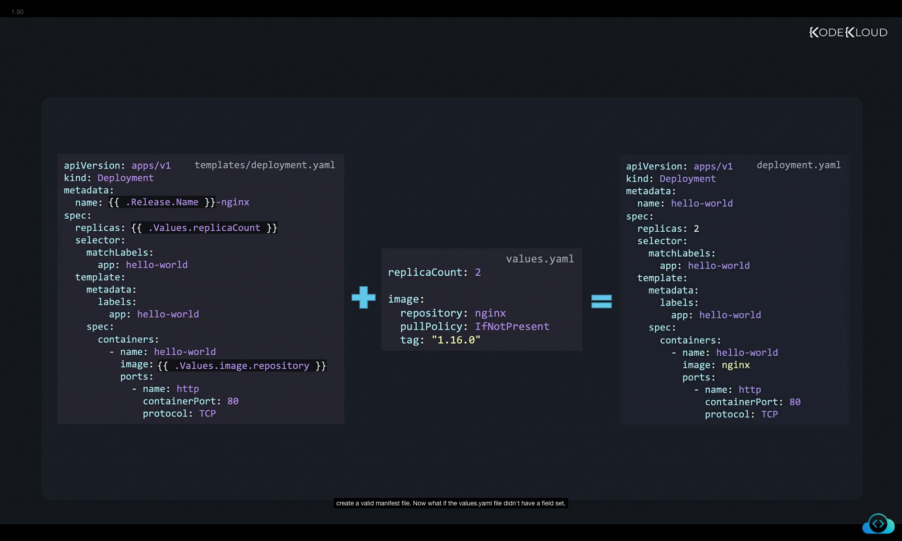
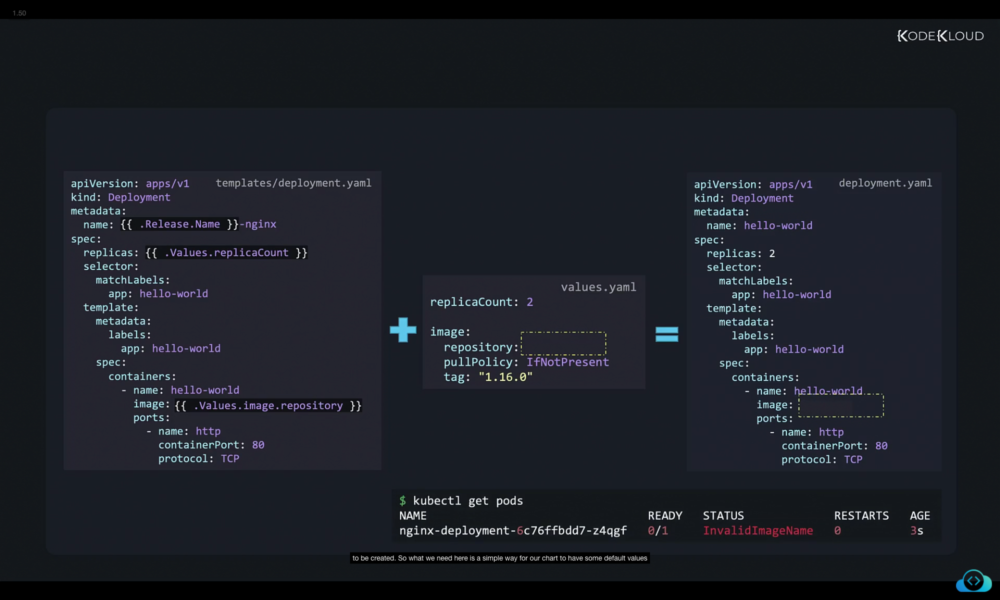
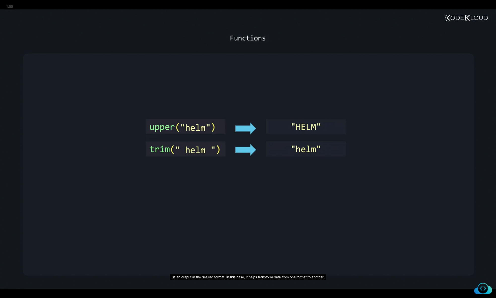
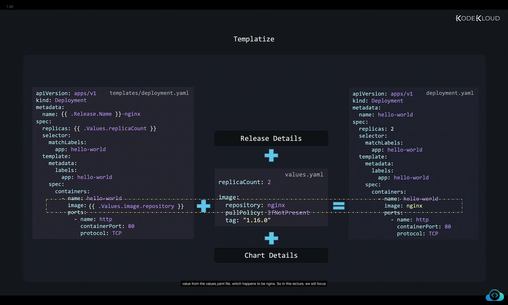
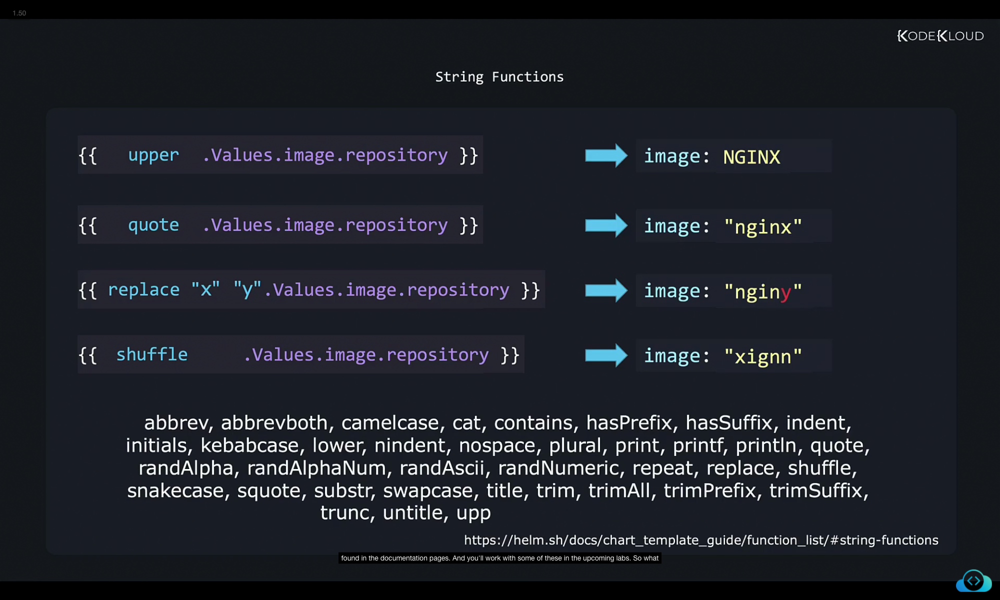
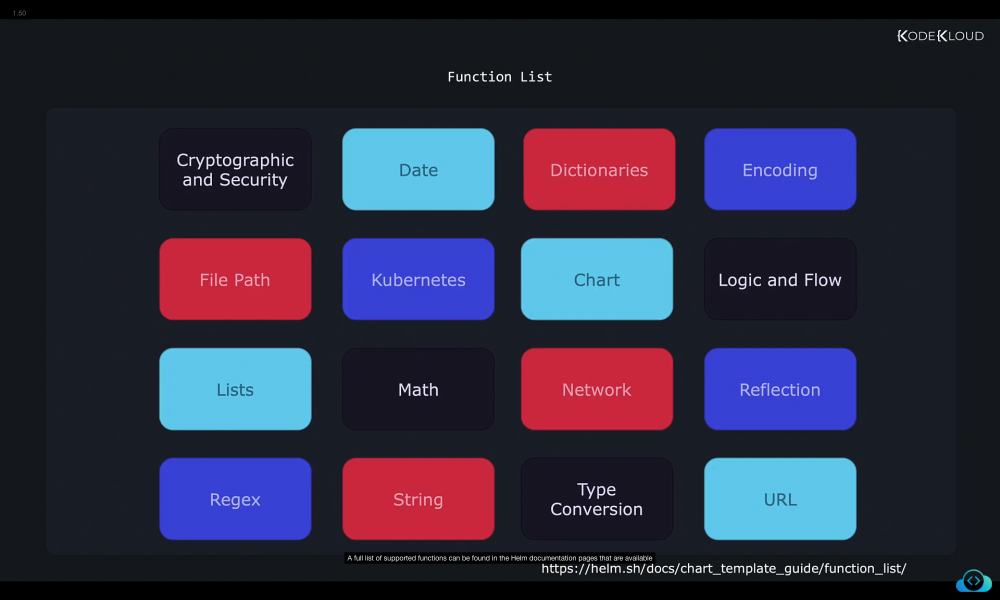
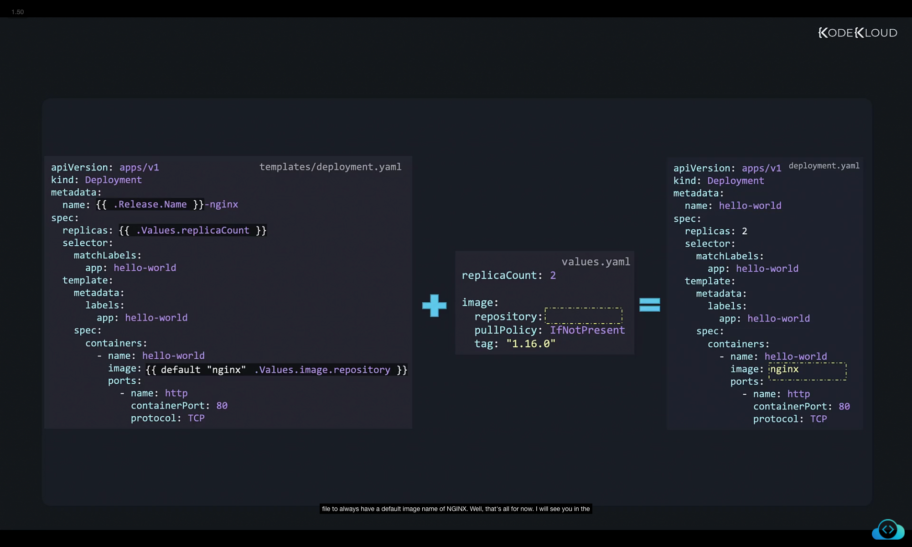

# Helm Template Functions – Detailed Notes

## 1. Templates + Values = Manifests

In Helm, a **template** and a `values.yaml` file work together to generate Kubernetes manifests.
Helm substitutes the variables inside the double curly braces (`{{ }}`) with values defined in `values.yaml`.



### Example: Deployment Template

**templates/deployment.yaml**

```yaml
apiVersion: apps/v1
kind: Deployment
metadata:
  name: {{ .Release.Name }}-nginx
spec:
  replicas: {{ .Values.replicaCount }}
  selector:
    matchLabels:
      app: hello-world
  template:
    metadata:
      labels:
        app: hello-world
    spec:
      containers:
        - name: hello-world
          image: {{ .Values.image.repository }}
          ports:
            - name: http
              containerPort: 80
              protocol: TCP
```

**values.yaml**

```yaml
replicaCount: 2
image:
  repository: nginx
  pullPolicy: IfNotPresent
  tag: "1.16.0"
```

**Generated manifest:**

```yaml
apiVersion: apps/v1
kind: Deployment
metadata:
  name: hello-world
spec:
  replicas: 2
  selector:
    matchLabels:
      app: hello-world
  template:
    metadata:
      labels:
        app: hello-world
    spec:
      containers:
        - name: hello-world
          image: nginx
          ports:
            - name: http
              containerPort: 80
              protocol: TCP
```

---

## 2. Missing Values in `values.yaml`

If a field is missing in `values.yaml`, Helm simply **leaves it empty** in the generated manifest.
This can cause issues if the missing field is required (e.g., container image).



### Example: Missing Image Repository

**values.yaml**

```yaml
replicaCount: 2
image:
  repository:   # empty
  pullPolicy: IfNotPresent
  tag: "1.16.0"
```

**Generated manifest:**

```yaml
...
containers:
  - name: hello-world
    image:    # ❌ empty field
```

**Result in Kubernetes:**

```bash
$ kubectl get pods
NAME                                READY   STATUS             RESTARTS   AGE
nginx-deployment-6c76ffbdd7-z4qgf   0/1     InvalidImageName   0          3s
```

➡️ Pod fails to start because the container image name is invalid.

---

## 3. Why Functions?

We need a way to handle **defaults and transformations** in templates:

* If the user provides a value → use it.
* If the user does not → fall back to a default (e.g., `nginx`).

This is where **functions** in Helm templates are useful.

---

## 4. What Are Functions?

Functions are like in programming:

* Take input → process it → return output.

For example, in programming:


```text
upper("helm")   ➞  "HELM"
trim(" helm ")  ➞  "helm"
```

So in Helm, functions transform values before they are rendered into the manifest.

---

## 5. Functions Inside Templates

Helm combines:

* Templates in `templates/`
* Values from `values.yaml`
* Release metadata

to generate final manifests.

Within the double curly braces `{{ }}`, functions can be applied to transform values.



---

### Example: String Transformation Functions

Helm provides many string functions. Here are a few:



```yaml
{{ upper .Values.image.repository }}     # ➞ image: NGINX
{{ quote .Values.image.repository }}     # ➞ image: "nginx"
{{ replace "x" "y" .Values.image.repository }} # ➞ image: nginy
{{ shuffle .Values.image.repository }}   # ➞ image: xignn
```

These do not change `values.yaml`, only the **rendered manifest**.

---

### List of Available String Functions

```
abbrev, abbrevboth, camelcase, cat, contains, hasPrefix, hasSuffix, 
indent, initials, kebabcase, lower, nindent, nospace, plural, print, 
printf, println, quote, randAlpha, randAlphaNum, randAscii, randNumeric, 
repeat, replace, shuffle, snakecase, squote, substr, swapcase, title, 
trim, trimAll, trimPrefix, trimSuffix, trunc, untitle, upper, wrap, wrapWith
```

---

## 6. Other Function Categories

Helm has many more function categories beyond strings:



* **Cryptographic and Security**
* **Dates**
* **Dictionaries**
* **Encoding**
* **File Paths**
* **Kubernetes and Chart Functions**
* **Logic and Flow Control**
* **Lists and Math**
* **Networking**
* **Regex**
* **Semantic Versions**
* **Type Conversion**
* **UUIDs and URLs**

📌 Full reference: [Helm Documentation – Template Functions](https://helm.sh/docs/chart_template_guide/function_list/)

---

## 7. Using Default Values with `default` Function

Back to our original problem:
If no image is provided, we want Helm to **fallback to "nginx"** automatically.

We use the `default` function:


### Deployment Template with Default Function

**templates/deployment.yaml**

```yaml
apiVersion: apps/v1
kind: Deployment
metadata:
  name: {{ .Release.Name }}-nginx
spec:
  replicas: {{ .Values.replicaCount }}
  selector:
    matchLabels:
      app: hello-world
  template:
    metadata:
      labels:
        app: hello-world
    spec:
      containers:
        - name: hello-world
          image: {{ default "nginx" .Values.image.repository }}
          ports:
            - name: http
              containerPort: 80
              protocol: TCP
```



### Values File

**values.yaml**

```yaml
replicaCount: 2
image:
  repository: ""
  pullPolicy: IfNotPresent
  tag: "1.16.0"
```

### Generated Manifest (with default applied)

```yaml
...
containers:
  - name: hello-world
    image: nginx   # ✅ default applied
```

➡️ This ensures that even if the user forgets to set an image, the chart deploys successfully.

---

## ✅ Summary

1. **Templates + values.yaml** generate manifests.
2. Missing values cause incomplete manifests and deployment errors.
3. **Functions** allow data transformation and defaults.
4. String functions include `upper`, `quote`, `replace`, `shuffle`, etc.
5. Helm supports many categories of functions (crypto, math, regex, etc.).
6. The **`default` function** is crucial to provide fallback values.

---

