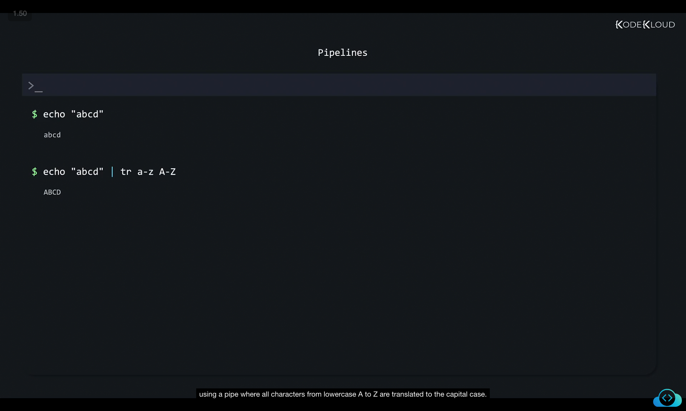
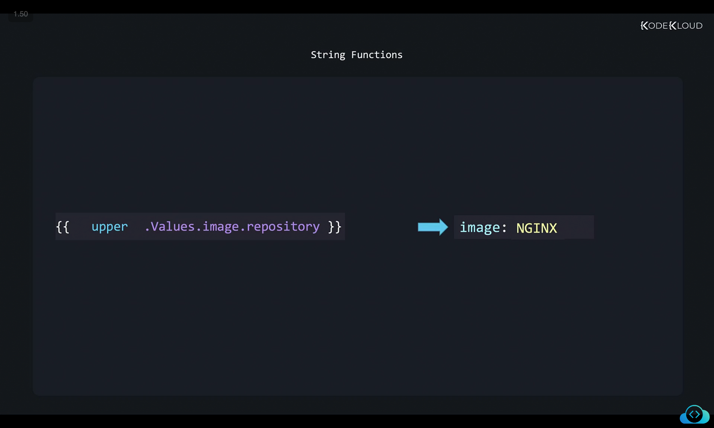
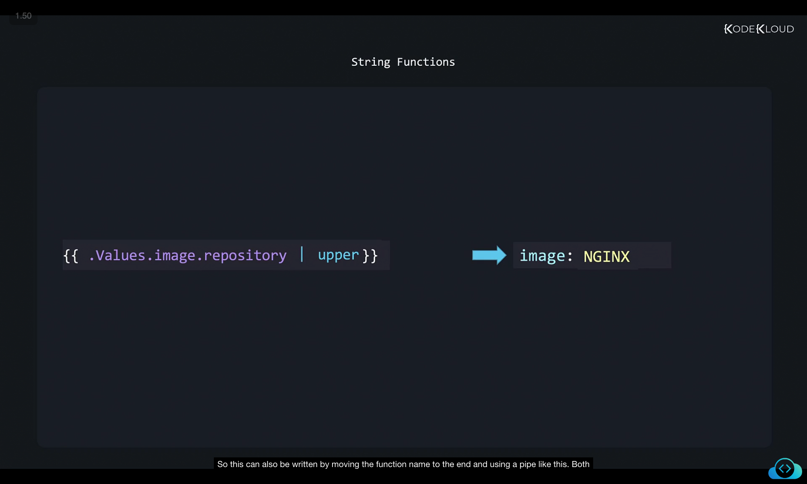
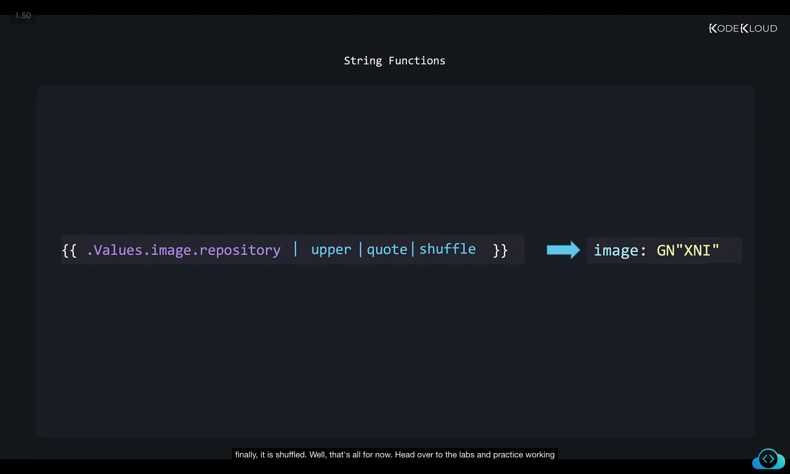

```
](../14-class-pipelines/image
](../14-class-pipelines/image
```
Here’s a **rewritten and well-structured version** of your notes with **detailed explanations** while keeping the screenshots (``) exactly as they are. You can paste this directly into your `.md` file:

---

# Pipelines in Helm

## 1. Introduction to Pipelines in Linux

Before we dive into Helm pipelines, let’s recall the concept of **pipelines in Linux**.

* Normally, when you run a command like `echo`, it prints the provided string to the terminal.
* However, sometimes we want to **send the output of one command as input to another command**.
* This is where **pipes (`|`)** come in. Pipes are used to connect commands together, forming what is known as a **pipeline**.

### Example: Using a pipeline in Linux



```bash
$ echo "abcd"
abcd

$ echo "abcd" | tr a-z A-Z
ABCD
```

* `echo "abcd"` → prints the string `abcd`.
* `tr a-z A-Z` → translates lowercase letters into uppercase.
* The pipe (`|`) sends the output of `echo` as input to `tr`, giving us `ABCD`.

✅ **Key takeaway:** A pipeline lets you **chain commands together** so the output of one becomes the input of the next.

---

## 2. Functions in Helm

Helm templates also support **functions**. Functions transform data, just like commands do in Linux pipelines.

* In Helm, a function is usually written **before the variable**.

### Example: Function without pipeline



```yaml
{{ upper .Values.image.repository }}
# Output: image: NGINX
```

Here:

* `.Values.image.repository` → contains the string `"nginx"`.
* `upper` → converts the string to uppercase.
* Final output → `"NGINX"`.

---

## 3. Pipelines in Helm

Instead of writing the function **before** the variable, Helm allows you to use **pipelines**, similar to Linux.

### Example: Function with pipeline



```yaml
{{ .Values.image.repository | upper }}
# Output: image: NGINX
```

Here:

* `.Values.image.repository` → `"nginx"`.
* `| upper` → pipes the value to the `upper` function.
* Output is the same: `"NGINX"`.

👉 Pipelines are more common in Helm templates because they are **cleaner and easier to read**.

---

## 4. Chaining Multiple Functions with Pipelines

The real power of pipelines comes from being able to **chain multiple functions** together, just like in Linux.

### Example: Multiple functions in a pipeline



```yaml
{{ .Values.image.repository | upper | quote | shuffle }}
# Output: image: GN"XNI"
```

Step-by-step execution:

1. `.Values.image.repository` → `"nginx"`.
2. `upper` → `"NGINX"`.
3. `quote` → `"\"NGINX\""` (adds quotes around the string).
4. `shuffle` → randomly shuffles the characters, e.g., `"GN\"XNI\""`.

✅ **Key takeaway:** Pipelines allow you to apply **a sequence of transformations** to your variables, making Helm templates more powerful and flexible.

---

## 5. Summary

* **Pipelines in Linux**: Use `|` to pass output from one command to another.
* **Functions in Helm**: Can be written directly before variables or with pipelines.
* **Pipelines in Helm**:

  * Clean and readable.
  * Allow chaining multiple functions.
  * Widely used in Helm templates.

👉 Practice writing pipelines with different Helm functions to get comfortable with this approach.

---

Would you like me to also **add a reference table of the most common Helm functions** (like `upper`, `lower`, `quote`, `default`, etc.) so your notes become more like a ready-to-use cheatsheet?
