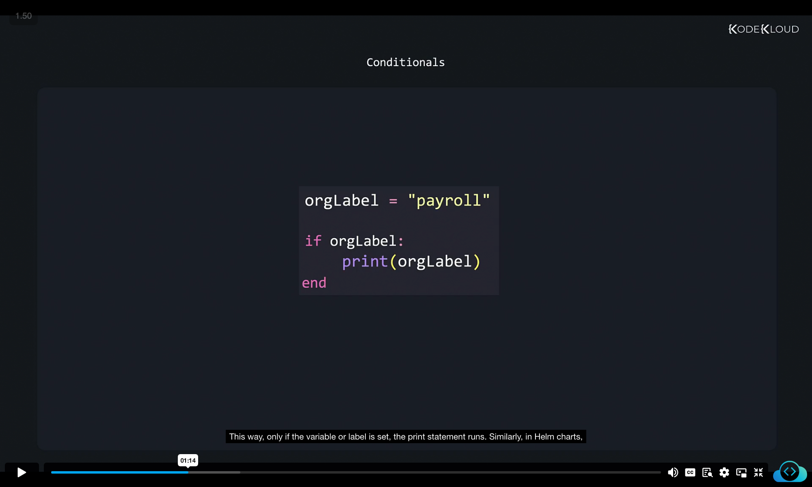
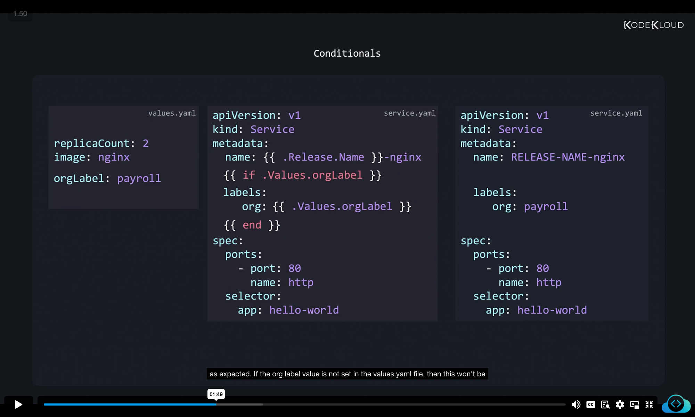
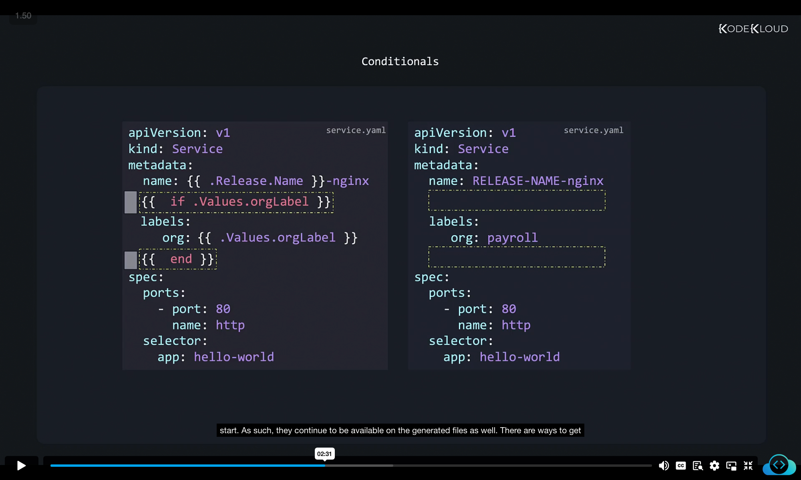
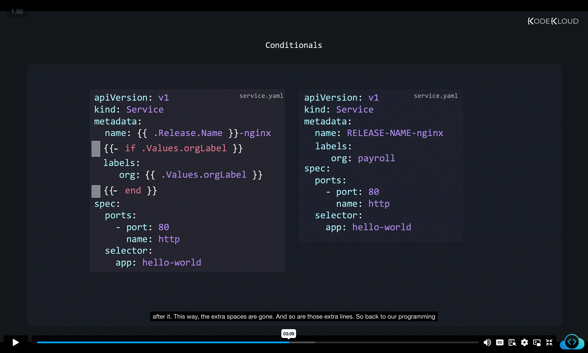
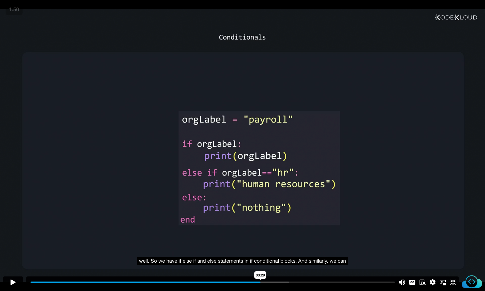
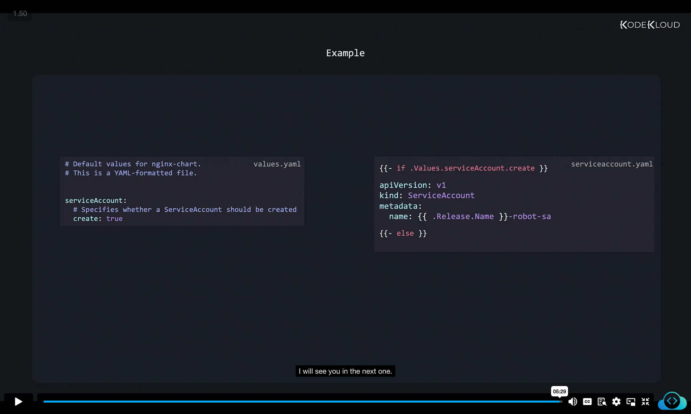

# Helm Conditionals – Detailed Notes

In this section, we will learn how to use **conditional logic in Helm templates**.
Conditionals allow us to **include or exclude parts of a template dynamically**, based on values provided in the `values.yaml` file.

---

## 1. Starting Example – Adding Custom Labels

We start with two files: `values.yaml` and `service.yaml`.


<table>
<tr>
<th>values.yaml</th>
<th>service.yaml</th>
</tr>
<tr>
<td>
<pre>

```yaml
replicaCount: 2
image: nginx
orgLabel: payroll
```

</pre>
</td>
<td>

```yaml
apiVersion: v1
kind: Service
metadata:
  name: {{ .Release.Name }}-nginx
  labels:
    org: {{ .Values.orgLabel }}
spec:
  ports:
    - port: 80
      name: http
  selector:
    app: hello-world
```

</td>
</tr>
</table>


Here:

* We define a new property `orgLabel` in `values.yaml`.
* We reference it in `service.yaml` using `{{ .Values.orgLabel }}`.
* This works fine when the value is present.


---

## 2. Making Labels Optional

The problem:
If `orgLabel` is **not defined** in `values.yaml`, we don’t want the `labels` section to appear in the generated manifest.

In programming, we handle this with **if statements**.

### Example: Python-style Conditional



```python
orgLabel = "payroll"

if orgLabel:
    print(orgLabel)
end
```

* Here, `print` runs only if `orgLabel` has a value.

---

## 3. Using `if` in Helm Templates

Helm templates also support **if blocks**, but inside double curly braces.


<table>
<tr>
<th>values.yaml</th>
<th>service.yaml (with condition)</th>
<th>Generated Output</th>
</tr>

<tr>
<td>

```yaml
replicaCount: 2
image: nginx
orgLabel: payroll
```

</td>
<td>

```yaml
apiVersion: v1
kind: Service
metadata:
  name: {{ .Release.Name }}-nginx
  {{ if .Values.orgLabel }}
  labels:
    org: {{ .Values.orgLabel }}
  {{ end }}
spec:
  ports:
    - port: 80
      name: http
  selector:
    app: hello-world
```

</td>

<td>

```yaml
apiVersion: v1
kind: Service
metadata:
  name: RELEASE.NAME-nginx
  labels:
    org: payroll
spec:
  ports:
    - port: 80
      name: http
  selector:
    app: hello-world
```

</td>
</tr>
</table>

* If `orgLabel` is **not set**, the `labels` section will be skipped entirely.
* This is very useful for optional configurations.



---

## 4. The Whitespace Issue

Problem: If `orgLabel` is not defined, Helm still leaves **empty lines**.
This happens because the template expression itself is removed, but the surrounding whitespace remains.



---

## 5. Trimming Whitespace

Solution: Use a **dash (`-`)** after the opening curly braces.

Example:


<table>
<tr>
<th>service.yaml</th>
<th>service.yaml Generated Output (no extra lines)</th>
</tr>
<tr>

<td>

```yaml
apiVersion: v1
kind: Service
metadata:
  name: {{ .Release.Name }}-nginx
  {{- if .Values.orgLabel }}
  labels:
    org: {{ .Values.orgLabel }}
  {{- end }}
spec:
  ports:
    - port: 80
      name: http
  selector:
    app: hello-world
```
</td>

<td>

```yaml
apiVersion: v1
kind: Service
metadata:
  name: RELEASE.NAME-nginx
  labels:
    org: payroll
spec:
  ports:
    - port: 80
      name: http
  selector:
    app: hello-world
```
</td>

</tr>
</table>



---

## 6. If-Else Conditions

Just like programming languages, Helm also supports:

* **if**
* **else if**
* **else**

### Example in Python



```python
orgLabel = "payroll"

if orgLabel:
    print(orgLabel)
elif orgLabel == "hr":
    print("human resources")
else:
    print("nothing")
end
```

---

## 7. If-Else in Helm Templates

### service.yaml

```yaml
apiVersion: v1
kind: Service
metadata:
  name: {{ .Release.Name }}-nginx
  {{- if .Values.orgLabel }}
  labels:
    org: {{ .Values.orgLabel }}
  {{- else if eq .Values.orgLabel "hr" }}
  labels:
    org: human resources
  {{- else }}
  labels:
    org: default
  {{- end }}
spec:
  ports:
    - port: 80
      name: http
  selector:
    app: hello-world
```

* Helm uses functions like `eq`, `ne`, `lt`, `gt`, `not`, and `empty` instead of direct operators (`==`, `!=`, etc.).
* Example:

  * `eq .Values.orgLabel "hr"` → true if `orgLabel` is `"hr"`
  * `ne .Values.orgLabel "hr"` → true if not equal to `"hr"`


---

## 8. Real-World Example – Conditional Resource Creation

Sometimes you want **entire objects** to be optional.
For example, creating a **ServiceAccount** only if the user enables it in `values.yaml`.

### values.yaml

```yaml
# Default values for nginx-chart.
serviceAccount:
  # Specifies whether a ServiceAccount should be created
  create: true
```

### serviceaccount.yaml

```yaml
{{- if .Values.serviceAccount.create }}
apiVersion: v1
kind: ServiceAccount
metadata:
  name: {{ .Release.Name }}-robot-sa
{{- end }}
```

* If `create: true`, Helm generates the ServiceAccount.
* If `create: false`, the entire object is skipped.



---

# 🔑 Key Takeaways

1. **Conditionals control YAML generation** – use them for optional fields and resources.
2. Use `{{ if }}` … `{{ end }}` blocks to wrap conditional sections.
3. **Whitespace matters** – use `{{-` and `-}}` to trim empty lines.
4. Use **functions (`eq`, `ne`, `gt`, etc.)** for comparisons instead of direct operators.
5. You can conditionally include:

   * Specific lines (like labels)
   * Entire Kubernetes objects (like ServiceAccount)
