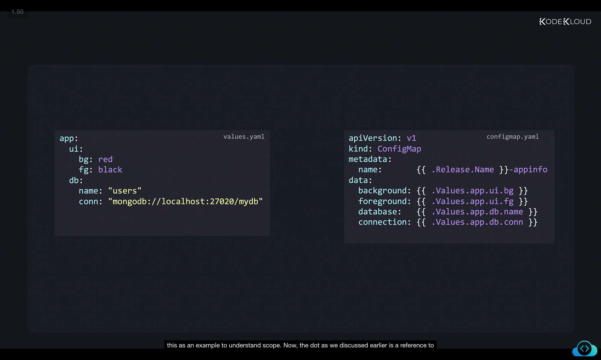
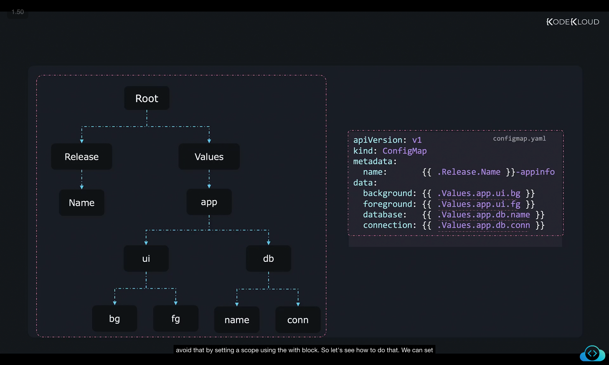
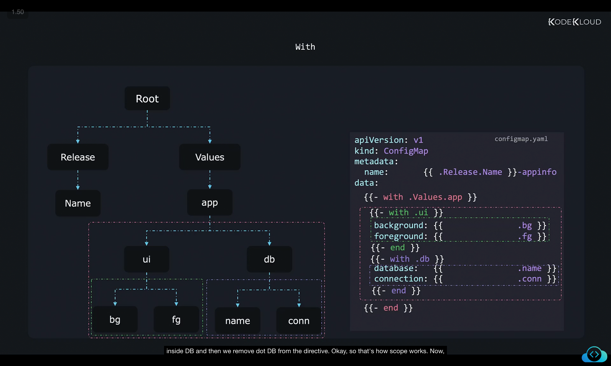
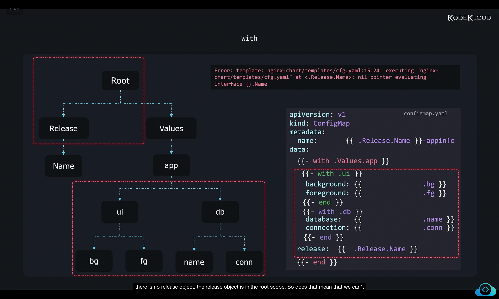
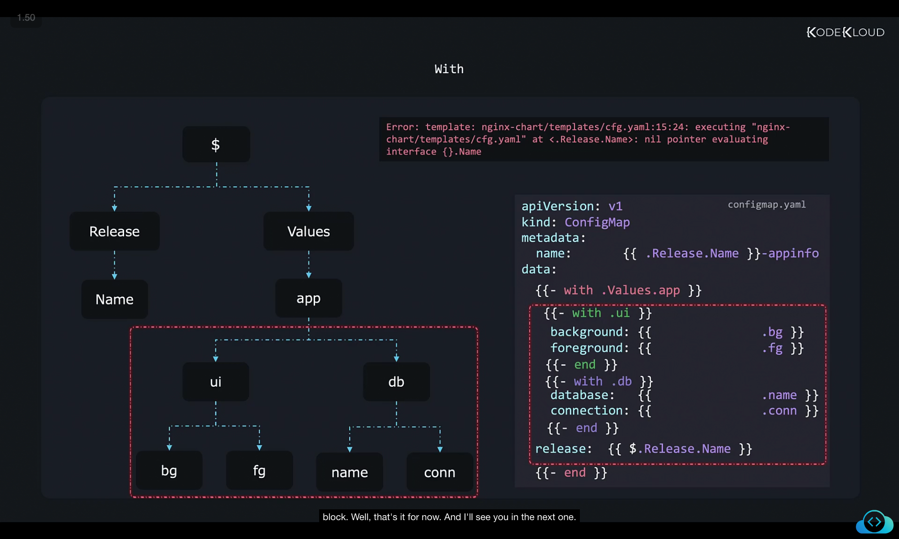

```
](../16-class-with-blocks/image
](../16-class-with-blocks/image
```
Got it 👍 I’ll rewrite this into **structured, detailed notes** with clear sections, proper explanations, and keep all the screenshots (``) exactly as they are. This way you can directly paste it into your `.md` file.

Here’s the improved version:

---

# Helm Scopes – Detailed Notes

## 1. Introduction to Scope in Helm

In Helm templates, **scope** determines what the `.` (dot) refers to at any given point.

* By default, `.` refers to the **root scope**.
* The root scope includes:

  * `.Values` → values from `values.yaml`
  * `.Release` → release-related metadata (name, namespace, etc.)
  * Other built-in objects

Understanding scopes helps us **avoid repetition** and **write cleaner templates**.

---

## 2. Example Setup

We’ll use an example to understand scope.

### `values.yaml`

```yaml
app:
  ui:
    bg: red
    fg: black
  db:
    name: "users"
    conn: "mongodb://localhost:27020/mydb"
```

### `configmap.yaml`

```yaml
apiVersion: v1
kind: ConfigMap
metadata:
  name: {{ .Release.Name }}-appinfo
data:
  background: {{ .Values.app.ui.bg }}
  foreground: {{ .Values.app.ui.fg }}
  database: {{ .Values.app.db.name }}
  connection: {{ .Values.app.db.conn }}
```

Here:

* **UI settings** (bg, fg) come from `.Values.app.ui`
* **DB settings** (name, conn) come from `.Values.app.db`
* `.Release.Name` comes from the **release object**.



---

## 3. Understanding the Root Scope

At this point:

* `.` (dot) = **root scope**.
* To access nested values, you must fully traverse:

  * `.Values.app.ui.bg`
  * `.Values.app.ui.fg`
  * `.Values.app.db.name`
  * `.Values.app.db.conn`

This leads to **repetition** (lots of `.Values.app` everywhere).



---

## 4. Reducing Repetition with `with`

The `with` block lets us **set a new scope**.

Example:

```yaml
{{- with .Values.app }}
  background: {{ .ui.bg }}
  foreground: {{ .ui.fg }}
  database: {{ .db.name }}
  connection: {{ .db.conn }}
{{- end }}
```

* Inside this block, `.` now means **`.Values.app`**.
* So `.ui.bg` actually means `.Values.app.ui.bg`.
* This reduces duplication.


---

## 5. Nested `with` Blocks

We can **nest `with` blocks** to simplify further.

```yaml
apiVersion: v1
kind: ConfigMap
metadata:
  name: {{ .Release.Name }}-appinfo
data:
{{- with .Values.app }}
  {{- with .ui }}
  background: {{ .bg }}
  foreground: {{ .fg }}
  {{- end }}
  {{- with .db }}
  database: {{ .name }}
  connection: {{ .conn }}
  {{- end }}
{{- end }}
```

* Inside `{{- with .ui }}`, `.` means `.Values.app.ui`.
* So `.bg` → `.Values.app.ui.bg`.
* Inside `{{- with .db }}`, `.` means `.Values.app.db`.
* So `.name` → `.Values.app.db.name`.

This way, we avoid repeating `.ui` or `.db`.



---

## 6. Problem: Losing Access to Root Scope

Suppose we add this line inside a `with` block:

```yaml
release: {{ .Release.Name }}
```

This fails with an error:

```
Error: template: nginx-chart/templates/cfg.yaml:15:24: executing "nginx-chart/templates/cfg-yaml" at <Release.Name>: nil pointer evaluating interface {}.Name
```

Why?

* Because inside `with .Values.app`, the scope is `.Values.app`.
* `.Release` does **not exist** in `.Values.app`.
* `.Release` only exists in the **root scope**.



---

## 7. Accessing Root Scope with `$`

Helm provides `$` as a **reference to the root scope**.

* `.` = current scope
* `$` = root scope

Correct way:

```yaml
release: {{ $.Release.Name }}
```

This ensures:

* No matter how deep you are in nested scopes, `$` always points back to root.

Final fixed configmap:

```yaml
apiVersion: v1
kind: ConfigMap
metadata:
  name: {{ .Release.Name }}-appinfo
data:
{{- with .Values.app }}
  {{- with .ui }}
  background: {{ .bg }}
  foreground: {{ .fg }}
  {{- end }}
  {{- with .db }}
  database: {{ .name }}
  connection: {{ .conn }}
  {{- end }}
  release: {{ $.Release.Name }}
{{- end }}
```



---

## 8. Key Takeaways

* `.` → refers to **current scope**.
* By default, current scope = **root scope**.
* Use `with` to set **a narrower scope** and avoid repetition.
* Inside nested `with`, `.` changes to that block’s scope.
* To escape back to root, use `$`.

---

✅ With this structure, you can directly paste into your `.md` file — it’s organized like proper course notes.

Do you want me to also add a **visual tree diagram** (like ASCII or markdown tree) to represent how scopes change at each step? That will make it even easier to see the hierarchy.
