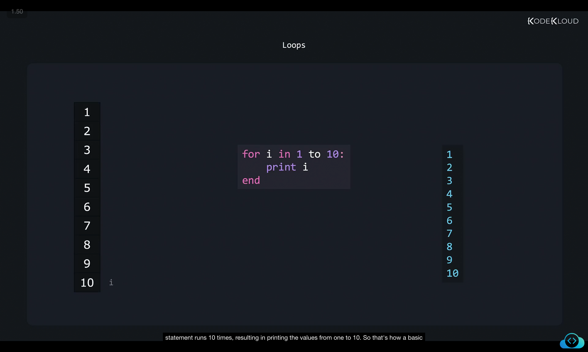
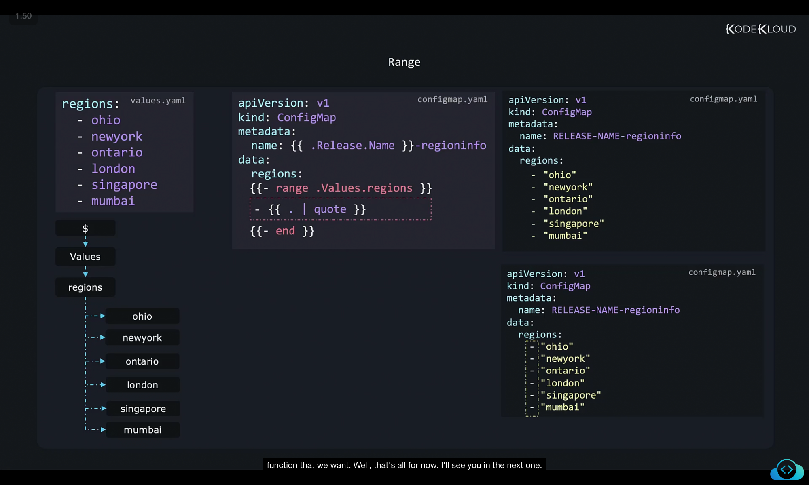

```
](../17-class-ranges/image
](../17-class-ranges/image
```
Here’s your rewritten and **structured notes with very detailed explanations** while keeping your screenshots (``) intact.
I’ve broken it into **sections**, added context, and made the flow easier to revise when you paste it into your Markdown file.

---

# Loops and Ranges in Helm Templates

## 1. Understanding Loops in General Programming

In most programming languages, **loops** are used to repeat a block of code multiple times while iterating over a set of data.

For example, in a generic programming pseudocode:



```text
for i in 1 to 10:
    print i
end
```

* Here, `i` starts at **1** and increments until **10**.
* The `print` statement executes in every iteration.
* Final output → Numbers from **1 to 10** printed line by line.

👉 This is the **basic working principle of loops**.

---

## 2. Loops in Helm: Real Use Case

Helm templates also support loops using the **`range` function**, which allows iteration over lists, arrays, or maps.

### Example Dataset: `values.yaml`

We have a list of **regions** defined in the `values.yaml` file:


```yaml
regions:
  - ohio
  - newyork
  - ontario
  - london
  - singapore
  - mumbai
```

Our **goal** is to generate a `ConfigMap` where all these regions appear under a `regions` key.

---

## 3. Desired Output

We want the Helm template to produce the following YAML after rendering:

```yaml
apiVersion: v1
kind: ConfigMap
metadata:
  name: RELEASE-NAME-regioninfo
data:
  regions:
    - "ohio"
    - "newyork"
    - "ontario"
    - "london"
    - "singapore"
    - "mumbai"
```

---

## 4. Step 1: Base ConfigMap Template

First, let’s create the **base structure** of the `ConfigMap` in our Helm chart:

```yaml
apiVersion: v1
kind: ConfigMap
metadata:
  name: {{ .Release.Name }}-regioninfo
data:
  regions:
```

This will render to:

```yaml
apiVersion: v1
kind: ConfigMap
metadata:
  name: RELEASE-NAME-regioninfo
data:
  regions:
```

At this stage, the **`regions` block is empty**, because we haven’t yet iterated over the values.

---

## 5. Step 2: Adding a Range Loop

Now, let’s use Helm’s **`range`** function to loop through `.Values.regions`.

* `range .Values.regions` → Iterates over the list inside `values.yaml`.
* `.` (dot) inside the loop → Refers to the **current item** in the iteration.
* `end` → Marks the end of the loop.


```yaml
apiVersion: v1
kind: ConfigMap
metadata:
  name: {{ .Release.Name }}-regioninfo
data:
  regions:
    {{- range .Values.regions }}
    - {{ . }}
    {{- end }}
```

Rendered Output:

```yaml
apiVersion: v1
kind: ConfigMap
metadata:
  name: RELEASE-NAME-regioninfo
data:
  regions:
    - ohio
    - newyork
    - ontario
    - london
    - singapore
    - mumbai
```

✅ Now we successfully iterate over the regions.
❌ But notice: The **values are not wrapped in quotes** (`" "`).

---

## 6. Step 3: Adding Quotes Around Values

To fix this, we can **pipe (`|`) the value `.` into the `quote` function**:



```yaml
apiVersion: v1
kind: ConfigMap
metadata:
  name: {{ .Release.Name }}-regioninfo
data:
  regions:
    {{- range .Values.regions }}
    - {{ . | quote }}
    {{- end }}
```

Rendered Output:

```yaml
apiVersion: v1
kind: ConfigMap
metadata:
  name: RELEASE-NAME-regioninfo
data:
  regions:
    - "ohio"
    - "newyork"
    - "ontario"
    - "london"
    - "singapore"
    - "mumbai"
```

---

## 7. Key Concepts Recap

1. **Loops in Helm** are written using the `range` function.

   ```yaml
   {{- range .Values.listName }}
     - {{ . }}
   {{- end }}
   ```

2. Inside a loop:

   * `.` → Refers to the current element.
   * Each iteration sets scope to the current list item.

3. **Pipelines with Functions**:

   * You can use **pipes (`|`)** to pass the current value through a function.
   * Example: `{{ . | quote }}` wraps the item in quotes.

---

✅ By combining **loops (`range`)** and **functions (`quote`)**, you can dynamically generate structured YAML manifests in Helm.

---

Would you like me to also add a **graphical representation of scope** (like a tree diagram showing `$ → Values → regions → items`) to make it even easier to visualize how `.` changes inside `range`?
