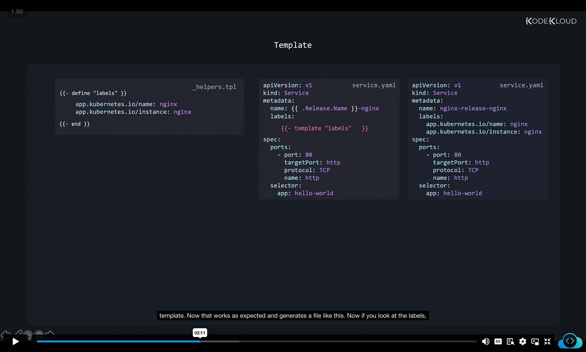
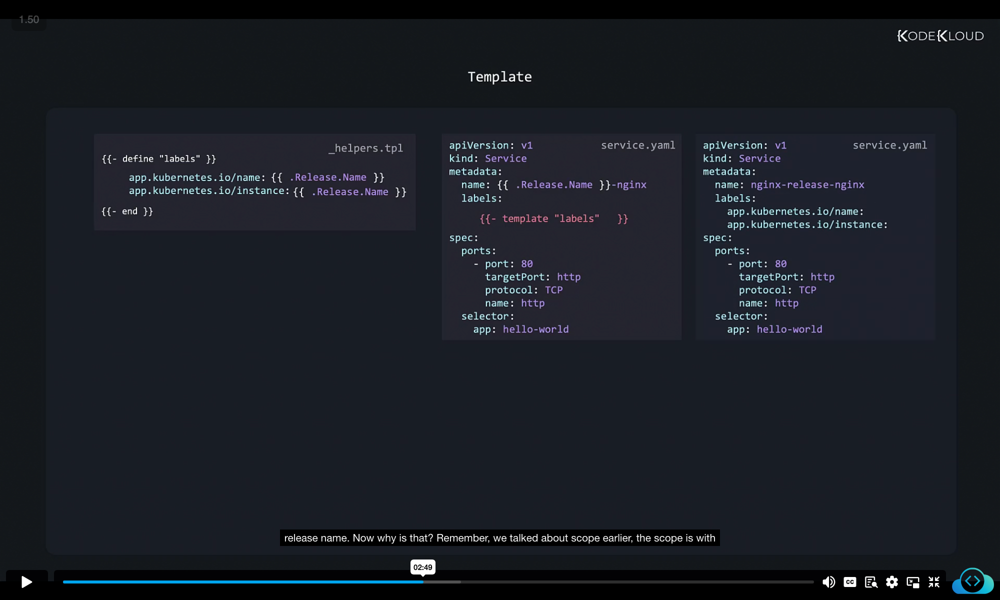
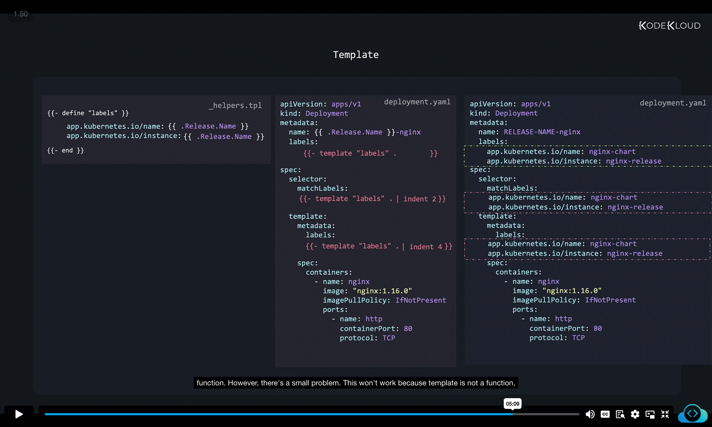
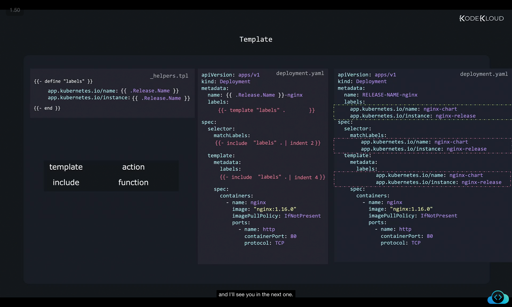

```
](../18-class-named-templates/image
](../18-class-named-templates/image
```
Got it ✅
I’ll rewrite your content into **well-structured, detailed notes** with proper explanations, indentation, and keep your screenshots (``) intact so you can directly paste it into your `.md` file.

Here’s the improved version of your notes on **Named Templates in Helm**:

---

# 📌 Named Templates in Helm

## 1. The Problem: Repetition of Labels

In Kubernetes manifests, labels are often repeated multiple times across different resources.
For example, consider a **Service** and a **Deployment** file:


### service.yaml

```yaml
apiVersion: v1
kind: Service
metadata:
  name: {{ .Release.Name }}-nginx
  labels:
    app.kubernetes.io/name: nginx
    app.kubernetes.io/instance: nginx
spec:
  ports:
    - port: 80
      targetPort: http
      protocol: TCP
      name: http
  selector:
    app: hello-world
```

### deployment.yaml

```yaml
apiVersion: apps/v1
kind: Deployment
metadata:
  name: {{ .Release.Name }}-nginx
  labels:
    app.kubernetes.io/name: nginx
    app.kubernetes.io/instance: nginx
spec:
  selector:
    matchLabels:
      app.kubernetes.io/name: nginx
      app.kubernetes.io/instance: nginx
  template:
    metadata:
      labels:
        app.kubernetes.io/name: nginx
        app.kubernetes.io/instance: nginx
    spec:
      containers:
        - name: nginx
          image: "nginx:1.16.0"
          imagePullPolicy: IfNotPresent
          ports:
            - name: http
              containerPort: 80
              protocol: TCP
```

🔴 **Issue:** These label definitions are duplicated in multiple places. As your manifests grow, duplication increases the risk of mistakes and inconsistency.

---

## 2. The Solution: Named Templates (Partials)

We solve this duplication problem using **named templates (partials)** in Helm.

### Step 1: Create a Helper File

Create a file called `_helpers.tpl` inside the `templates/` directory.

⚡ Note:

* Files starting with an underscore (`_`) are not rendered into manifests.
* These files are only used to store helper definitions.


```yaml
app.kubernetes.io/name: nginx
app.kubernetes.io/instance: nginx
```

### Step 2: Define a Named Template

Wrap the repeated code in a **`define` block**:



```yaml
{{- define "labels" }}
  app.kubernetes.io/name: nginx
  app.kubernetes.io/instance: nginx
{{- end }}
```

Now, you can use this named template anywhere using the `template` function:

```yaml
labels:
  {{- template "labels" . }}
```

### Output

```yaml
labels:
  app.kubernetes.io/name: nginx
  app.kubernetes.io/instance: nginx
```

---

## 3. Making Named Templates Dynamic

The above helper hard-codes the value `nginx`. That’s not flexible.
Instead, let’s use Helm variables like `.Release.Name`:



```yaml
{{- define "labels" }}
  app.kubernetes.io/name: {{ .Release.Name }}
  app.kubernetes.io/instance: {{ .Release.Name }}
{{- end }}
```

But if we try this:

```yaml
labels:
  {{- template "labels" }}
```

We get an **empty result**:

```yaml
labels:
  app.kubernetes.io/name: 
  app.kubernetes.io/instance:
```

---

## 4. Fixing Scope with `.`

This happens because the helper template doesn’t automatically inherit the scope from the parent file.
To fix this, we must **pass the scope explicitly** using `.`:


```yaml
labels:
  {{- template "labels" . }}
```

✅ Now `.Release.Name` becomes available inside the helper.

---

## 5. Indentation Issues with Multiple Uses

When using the template in multiple places (like in a **Deployment**), indentation can break:


### deployment.yaml

```yaml
spec:
  selector:
    matchLabels:
      {{- template "labels" . }}
  template:
    metadata:
      labels:
        {{- template "labels" . }}
```

### Problem:

The output is not aligned properly in the YAML file because Helm inserts the helper code “as is.”

---

## 6. Fixing Indentation with `indent`

Helm provides the **`indent` function** to adjust indentation levels.



```yaml
spec:
  selector:
    matchLabels:
      {{- include "labels" . | indent 6 }}
  template:
    metadata:
      labels:
        {{- include "labels" . | indent 8 }}
```

⚠️ Important:

* `template` is an **action** → cannot be piped.
* `include` is a **function** → can be piped into other functions like `indent`.

---

## 7. Final Correct Example



### \_helpers.tpl

```yaml
{{- define "labels" }}
  app.kubernetes.io/name: {{ .Release.Name }}
  app.kubernetes.io/instance: {{ .Release.Name }}
{{- end }}
```

### deployment.yaml

```yaml
apiVersion: apps/v1
kind: Deployment
metadata:
  name: {{ .Release.Name }}-nginx
  labels:
    {{- include "labels" . | indent 4 }}
spec:
  selector:
    matchLabels:
      {{- include "labels" . | indent 6 }}
  template:
    metadata:
      labels:
        {{- include "labels" . | indent 8 }}
    spec:
      containers:
        - name: nginx
          image: "nginx:1.16.0"
          imagePullPolicy: IfNotPresent
          ports:
            - name: http
              containerPort: 80
              protocol: TCP
```

### Generated YAML

```yaml
apiVersion: apps/v1
kind: Deployment
metadata:
  name: RELEASE-NAME-nginx
  labels:
    app.kubernetes.io/name: nginx-chart
    app.kubernetes.io/instance: nginx-release
spec:
  selector:
    matchLabels:
      app.kubernetes.io/name: nginx-chart
      app.kubernetes.io/instance: nginx-release
  template:
    metadata:
      labels:
        app.kubernetes.io/name: nginx-chart
        app.kubernetes.io/instance: nginx-release
    spec:
      containers:
        - name: nginx
          image: "nginx:1.16.0"
          imagePullPolicy: IfNotPresent
          ports:
            - name: http
              containerPort: 80
              protocol: TCP
```

---

# ✅ Key Takeaways

* **Named templates (partials)** reduce duplication.
* Store them in `_helpers.tpl`.
* Use `template` or `include` to reuse them.
* Always **pass `.`** to maintain scope.
* Use **`include + indent`** to ensure proper YAML formatting.

---

Would you like me to also **add diagrams/ASCII flowcharts** (like scope visualization or flow of `include | indent`) to make it even easier to visualize?
