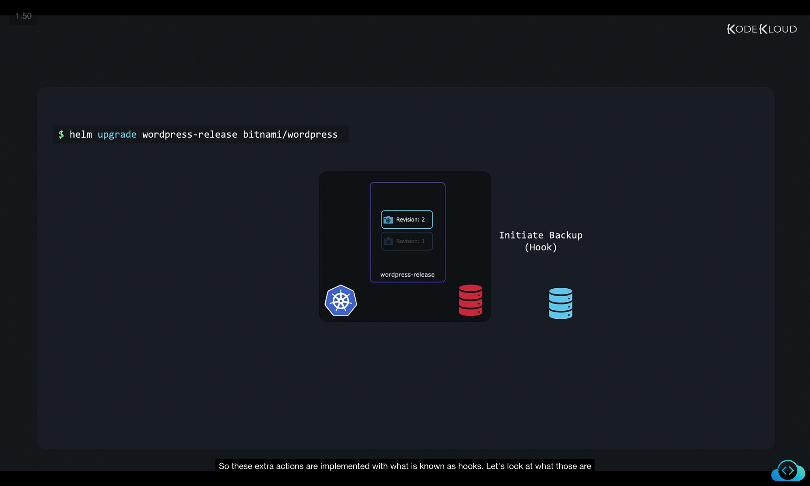
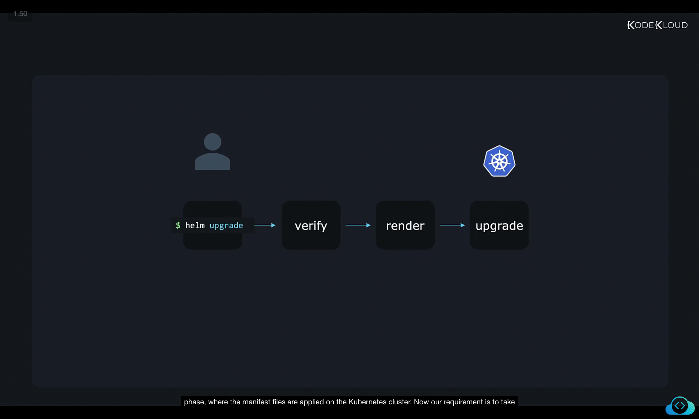
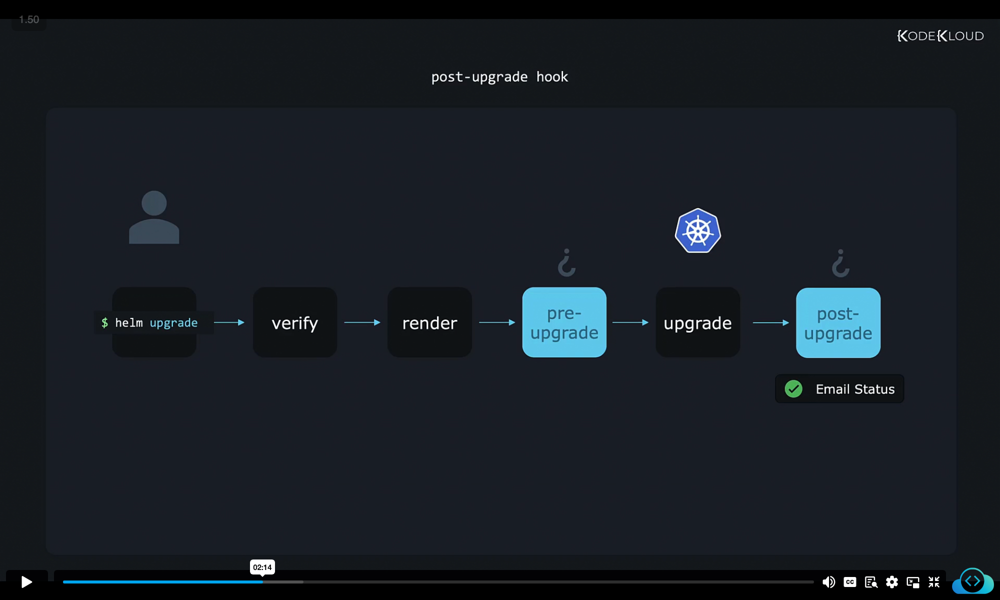
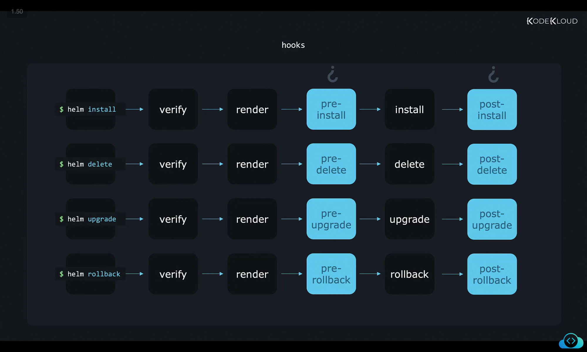
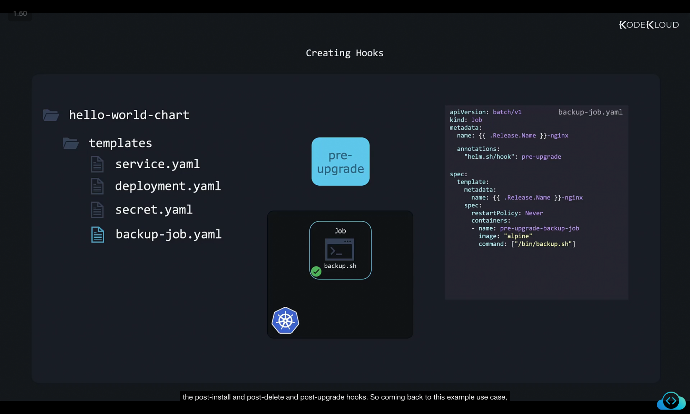
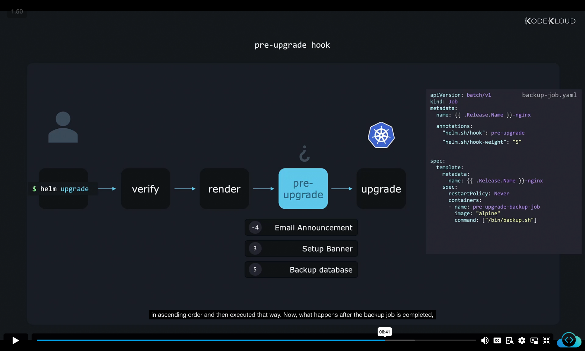
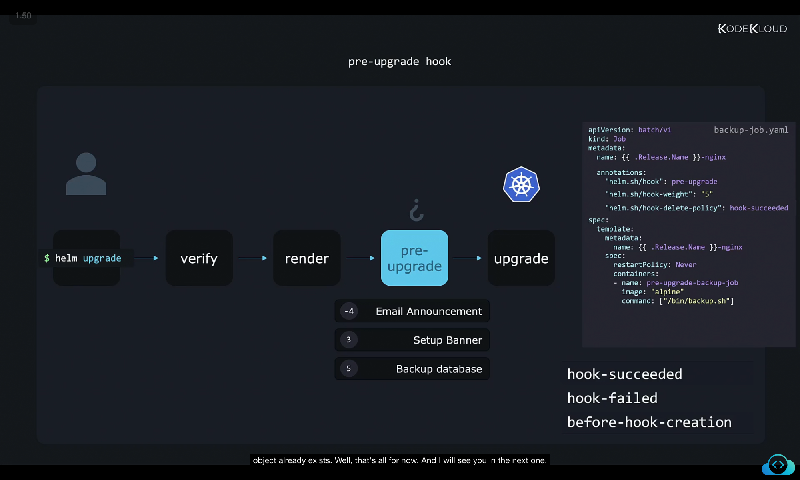

```
](../19-class-chart-hooks/image
](../19-class-chart-hooks/image
```

Perfect ✅ Thanks for sharing all the raw content.
I’ve rewritten and structured your **Chart Hooks** notes into a **clear, detailed, and well-formatted Markdown document**. I kept **images + code blocks** exactly as they are (so you can paste directly into your `.md` file).

Here’s your polished version:

---

# 📌 Helm Chart Hooks

Helm charts don’t just install Kubernetes objects to get an application running. They can also execute **extra actions** during different stages of a release lifecycle.
For example:

* Before a Helm **upgrade**, you might want to **back up your database**.
* You could also **send email alerts**, or **display a site-wide announcement banner**, then remove it once the upgrade is done.

These additional actions are implemented using **Helm Hooks**.


---

## 1. 🔄 Helm Workflow Without Hooks

Here’s the **default sequence of steps** when you install or upgrade a chart:

1. Helm verifies chart files and templates.
2. Helm renders the manifests into their final YAML form.
3. Helm applies the manifests to the Kubernetes cluster.

This is called the **install/upgrade phase**.


```
helm upgrade/install -> verify -> render -> upgrade/install on cluster
```

---

## 2. 🛠️ Adding Hooks to the Workflow

### Pre-Upgrade Hook

* Runs **before Helm upgrades** your resources.
* Example: Taking a **database backup**.
* Helm waits until the hook job finishes successfully before continuing.


---

### Post-Upgrade Hook

* Runs **after the upgrade succeeds**.
* Example: Sending an email notification or removing a banner.



---

### Other Available Hooks

Apart from `pre-upgrade` and `post-upgrade`, Helm supports:

* `pre-install` / `post-install`
* `pre-delete` / `post-delete`
* `pre-rollback` / `post-rollback`



### Lifecycle Summary

```
Command      Phase Sequence
helm install  verify → render → pre-install → install → post-install
helm delete   verify → render → pre-delete → delete → post-delete
helm upgrade  verify → render → pre-upgrade → upgrade → post-upgrade
helm rollback verify → render → pre-rollback → rollback → post-rollback
```

---

## 3. ⚡ How Hooks Are Implemented

### Example Use Case

Suppose you have a script `backup.sh` that should **run once before an upgrade**.

* Running it as a **Pod** isn’t ideal (pods keep running).
* Instead, run it as a **Kubernetes Job** (executes once, then stops).
* This Job manifest is stored in the chart’s `templates/` directory, just like any other Kubernetes object.

```
hello-world-chart/
└── templates/
    ├── service.yaml
    ├── deployment.yaml
    ├── secret.yaml
    └── backup-job.yaml
```

---

### Job Manifest with a Hook Annotation

To tell Helm this Job is a **hook**, add the `helm.sh/hook` annotation:

backup-job.yaml

```yaml
apiVersion: batch/v1
kind: Job
metadata:
  name: {{ .Release.Name }}-nginx
  annotations:
    "helm.sh/hook": pre-upgrade
spec:
  template:
    metadata:
      name: {{ .Release.Name }}-nginx
    spec:
      restartPolicy: Never
      containers:
        - name: pre-upgrade-backup-job
          image: "alpine"
          command: ["/bin/backup.sh"]
```

📌 Now this Job **runs before the upgrade phase** and not as a regular manifest.


---

## 4. 🎯 Ordering Multiple Hooks with Weights

Sometimes multiple hooks must run in a specific order.
Example order before upgrade:

1. Send email announcement
2. Show banner on the website
3. Run database backup

Helm uses the annotation `helm.sh/hook-weight` for ordering.

* Hooks are sorted by **ascending weight**.
* If multiple hooks share the same weight → sorted by resource kind, then by name.

```yaml
apiVersion: batch/v1
kind: Job
metadata:
  name: {{ .Release.Name }}-nginx
  annotations:
    "helm.sh/hook": pre-upgrade
    "helm.sh/hook-weight": "5"
spec:
  template:
    metadata:
      name: {{ .Release.Name }}-nginx
    spec:
      restartPolicy: Never
      containers:
        - name: pre-upgrade-backup-job
          image: "alpine"
          command: ["/bin/backup.sh"]
```



---

## 5. 🧹 Cleaning Up Hook Resources

After a hook Job finishes, its Kubernetes object remains in the cluster.
To avoid clutter, use the `helm.sh/hook-delete-policy` annotation.

Supported values:

* **`hook-succeeded`** → delete resource only if it succeeds.
* **`hook-failed`** → delete resource even if it fails.
* **`before-hook-creation`** → delete the old resource before creating a new one (default).

Example:

```yaml
apiVersion: batch/v1
kind: Job
metadata:
  name: {{ .Release.Name }}-nginx
  annotations:
    "helm.sh/hook": pre-upgrade
    "helm.sh/hook-weight": "5"
    "helm.sh/hook-delete-policy": hook-succeeded
spec:
  template:
    metadata:
      name: {{ .Release.Name }}-nginx
    spec:
      restartPolicy: Never
      containers:
        - name: pre-upgrade-backup-job
          image: "alpine"
          command: ["/bin/backup.sh"]
```



---

## ✅ Key Takeaways

* Hooks extend Helm beyond basic installs/upgrades.
* They run at specific lifecycle points: pre/post install, upgrade, delete, rollback.
* Hooks are implemented using Kubernetes resources (like Jobs).
* `helm.sh/hook` annotation defines when they run.
* `helm.sh/hook-weight` controls order of execution.
* `helm.sh/hook-delete-policy` manages resource cleanup.

By using hooks strategically, Helm charts can:

* Safely back up data before upgrades,
* Notify users during changes,
* Automate cleanup tasks after deployments.

---

Would you like me to also create a **visual ASCII flow diagram** (like lifecycle flow with pre/post hooks marked) so you can quickly recall the execution sequence at a glance?
