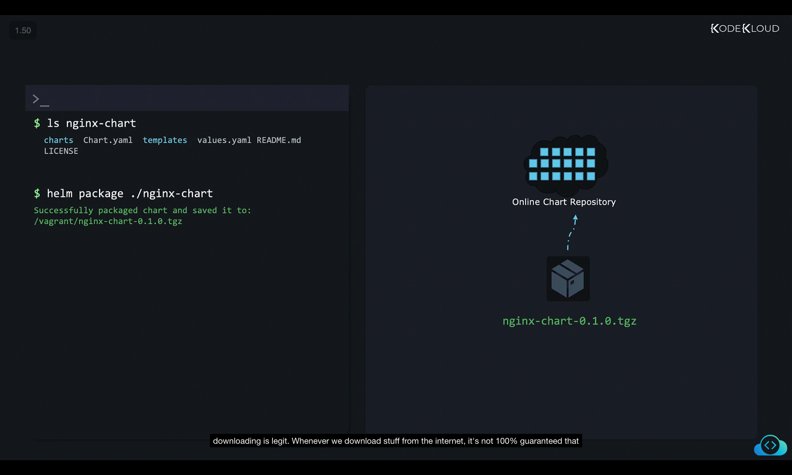
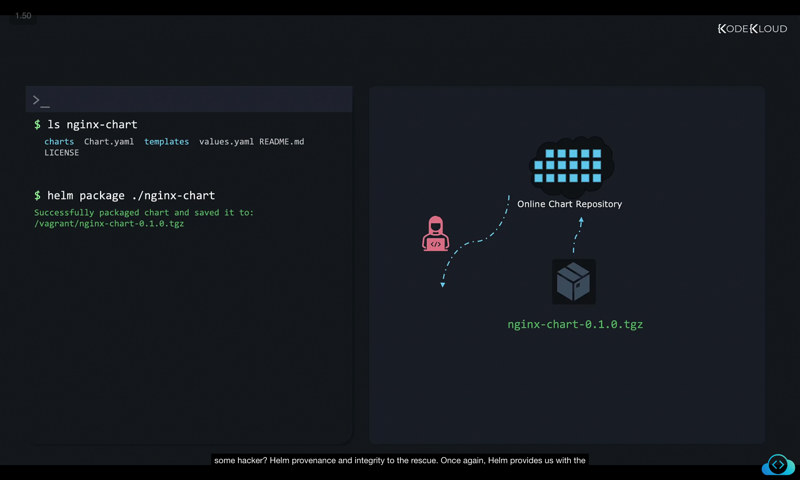
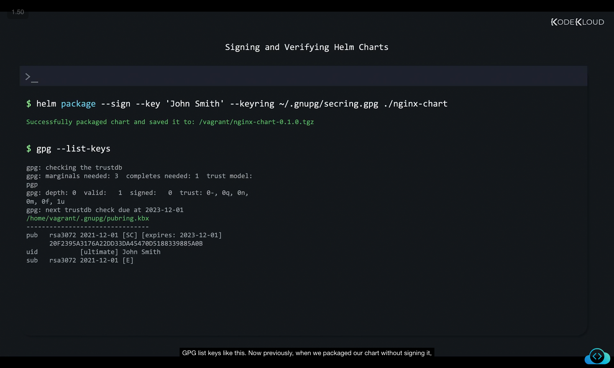

# 📦 Packaging and Uploading Helm Charts

Once we’ve developed a Helm chart, the next step is to **package** it and then **upload** it to a chart repository so that others can download and install it.


---

## 1. 📁 Chart Directory Structure

Let’s say we have built a chart called **nginx-chart**. The directory contains:

* `Chart.yaml` → Metadata about the chart (name, version, description).
* `values.yaml` → Default configuration values.
* `templates/` → Kubernetes manifests written with Go templates.
* `charts/` → Subcharts (if any).
* `README.md` → Documentation.
* `LICENSE` → Licensing information.

```bash
$ ls nginx-chart
charts  Chart.yaml  templates  values.yaml  README.md  LICENSE
```

---

## 2. 📦 Packaging a Chart

We can package the chart into a single compressed archive (`.tgz`) using the **helm package** command:

```bash
$ helm package ./nginx-chart
Successfully packaged chart and saved it to:
/vagrant/nginx-chart-0.1.0.tgz
```

* The packaged file is named **nginx-chart-0.1.0.tgz**.
* The version number `0.1.0` comes from `Chart.yaml`.
* `.tgz` → Tar archive compressed with gzip.
* Inside this archive, all files/directories of the chart are neatly bundled together, making it portable.



---

## 3. 🔒 Why Signing Charts Matters

When downloading files from the internet, there’s always a risk:

* Servers may be compromised.
* Attackers could replace original files with malicious ones.

Users need a way to **verify the authenticity and integrity** of a chart.
That’s where **cryptographic signing** comes in.



---

## 4. 🛡️ Helm Provenance & Integrity

Helm provides built-in support for **signing charts**.

How it works:

1. **Chart developers** sign the chart using a **private key**.
2. A **provenance file (`.prov`)** is created alongside the chart.
3. **Users** download both files and verify the signature with the developer’s **public key**.

   * If valid → Users know the chart is authentic and unchanged.


---

## 5. 🔑 Generating Keys with GPG

Helm uses **GNU Privacy Guard (GPG)** for key management.

### Quick Key Generation

```bash
$ gpg --quick-generate-key "John Smith"
```

Output:

```bash
pub   rsa3072 2021-12-01 [SC] [expires: 2023-12-01]
      20F2395A3176A22DD33D45470D5188339885A0B
uid           John Smith
sub   rsa3072 2021-12-01 [E]
```

* **Private key** → Used to sign charts (keep secret).
* **Public key** → Shared with users (for verification).
* Keys can also be uploaded to key servers (e.g., `keyserver.ubuntu.com`).


### Full Key Generation (More Secure)

```bash
$ gpg --full-generate-key "John Smith"
```

This allows fine-tuning:

* Key type
* Expiration date
* Email association
* Stronger passphrase


---

## 6. 🔄 Handling GPG v2 Key Format

Most Linux distros use **GPG v2**, which stores keys differently.
Helm prefers the **older key format**.

Convert keys:

```bash
$ gpg --export-secret-keys > ~/.gnupg/secring.gpg
```


---

## 7. ✍️ Signing a Helm Chart

We can now sign our chart while packaging:

```bash
$ helm package --sign --key 'John Smith' --keyring ~/.gnupg/secring.gpg ./nginx-chart
Successfully packaged chart and saved it to: /vagrant/nginx-chart-0.1.0.tgz
```

Check keys:

```bash
$ gpg --list-keys
```



---

## 8. 📄 Provenance File (`.prov`)

After signing, Helm generates an **extra file**:

```bash
$ ls
nginx-chart-0.1.0.tgz   nginx-chart-0.1.0.tgz.prov
```

The `.prov` file contains:

* Chart metadata
* Hash of the chart (`sha256`)
* Digital signature

Example:

```
-----BEGIN PGP SIGNED MESSAGE-----
Hash: SHA512
apiVersion: v2
appVersion: 1.16.0
...
files:
  nginx-chart-0.1.0.tgz: sha256:b7d0502a9617ab953a3246bc7ba6a9de9d4286b2e78e3ea7975cc54698c4274
-----BEGIN PGP SIGNATURE-----
...
-----END PGP SIGNATURE-----
```

---

## 9. 🔍 Verifying Integrity

Check hash manually:

```bash
$ sha256sum nginx-chart-0.1.0.tgz
b7d05022a9617ab953a3246bc7ba6a9de9d4286b2e78e3ea7975cc54698c4274    nginx-chart-0.1.0.tgz
```

* If even **1 byte** changes, the hash will differ.
* Provenance + PGP signature ensures the hash itself can’t be tampered with.


---

## 10. 🧪 Helm Verify Command

When distributing charts, you must provide:

* `nginx-chart-0.1.0.tgz`
* `nginx-chart-0.1.0.tgz.prov`

Users can verify:

```bash
$ helm verify ./nginx-chart-0.1.0.tgz
Error: failed to load keyring: open /home/vagrant/.gnupg/pubring.gpg: no such file or directory
```

This error happens because Helm expects old-style public keys.

### Workaround: Export Public Key

```bash
$ gpg --export 'John Smith' > mypublickey
$ helm verify --keyring ./mypublickey ./nginx-chart-0.1.0.tgz
Signed by: John Smith
Using Key With Fingerprint: 20F2395A3176A22DD33DA45470D518839885A0B
Chart Hash Verified: sha256:b7d5022a9617ab953a3246bc7ba6a9de9d4286b2e78e3ea7975cc54698c4274
```


### Downloading Keys from Keyservers

Users can also fetch your public key directly:

```bash
$ gpg --recv-keys --keyserver keyserver.ubuntu.com 8D40FE0CACC3FED4AD1C217180BA57AAFAAD1CA5
```


---

## 11. ⛔ Verifying During Install

Verification can be integrated into Helm commands.

Example: Installing a chart with signature verification:

```bash
$ helm install --verify nginx-chart-0.1.0
```

* If verification fails → Installation is **aborted**.
* Ensures only **trusted, signed charts** are installed.


---

## ✅ Key Takeaways

* **Package charts** using `helm package`.
* **Sign charts** with GPG to build trust.
* **Provenance files (`.prov`)** ensure integrity & authenticity.
* **Verify charts** using `helm verify` or `--verify` flag during install.
* Always distribute **both `.tgz` and `.tgz.prov` files**.
* Share your **public key** via key servers for users to validate signatures.

Next: 📤 Uploading charts to repositories.

