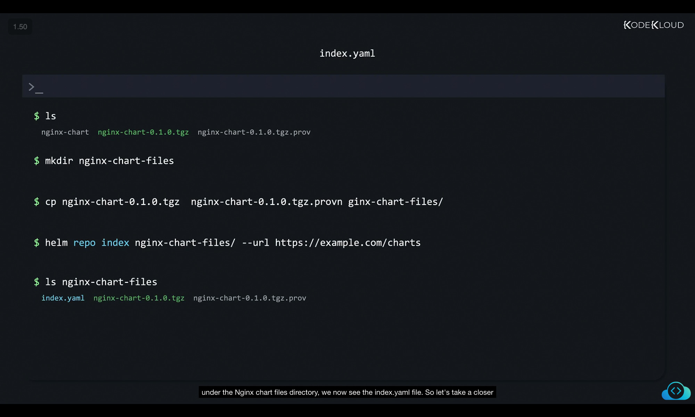
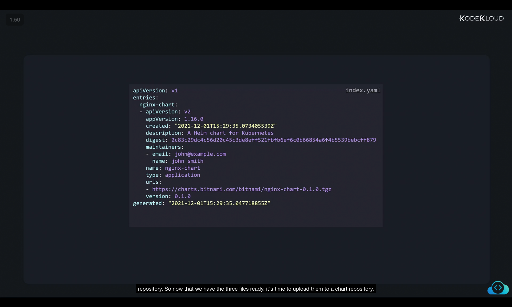
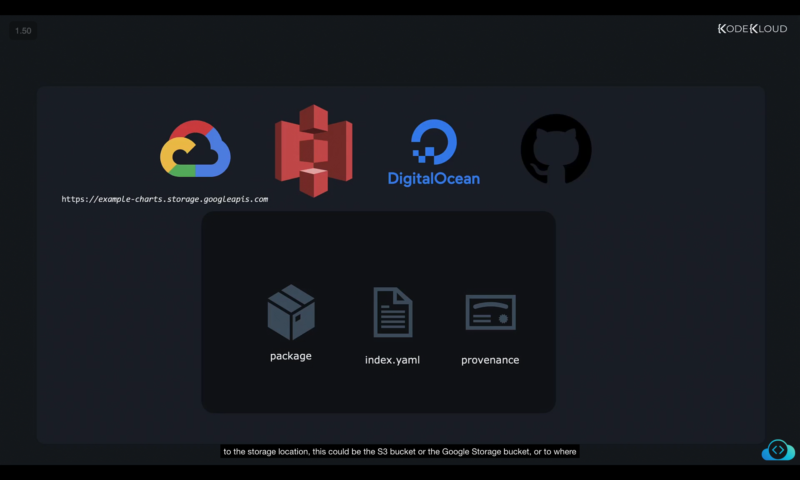
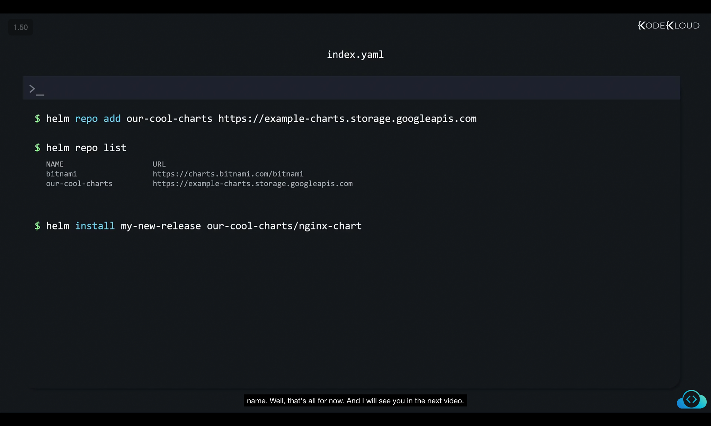

```
](../21-class-uploading-charts/image
](../21-class-uploading-charts/image
```
Got it ✅ I’ll rewrite your given content into **structured, detailed, and well-explained notes** (with your screenshots kept exactly as they are).
This way you can directly paste it into your Markdown file and it will read like a proper learning document.

---

# 📘 Helm Chart Repository – Packaging, Indexing, and Uploading

Now that we have **packaged our chart** and also **signed it**, the next step is to **upload our chart repository online** so that users can easily install it with a single command such as:

```bash
helm install my-release <repo-name>/nginx-chart
```

This process requires a **chart repository** that contains specific files. Let’s break this down step by step.

---

## 📂 Components of a Chart Repository

A Helm chart repository typically contains the following files:

1. **Packaged Chart (.tgz file)**

   * Example: `nginx-chart-0.1.0.tgz`
   * This is the Helm chart we created and packaged in the previous step.

2. **Index File (`index.yaml`)**

   * Describes the chart repository.
   * Contains:

     * Chart metadata (name, version, description).
     * URLs to download chart packages.
     * Checksums for verification.

3. **Provenance File (`.prov`)**

   * Example: `nginx-chart-0.1.0.tgz.prov`
   * Contains cryptographic signatures to verify authenticity of charts.
   * Ensures users are downloading charts from **trusted authors** (and not malicious versions).


---

## 📦 Current Files

At this point, we already have:

```bash
$ ls
nginx-chart  nginx-chart-0.1.0.tgz  nginx-chart-0.1.0.tgz.prov
```

* ✅ Packaged Chart → `nginx-chart-0.1.0.tgz`
* ✅ Provenance File → `nginx-chart-0.1.0.tgz.prov`
* ❌ Missing File → `index.yaml`

So the **next step** is to generate the `index.yaml`.

---

## 🛠 Step 1: Organize Files

First, create a directory to hold all required chart files:

```bash
$ mkdir nginx-chart-files
$ cp nginx-chart-0.1.0.tgz nginx-chart-0.1.0.tgz.prov nginx-chart-files/
```

---

## 🛠 Step 2: Generate the `index.yaml`

Use the `helm repo index` command to generate the **index file**.

```bash
$ helm repo index nginx-chart-files/ --url https://example.com/charts
```

This command:

* Generates `index.yaml` inside the `nginx-chart-files/` directory.
* Associates it with the given repository URL (`https://example.com/charts`).

Now the directory looks like this:

```bash
$ ls
index.yaml nginx-chart-0.1.0.tgz  nginx-chart-0.1.0.tgz.prov
```



---

## 📖 Understanding `index.yaml`

The **`index.yaml`** contains metadata about available charts.

Example:

```yaml
apiVersion: v1
entries:
  nginx-chart:
    - apiVersion: v2
      appVersion: 1.16.0
      created: "2021-12-01T15:29:35.073405539Z"
      description: A Helm chart for Kubernetes
      digest: 2c83c29dc4c56d20c45c3de8ef521fbfbe6f6c0b66854a6f4b5339bebcff879
      maintainers:
        - email: john@example.com
          name: john smith
      name: nginx-chart
      type: application
      urls:
        - https://charts.bitnami.com/bitnami/nginx-chart-0.1.0.tgz
      version: 0.1.0
generated: "2021-12-01T15:29:35.047718855Z"
```

Key Sections:

* **entries → nginx-chart** → Lists available chart(s).
* **urls** → Download location of `.tgz` file.
* **digest** → SHA256 checksum (used for validation).
* **maintainers** → Author information.

👉 The **URLs section** is the most important — this is where Helm looks when installing charts.



---

## ☁️ Step 3: Upload to a Chart Repository

Once all three files are ready:

* `nginx-chart-0.1.0.tgz`
* `nginx-chart-0.1.0.tgz.prov`
* `index.yaml`

You can upload them to a **chart repository**.
Examples of where you can host:

* ✅ Your own web server.
* ✅ Cloud Storage services (GCS, AWS S3, DigitalOcean Spaces, etc.).
* ✅ GitHub Pages.

After uploading, you’ll get a **URL** (e.g., `https://example-charts.storage.googleapis.com`).



---

## 🛠 Step 4: Add the Repository in Helm

Once hosted, add the repository locally in Helm:

```bash
$ helm repo add our-cool-charts https://example-charts.storage.googleapis.com
```

Check if it’s added successfully:

```bash
$ helm repo list
NAME            URL
bitnami         https://charts.bitnami.com/bitnami
our-cool-charts https://example-charts.storage.googleapis.com
```

Finally, install your chart from the repo:

```bash
$ helm install my-new-release our-cool-charts/nginx-chart
```



---

## ✅ Summary

1. **Package & Sign Chart** → `.tgz` and `.prov` files.
2. **Generate `index.yaml`** using `helm repo index`.
3. **Upload all files** to a chart repository (Web server, S3, GCS, GitHub Pages, etc.).
4. **Add Repo in Helm** → `helm repo add`.
5. **Install Charts Easily** → `helm install release repo/chart`.

---

Would you like me to also create a **mermaid flow diagram** here (like earlier), showing the process **from packaging → indexing → uploading → using repo**? That way your notes will be both text + visual.
